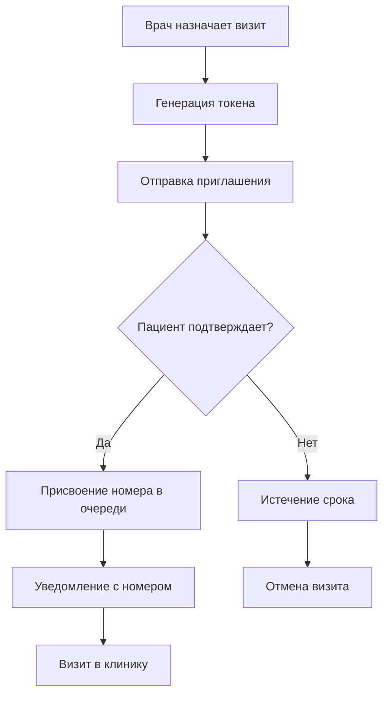

# Документация системы подтверждения визитов

## 📋 Обзор

Система подтверждения визитов - это комплексное решение для управления записями пациентов в медицинской клинике. Система позволяет врачам назначать визиты, а пациентам подтверждать их через различные каналы связи.

## 🏗️ Архитектура системы

```
┌─────────────────┐    ┌─────────────────┐    ┌─────────────────┐
│     Врач        │    │    Пациент      │    │  Регистратор    │
│                 │    │                 │    │                 │
│ • Назначает     │    │ • Подтверждает  │    │ • Помогает      │
│   визиты        │    │   через:        │    │   по телефону   │
│ • Выбирает      │    │   - Telegram    │    │ • Управляет     │
│   услуги        │    │   - PWA         │    │   очередями     │
│ • Указывает     │    │   - Телефон     │    │                 │
│   канал связи   │    │                 │    │                 │
└─────────────────┘    └─────────────────┘    └─────────────────┘
         │                       │                       │
         └───────────────────────┼───────────────────────┘
                                 │
                    ┌─────────────────┐
                    │ Система очередей│
                    │                 │
                    │ • Присвоение    │
                    │   номеров       │
                    │ • Печать        │
                    │   талонов       │
                    │ • Уведомления   │
                    └─────────────────┘
```

## 📚 Структура документации

### 🔧 API Документация
- **[API подтверждения визитов](api/visit_confirmation.md)** - Полное описание всех эндпоинтов
- **[Модели данных](api/data_models.md)** - Структуры запросов и ответов
- **[Коды ошибок](api/error_codes.md)** - Справочник по ошибкам и их решению

### 👥 UX Документация  
- **[Пользовательские потоки](ux/visit_confirmation_flows.md)** - Детальное описание UX для всех ролей
- **[Интерфейсы](ux/interface_guidelines.md)** - Руководство по дизайну интерфейсов
- **[Мобильная оптимизация](ux/mobile_optimization.md)** - Особенности мобильного UX

### 🛡️ Безопасность
- **[Система безопасности](security/confirmation_security.md)** - Комплексная защита системы
- **[Аудит и мониторинг](security/audit_monitoring.md)** - Логирование и отслеживание
- **[Соответствие стандартам](security/compliance.md)** - GDPR, HIPAA и локальные требования

### ⚙️ Техническая документация
- **[Установка и настройка](technical/installation.md)** - Развертывание системы
- **[Конфигурация](technical/configuration.md)** - Настройка параметров
- **[Миграции](technical/migrations.md)** - Обновление базы данных

### 🧪 Тестирование
- **[Стратегия тестирования](testing/strategy.md)** - Подходы к тестированию
- **[Unit тесты](testing/unit_tests.md)** - Модульное тестирование
- **[E2E тесты](testing/e2e_tests.md)** - Сквозное тестирование

## 🚀 Быстрый старт

### 1. Для разработчиков

```bash
# Клонирование репозитория
git clone https://github.com/clinic/visit-confirmation.git
cd visit-confirmation

# Установка зависимостей
pip install -r requirements.txt
npm install

# Настройка окружения
cp .env.example .env
# Отредактируйте .env файл

# Запуск миграций
alembic upgrade head

# Запуск сервера
uvicorn app.main:app --reload
```

### 2. Для администраторов

```bash
# Проверка состояния системы
curl http://localhost:8000/api/v1/health

# Просмотр статистики безопасности
curl -H "Authorization: Bearer $ADMIN_TOKEN" \
     http://localhost:8000/api/v1/admin/security/stats

# Запуск утреннего присвоения номеров
curl -X POST -H "Authorization: Bearer $ADMIN_TOKEN" \
     http://localhost:8000/api/v1/admin/morning-assignment/run
```

### 3. Для интеграторов

```javascript
// Пример интеграции с фронтендом
import { VisitConfirmationAPI } from './api/visit-confirmation';

const api = new VisitConfirmationAPI({
  baseURL: 'http://localhost:8000/api/v1',
  token: 'your-auth-token'
});

// Назначение визита
const visit = await api.scheduleVisit({
  patientId: 123,
  serviceIds: [1, 2],
  visitDate: '2025-09-26',
  visitTime: '14:30',
  confirmationChannel: 'telegram'
});

// Подтверждение визита
const confirmation = await api.confirmVisit({
  token: visit.confirmation.token,
  channel: 'telegram'
});
```

## 📊 Ключевые метрики

### Производительность
- **Время отклика API**: < 200ms (95-й процентиль)
- **Пропускная способность**: 1000 запросов/сек
- **Доступность**: 99.9% uptime

### Безопасность
- **Rate limiting**: 5 попыток/мин на подтверждение
- **Время жизни токенов**: 48 часов
- **Аудит**: 100% покрытие операций

### Пользовательский опыт
- **Скорость подтверждения**: 80% в течение 2 часов
- **Процент подтверждений**: 90% от назначенных
- **Распределение каналов**: 60% Telegram, 25% PWA, 15% телефон

## 🔄 Жизненный цикл визита



## 🛠️ Технологический стек

### Backend
- **FastAPI** - Веб-фреймворк
- **SQLAlchemy** - ORM для работы с БД
- **Alembic** - Миграции базы данных
- **Pydantic** - Валидация данных
- **Redis** - Кэширование и rate limiting

### Frontend
- **React.js** - UI библиотека
- **Vite** - Сборщик проекта
- **React Router** - Маршрутизация
- **Axios** - HTTP клиент

### Интеграции
- **Telegram Bot API** - Уведомления через Telegram
- **PWA** - Прогрессивное веб-приложение
- **ESC/POS** - Печать талонов

### Безопасность
- **JWT** - Аутентификация
- **bcrypt** - Хеширование паролей
- **Rate Limiting** - Защита от злоупотреблений
- **HTTPS** - Шифрование трафика

## 📈 Дорожная карта

### Фаза 1: MVP (Завершена)
- ✅ Базовое подтверждение визитов
- ✅ Telegram интеграция
- ✅ PWA поддержка
- ✅ Система безопасности

### Фаза 2: Расширение (В процессе)
- 🔄 Умные уведомления
- 🔄 Интеграция с календарем
- 🔄 Голосовые уведомления
- 🔄 Мультиязычность

### Фаза 3: ИИ и аналитика (Планируется)
- 📋 ИИ-помощник для пациентов
- 📋 Предиктивная аналитика
- 📋 Автоматическое перенесение визитов
- 📋 Оптимизация расписания

## 🤝 Участие в разработке

### Процесс разработки
1. **Fork** репозитория
2. **Создание** feature ветки
3. **Разработка** с тестами
4. **Pull Request** с описанием изменений
5. **Code Review** и тестирование
6. **Merge** в main ветку

### Стандарты кода
- **Python**: PEP 8, type hints, docstrings
- **JavaScript**: ESLint, Prettier, JSDoc
- **Git**: Conventional Commits
- **Тестирование**: 80%+ покрытие кода

### Документация
- **API**: OpenAPI/Swagger спецификации
- **Код**: Inline комментарии и docstrings
- **Архитектура**: Диаграммы и описания
- **UX**: Пользовательские сценарии

## 📞 Поддержка

### Техническая поддержка
- **Email**: tech-support@clinic.example.com
- **Slack**: #visit-confirmation-support
- **Документация**: https://docs.clinic.example.com

### Сообщение об ошибках
- **GitHub Issues**: Для багов и feature requests
- **Security**: security@clinic.example.com для уязвимостей
- **Urgent**: +998 90 123-45-67 для критических проблем

### Часто задаваемые вопросы

**Q: Как изменить время жизни токенов подтверждения?**
A: Установите переменную окружения `CONFIRMATION_TOKEN_TTL=48` (в часах)

**Q: Можно ли отключить определенный канал подтверждения?**
A: Да, через админ панель в разделе "Настройки каналов"

**Q: Как настроить rate limiting?**
A: Через переменные окружения `*_RATE_LIMIT` и `*_BLOCK_DURATION`

**Q: Поддерживается ли кластерная установка?**
A: Да, система поддерживает горизонтальное масштабирование

## 📄 Лицензия

Этот проект лицензирован под MIT License - см. файл [LICENSE](../LICENSE) для деталей.

## 🙏 Благодарности

- **Команда разработки** за создание системы
- **Медицинский персонал** за тестирование и обратную связь
- **Пациенты** за использование и предложения по улучшению
- **Open Source сообщество** за используемые библиотеки

---

*Последнее обновление: 25 сентября 2025*
*Версия документации: 1.0.0*
