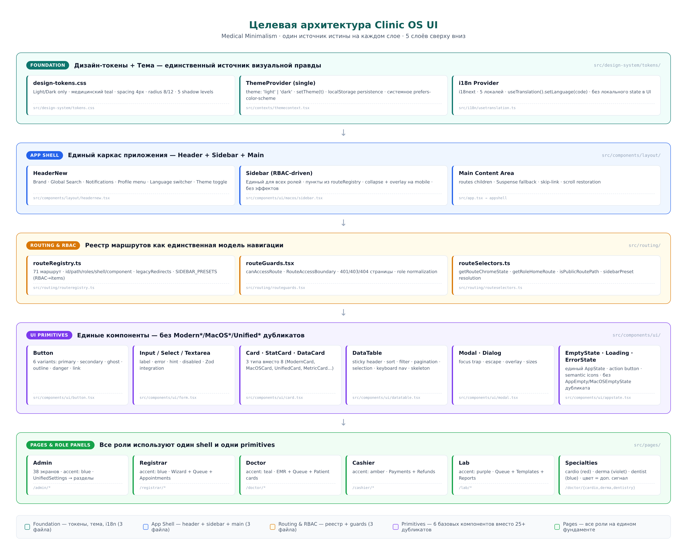
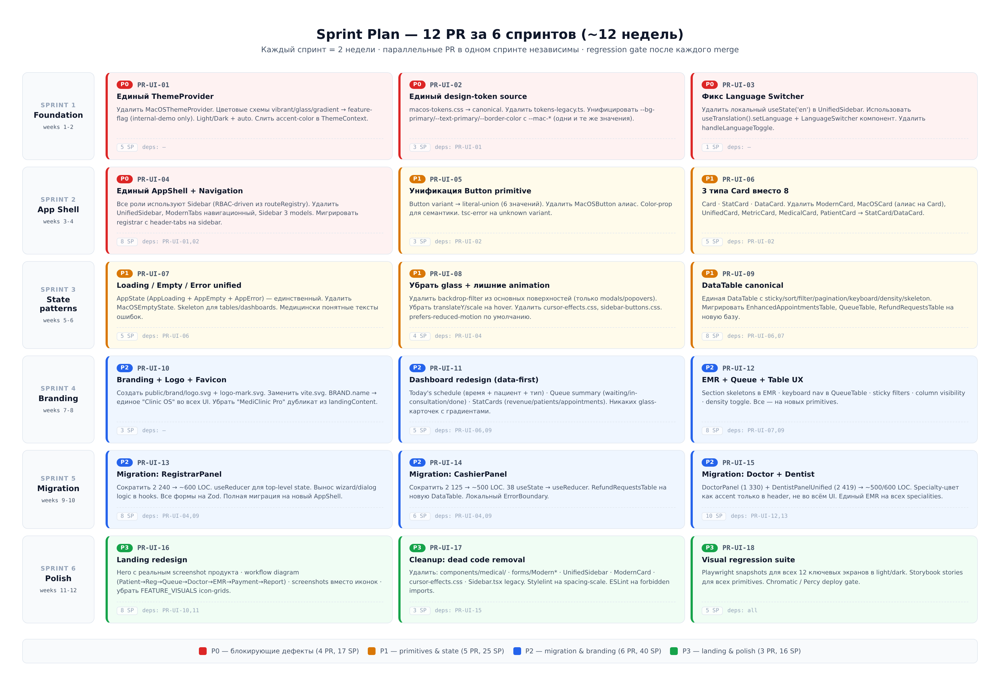

# UI Remediation Plan — Clinic Management Frontend

> **Документ-источник правды для миграции UI репозитория `drsapaev/final`.**
> Сопровождается жёстким контрактом `AGENTS_UI.md` — прочитать ПЕРЕД началом работы.

**Версия:** 2.10 · **Дата:** 31.08.2026 · **Основано на:** UI-аудите от 18.08.2026 + cross-check с актуальным main от 21.08.2026; статусы PR синхронизированы с main `a13e0973f` (progress snapshot — исполнение правила №7 AGENTS_UI); Phase 2C info-family definition-only remediation VERIFIED на `e16f3b0c`; Phase 2A `--mac-text-muted` consumer migration VERIFIED на `9b1ef5d`; Phase 2B-A `--mac-spacing-md` single-usage remediation VERIFIED на `26410a025`; PR-UI-09a DataTable foundation remediation MERGED-VERIFIED на `8143a361`; PR-UI-09b decommission dead Table implementations MERGED-VERIFIED на `11b423990`; PR-UI-09c live-consumer migration COMPLETE — 4 инкремента (#2857 → `c8464c81`, #2860 → `e35df1f0`, #2861 → `e17d261b`, #2862 → `028ab397`) MERGED-VERIFIED; PR-UI-09d final alias-cleanup MERGED-VERIFIED на `7243a108` (#2870); PR-UI-09e-1 DataTable row virtualization (AC4) MERGED-VERIFIED на `d20cde25` (#2872); PR-UI-10 branding MERGED-VERIFIED на `865ab5d8` (#2867, + follow-up #2869 → `66c7ceff`); PR-UI-11-1 AdminDashboard data-first + canonical DataCard MERGED-VERIFIED на `1378d6ef` (#2871); PR-UI-11-2 admin MacOSCard consumers → canonical Card MERGED-VERIFIED на `32edbc20` (#2873); PR-UI-11-3..11-12 MacOSCard-миграция (10 инкрементов #2876/#2878/#2880/#2882/#2884/#2886/#2888/#2889/#2892/#2894) MERGED-VERIFIED; PR-UI-19 Navigation i18n (C-6) MERGED-VERIFIED на `faace538` (#2879); PR-UI-12 EMR+Queue+Table UX COMPLETE — 4 инкремента (12-1 #2885 → `4199b9c2`, 12-2 #2890 → `f4d577d7`, 12-3 #2891 → `26347af3`, 12-4 #2893 → `64f73d40`) MERGED-VERIFIED; PR-UI-11-13..11-15 MacOSCard-хвост (3 инкремента #2896/#2899/#2902) MERGED-VERIFIED — 0 import-consumers; **v2.2 (срез `bf2f05b7`):** PR-UI-09e-2 EAT-декомпозиция MERGED-VERIFIED на `bf2f05b7` (#2932) — AC2 met: EnhancedAppointmentsTable 2 026→**304 LOC** (≤400, machine-checked), +26 тестов, zero-delta по всем visual baselines; **PR-UI-09 ✅ COMPLETE — 8 SP кредитованы** (см. §4.1.13); RRT ≤150 закрыт ранее в PR-UI-14-6 (123 LOC); QueueTable-цель §3.5 амандирована как устаревшая (§4.1.10 assessment, option C). **v2.4 (срез `36c126782`):** PR-UI-15 COMPLETE — 6 инкрементов (#2925/#2926/#2928/#2930/#2943/#2946) MERGED-VERIFIED, DoctorPanel 1 330→**277** (AC1 ≤500), DentistPanelUnified 2 148→**563** (AC2 ≤600, machine-checked), все §PR-UI-15 AC MET → §4.1.15; Sprint 5 CLOSED (19/19 SP). v2.1 (срез `c04c47e71`): PR-UI-14 COMPLETE → §4.1.12. Параллельная сессия: PR-UI-15-1..4 смержены (#2925 → `c9601e2d`, #2926 → `a108346f`, #2928 → `c0962464`, #2930 → `e046e8c7`) — DoctorPanel views + DentistPanelUnified data/dialogs/protocols. PR-UI-13 RegistrarPanel COMPLETE — 5 инкрементов (13-1 #2897 → `1bffc8d43`; 13-2 #2898 → `ecdd39842`; 13-3 #2900 → `4f6c05e79`; 13-4 #2901 → `7c06bc9af`; 13-5 #2903 → `a13e0973f`) MERGED-VERIFIED — все §PR-UI-13 AC MET (панель 2 252→493 LOC, −78%); + test-only follow-up #2906 → `fde58926` (30 unit-тестов на хуки 13-5). **v2.6 (PR #2959):** reconciliation двух параллельных v2.5-ledger'ов (#2958 partial-версия + #2959 closure-версия) — PR-UI-17 ✅ **COMPLETE** с 2 факт-амендированными items (6: common/Modal.tsx LIVE — консолидация отдельное решение; 7: условие lucide-миграции не выполнено — отдельный трек), **5 SP кредитованы**; портфолио **18/19 PR · 97/103 SP**; AC6 bundle амандирован фактом −15.88 KB gzip (мёртвый код был уже tree-shaken); см. §4.1.17. **v2.7 (срез `2807e625b`):** PR-UI-18 COMPLETE — 5 инкрементов MERGED-VERIFIED (18-1 #2951 `baf0b9492` + 18-2 #2956 `a1e0fc3a5` + 18-3 #2961 `08253d097` — 12-экранные visual baselines × light/dark, параллельная сессия; 18-4 #2963 `e82d9cf01` — Storybook stories для всех 10 canonical primitives + инфра-ремонт + CI-гейт; 18-5 #2964 `2807e625b` — axe-core/playwright a11y-гейт 6 публичных маршрутов × 2 темы + фикс unnamed role=checkbox на login), item 3 амендирован (Chromatic/Percy — внешний SaaS без токенов репо; функциональный интент закрыт существующим блокирующим Playwright visual-diff-гейтом); портфолио **19/19 PR · 102/103 SP**; Sprint 6 CLOSED; см. §4.1.18. **v2.8 (срез `88af44c4`):** follow-up re-audit — root TelegramManager decommission ОТЗЫВАН: компонент LIVE (5 доказательств: lazy-import App.tsx → ROUTE_COMPONENTS; живой маршрут /admin/integrations/telegram Admin role-scoped; CI-job telegram-miniapp-release-gate с 2 e2e; API-интеграция /telegram/* + /admin/telegram/*; 2 fs-контракт-теста), запись M-8 §4.1.17 «runtime-DEAD» ошибочна (grep-only артефакт 17-3, динамический lazy()-импорт не пойман) и исправлена; см. §4.1.19. **v2.9 (PR #2976):** follow-up track 2 (A+) — common/Modal.tsx (513 LOC) runtime-DEAD-декомиссия + тримминг мёртвых экспортов hooks/useModal.tsx (304→59 LOC; 0 импортёров, machine-verified): провайдер размонтирован из AppProviders/renderWithProviders, stale-записи манифестов (frontendAudit .jsx, test-system.js) вычищены, 2 осиротевших i18n-ключа ×5 локалей удалены; канонический macos/Modal не тронут (ConfirmDialog×34); Tier-1 полностью зелёный (1641/1641, e2e 93/93, ratchet-улучшения: modalFilesOutsideKitCount 23→22, inlineStyles 2431→2424, inlineStyleFiles 213→211); см. §4.1.20. **v2.9.1 (post-merge VERIFIED, 31.08.2026):** post-merge VERIFIED 5 инвариантов правила §16 (post-hoc форма; прецедент — запись #2954 §4.1.16 с v2.6; post-hoc↔merge-time маппинг обоснован в консолидированной записи §4.1.17) повторно исполнена на origin/main @ `6450bdc64a` для 5 инкрементов PR-UI-17, ранее не имевших явной записи (#2948 `94ebcb04c` / #2949 `2e1fba60d` / #2952 `d9ffa2133` / #2953 `62e95e298` / #2955 `e7649b287`); #2954 `b247f00ac` имеет явную запись с v2.6. Все 5 инвариантов §16 PASS по каждому инкременту: INV1 merged-SHA (squash в истории main; merge-time форма — по построению squash-merge); INV2 AC на merged tree (CI на самом squash-коммите + AC-диспозиция §4.1.17 v2.6); INV3 Tier-1/regression gates (CI terminal 0 failures; Regression Audit Gate = success); INV4 скоуп без расширения (машинный numstat); INV5 неразрешённых отклонений нет (DEFERRED TIER 2 #2954 записан; metric/SSOT integrity — §4.1.17); см. §4.1.16 (амендменты ledger) + §4.1.17 (консолидированная запись). Портфолио неизменно: 19/19 PR · 102/103 SP; факты v2.7/v2.8/v2.9 (§4.1.18/§4.1.19/§4.1.20) сохранены без изменений. **v2.10 (PR #TBD):** follow-up track 3, инкремент 1 из 3 — навигационный icon-контракт мигрирован на LucideIcon component-refs: routeRegistry (SIDEBAR_PRESETS ×33 + ROUTE_REGISTRY nav-meta ×34 = 67 SF-строк → 29 lucide-импортов), Sidebar/MacOSTab API `icon?: string` → `icon?: LucideIcon`, HeaderNew (8 рендеров), CommandPalette dead-icon-поле удалено, 3 скрытых MacOSTab-фидера с lucide-именами-как-строками починены (runtime-невидимые иконки), 5 SF-имён вне ICONS-карты (questionmark-фоллбек: person.2 ×9, rectangle.stack.badge.plus, list.number, wand.and.stars, puzzlepiece) закрыты как intentional UX-bugfix, routeSelectors `'circle'`-фоллбек ×3 удалён; см. §4.1.21.

---

## Содержание

1. [Контекст и диагноз](#1-контекст-и-диагноз)
2. [Целевая архитектура](#2-целевая-архитектура)
3. [File-level матрица решений](#3-file-level-матрица-решений)
4. [Sprint Plan — 19 PR за 6 спринтов](#4-sprint-plan--19-pr-за-6-спринтов)
5. [P0: критические дефекты (4 PR)](#5-p0-критические-дефекты-4-pr)
6. [P1: primitives & state patterns (5 PR)](#6-p1-primitives--state-patterns-5-pr)
7. [P2: migration & branding (6 PR)](#7-p2-migration--branding-6-pr)
8. [P3: landing & polish (3 PR)](#8-p3-landing--polish-3-pr)
9. [Regression strategy](#9-regression-strategy)
10. [Risk matrix](#10-risk-matrix)

---

## 1. Контекст и диагноз

### 1.1. Что подтвердил cross-check с актуальным main

UI-аудит от 18.08.2026 был выполнен на снапшоте репозитория. Cross-check с актуальным main от 21.08.2026 (коммит `2a7487e`) подтвердил большинство находок, но часть уже изменилась:

| Находка аудита (18.08) | Состояние в main (21.08) | Действие |
|---|---|---|
| `LanguageSwitcher.tsx` использует локальный `useState('en')` + toggle без i18next | **ИСПРАВЛЕНО** в `LanguageSwitcher.tsx` — теперь использует `useTranslation().setLanguage(code)` | Удалить из плана; оставить regression-тест |
| `UnifiedSidebar.tsx` содержит тот же баг (строки 31, 74) | **ПОДТВЕРЖДЕНО** — баг живёт в `UnifiedSidebar.tsx:31,74` | PR-UI-03: удалить `UnifiedSidebar` целиком (используется только в `MediLabDemo`) |
| 5 параллельных UI-слоёв (macOS, Modern*, MUI, Tailwind, Unified*) | **ПОДТВЕРЖДЕНО** — все слои присутствуют | PR-UI-05..07: унификация |
| Два ThemeProvider (ThemeContext + MacOSThemeProvider) | **ПОДТВЕРЖДЕНО** — `ThemeContext.tsx` (661 LOC) + `macosTheme.tsx` (177 LOC) параллельно | PR-UI-01: слить в один |
| 6 color schemes (light/dark/auto + vibrant/glass/gradient) | **ПОДТВЕРЖДЕНО** — `colorScheme.ts:264` `COLOR_SCHEMES` | PR-UI-01: vibrant/glass/gradient → feature-flag |
| 8 Card-типов (ModernCard, MacOSCard, UnifiedCard, MetricCard, MedicalCard, PatientCard, StatCard, DataCard) | **ПОДТВЕРЖДЕНО** — все 8 присутствуют, разбросаны по 69 файлам | PR-UI-06: 3 типа (Card / StatCard / DataCard) |
| 6 Table-реализаций (EnhancedAppointmentsTable, common/Table, macos/Table, ResponsiveTable, RefundRequestsTable, QueueTable) | **ПОДТВЕРЖДЕНО** — 4 496 LOC суммарно, EnhancedAppointmentsTable — god-компонент 2 279 LOC | PR-UI-09: canonical DataTable |
| 3 модели навигации (sidebar для admin, header-tabs для registrar, ModernTabs в теле страницы для doctor/lab) | **ПОДТВЕРЖДЕНО** — `SIDEBAR_PRESETS` (строки 33-100 routeRegistry.ts) активны только для admin/doctor/lab/cardio/derma/dentist; registrar/cashier/patient — закомментированы (P-016) с пометкой «navigation lives in HeaderNew» | PR-UI-04: единый AppShell |
| `BRAND.logo = '/brand/logo.svg'` указывает на несуществующий `public/brand/` | **ПОДТВЕРЖДЕНО** — `public/brand/` не существует, файл `brand.ts` ссылается на несуществующие assets | PR-UI-10: создать brand assets |
| Двойное имя продукта "MediClinic Pro" + "Clinic OS" в landingContent | **ПОДТВЕРЖДЕНО** — 36 упоминаний обоих имён в `landingContent.ts` | PR-UI-10: унифицировать на "Clinic OS" |
| `cursor-effects.css` (520 LOC) + `sidebar-buttons.css` (75 LOC) — мёртвый CSS | **ПОДТВЕРЖДЕНО** — импортируются только в `MediLabDemo.tsx` и `UnifiedSidebar.tsx` (оба — demo-only) | PR-UI-17: удалить оба файла |
| `components/medical/` (4 файла, 1 097 LOC) — мёртвый код | **ПОДТВЕРЖДЕНО** — `MedicalCard` импортируется только в `MediLabDemo.tsx:10` | PR-UI-17: удалить каталог |
| `forms/Modern*` (4 файла, 705 LOC) — мёртвый код | **ПОДТВЕРЖДЕНО** — 0 импортов во всём `src/` | PR-UI-17: удалить каталог |

### 1.2. Главный диагноз

**Проблема интерфейса — архитектурная, не косметическая.** Функционально система зрелая (18 ADR, 314 unit-тестов, 71 маршрут, WebSocket real-time, mutation testing), но UI не имеет одного визуального языка. Это проявляется в:

- **5 параллельных UI-слоёв** в одной кодовой базе
- **2 ThemeProvider**, которые слушают события друг друга через `window.dispatchEvent('colorSchemeChanged')` (см. `ThemeContext.tsx:333` + `macosTheme.tsx:86`)
- **2 accent-blue** переменных (`--mac-accent-blue` в macos-tokens.css + `--accent` в macosTheme.tsx, которые перезаписывают друг друга)
- **6 цветовых схем** с комбинаторным взрывом тестирования (6 тем × 12 surfaces × 4 состояния ≈ 288 комбинаций)
- **3 модели навигации** (sidebar для админа, header-tabs для регистратора, ModernTabs в теле страницы для врача) — пользователь с правами Admin+Registrar видит разные UX на двух экранах

### 1.3. Выбранное направление: B — Medical Minimalism

Из трёх вариантов:

- **A. macOS UI** (текущий primary layer) — привлекательный, но «десктоп-приложение», а не «клиническая система»
- **B. Medical Minimalism** ✅ — белая/светлая основа, спокойный медицинский teal, сильная типографическая иерархия, плотные таблицы, data-first
- **C. Полный редизайн** — неприемлемо: создаст 6-й слой поверх существующих 5

Выбран **B**, с сохранением лучших interaction-patterns из macOS (spacing scale, focus-ring, keyboard shortcuts, `:focus-visible`, reduced-motion). Это не косметика, а **Layout Restructure**: один source of truth на каждом слое.

**Ключевая метрика успеха:** пользователь с любой ролью (Admin, Registrar, Doctor, Cashier, Lab, cardio/derma/dentist) видит один и тот же AppShell, одни и те же primitives, одну и ту же модель навигации. Различаются только accent color и набор пунктов в sidebar.

---

## 2. Целевая архитектура



### 2.1. 5 слоёв сверху вниз

| Слой | Файлы (canonical) | Что включает | Что НЕ включает |
|---|---|---|---|
| **Foundation** | `src/design-system/tokens.css` · `src/contexts/ThemeContext.tsx` · `src/i18n/useTranslation.ts` | CSS-переменные (light/dark + auto), ThemeProvider (single), i18next integration | MacOSThemeProvider, colorScheme.ts custom schemes, accent-picker |

**Theme type contract (уточнение из §2 AGENTS_UI):**
```ts
type Theme = 'light' | 'dark' | 'auto';            // что выбрал пользователь
type ResolvedTheme = 'light' | 'dark';              // что фактически применилось

interface ThemeContextValue {
  theme: Theme;                                     // хранится в localStorage 'colorScheme'
  resolvedTheme: ResolvedTheme;                     // вычисляется из theme + prefers-color-scheme
  setTheme: (t: Theme) => void;
  toggleTheme: () => void;                          // cycling: light → dark → auto → light
}
```

Компоненты читают **только `resolvedTheme`** — они не знают, пришла ли тема из `light`/`dark`/`auto`. Это убирает dual-truth: `--mac-bg-primary` всегда соответствует `resolvedTheme`, без задержки на `window.dispatchEvent('colorSchemeChanged')`.
| **App Shell** | `src/App.tsx` (AppShell) · `src/components/layout/HeaderNew.tsx` · `src/components/ui/macos/Sidebar.tsx` | Header (brand + search + notifications + profile + lang + theme) + Sidebar (RBAC-driven) + Main content | UnifiedSidebar, UnifiedLayout, Nav, ModernTabs-as-nav |
| **Routing & RBAC** | `src/routing/routeRegistry.ts` · `src/routing/routeGuards.tsx` · `src/routing/routeSelectors.ts` | 71 маршрут с id/path/roles/shell/component, SIDEBAR_PRESETS, route guards, 401/403/404 | — |
| **UI Primitives** | `src/components/ui/Button.tsx` · `Card.tsx` · `DataTable.tsx` · `Modal.tsx` · `AppState.tsx` · `Form.tsx` | Button (6 variants), Card/StatCard/DataCard (3 типа), DataTable (sticky/sort/filter/pagination), Modal (focus trap), AppState (loading/empty/error unified) | ModernCard, MacOSCard, UnifiedCard, MetricCard, MedicalCard, PatientCard, ModernDialog, ModernInput, ModernSelect, ModernTextarea, ModernForm, AppEmpty, MacOSEmptyState, ResponsiveTable, common/Table |
| **Pages & Role Panels** | `src/pages/*.tsx` (12 panels) | Admin (38 экранов), Registrar, Doctor, Cashier, Lab, cardio/derma/dentist, Patient | — |

### 2.2. Принцип «одного источника правды»

Каждый визуальный аспект имеет один canonical-источник:

| Аспект | Canonical | Альтернативы (после миграции) |
|---|---|---|
| CSS-переменные | `tokens.css` | — |
| Theme state | `useTheme()` из ThemeContext — `theme: 'light' \| 'dark' \| 'auto'` + `resolvedTheme: 'light' \| 'dark'` | — |
| Language state | `useTranslation().language` из i18next | — |
| Accent color | `--mac-accent` (один, медицинский teal) | role-tinted только в sidebar active item |
| Sidebar items | `SIDEBAR_PRESETS[role]` в routeRegistry | — |
| Icon library | `lucide-react` (прямые импорты) | — |
| Spacing | `--mac-spacing-1..16` (4px grid) | — |
| Typography | `--mac-font-size-xs..3xl` (7 размеров) | — |
| Card component | `Card` / `StatCard` / `DataCard` | — |
| Table component | `DataTable` | — |
| Empty/loading/error | `AppState` (AppLoading + AppEmpty + AppError) | — |

---

## 3. File-level матрица решений

### 3.1. Theme & design tokens

| Файл | LOC | Действие | Причина | PR |
|---|---|---|---|---|
| `src/contexts/ThemeContext.tsx` | 661 | **MIGRATE** | Оставить как canonical ThemeProvider. Удалить логику синхронизации с MacOSThemeProvider (строки 333-336 dispatch `colorSchemeChanged`). Упростить: только `theme: 'light'\|'dark'`, `setTheme(t)`, `toggleTheme()`. Remote sync с `/users/me/preferences` оставить. | PR-UI-01 |
| `src/theme/macosTheme.tsx` | 177 | **DELETE** ✅ #2812 | Дублирует ThemeProvider. Accent-picker (8 accent names) — удалить; `--mac-accent-blue` canonical в tokens.css. `useMacOSTheme` используется только в `AccentPicker.tsx` и `ColorSchemeSelector.tsx` — оба мигрировать. | PR-UI-01 ✅ |
| `src/theme/colorScheme.ts` | 450 | **MIGRATE** ✅ #2814 | Удалить определения `vibrant`, `glass`, `gradient` из `COLOR_SCHEME_DEFINITIONS` (строки 102, 153, 214). Оставить только `light`, `dark`, `auto`. Функции `applyColorSchemeToDom`, `persistColorSchemeLocally`, `resolveThemeMode` — оставить. Выполнено + добавлена migration-логика (normalizeColorScheme для legacy-значений). | PR-UI-01 ✅ |
| `src/theme/macos-tokens.css` | 677 | **MIGRATE** ✅ #2814 → `src/design-system/tokens.css` | Переименовать + убрать `[data-color-scheme="vibrant"]`, `[data-color-scheme="glass"]`, `[data-color-scheme="gradient"]` секции (строки 25-95 в `styles/macos.css`). Light/Dark только. **PR-08 (#2838, 25.08.2026) D4 primitives:** +54 LOC canonical entrance-семейство добавлено в `tokens.css` (4 `@keyframes` mac-entrance-up/left/right/scale + 4 utility classes `.mac-entrance-up/left/right` 0.6s ease-out + `.mac-entrance-scale` 0.4s ease-out + 5 `.mac-delay-100..500` + reduced-motion block update). Values byte-identical legacy `fadeInUp/Left/Right/Scale` (equivalence-by-construction); 15 MediLabDemo legacy refs migrated. | PR-UI-02 ✅ (+ PR-UI-08 D4) |
| `src/theme/tokens-legacy.ts` | — | **DELETE** ⬜ | Используется только в ThemeContext.getColor/getSpacing. После миграции ThemeContext на прямое чтение CSS-переменных — удалить. **Ownership-фикс (25.08.2026):** удаление перенесено из PR-UI-02 в PR-UI-17 — файл жив, единственный импортёр `ThemeContext.tsx`. | PR-UI-02 → **PR-UI-17** |
| `src/theme/colorUtils.ts` | — | **KEEP** | Утилиты `mixColors`, `toRgbaString` используются в ThemeContext. Оставить как есть. | — |
| `src/styles/macos.css` | 840 | **MIGRATE** ✅ #2814 (частично) | Удалить секции vibrant/glass/gradient (строки 25-95, ~70 LOC) — выполнено (~259 LOC удалено). Оставить остальное. После PR-UI-02 переименовать в `design-system/styles.css`. **UI-audit track C-4 (commit `c9ea39edd`, 25.08.2026, ОТДЕЛЬНЫЙ pre-PR-08 commit, НЕ часть PR-UI-08):** дополнительная очистка — `@media (prefers-color-scheme: dark) :root` block (5 legacy vars: `--bg`/`--text`/`--surface`/`--glass-stroke`/`--shadow`) + dead `.glass` rule (last consumer of legacy vars) removed; canonical `--mac-bg-primary` replacement for `html { background-color }`. C-4 attributed to UI-audit track, не к PR-UI-08. | PR-UI-02 ✅ (+ C-4 follow-up) |
| `src/styles/theme.css` | 578 | **MIGRATE** | Аудит и консолидация с `tokens.css`. Дублирующие `:root`-определения — удалить. | PR-UI-02 |
| `src/styles/dark-theme-visibility-fix.css` | 164 | **KEEP** | Полезные dark-mode патчи. Оставить. | — |
| `src/styles/global-fixes.css` | 232 | **KEEP** | Полезные global fixes. Оставить. | — |

### 3.2. App Shell & navigation

| Файл | LOC | Действие | Причина | PR |
|---|---|---|---|---|
| `src/App.tsx` | 494 | **MIGRATE** | AppShell — упростить. Удалить двойную логику compact-sidebar для mobile (строки 246-322). Использовать стандартный overlay-drawer pattern. | PR-UI-04 |
| `src/components/layout/HeaderNew.tsx` | 705 | **MIGRATE** | Удалить хардкод navigational buttons для registrar/cashier (после PR-UI-04 они не нужны). Сократить до ~300 LOC. Оставить: brand, GlobalSearchBar, NotificationCenter, profile menu, LanguageSwitcher, theme toggle. | PR-UI-04 |
| `src/components/ui/macos/Sidebar.tsx` | 649 | **MIGRATE** | Оставить как canonical sidebar. Удалить эффекты (text-shadow, transform, backdrop-filter) из активного пункта. Hover = background tint + font-weight emphasis только. | PR-UI-04 |
| `src/components/layout/UnifiedSidebar.tsx` | 498 | **DELETE** ✅ #2810 | Используется только в `MediLabDemo.tsx` (demo-only). Содержит 5 проблем: локальный `useState('en')` (строка 31), toggle без i18next (строка 74), 5 event-listeners для color scheme sync (строки 33-64), `auth.clearToken()` без redirect (строка 482), визуальные эффекты (text-shadow, box-shadow, transform, backdrop-filter). Все проблемы ушли с удалением файла. | PR-UI-03 ✅ |
| `src/components/layout/UnifiedLayout.tsx` | 123 | **DELETE** ✅ #2810 | Используется только в `MediLabDemo.tsx`. После удаления UnifiedSidebar — не нужен. **Ownership-фикс (25.08.2026):** фактически удалён в PR-UI-03 (раньше плана — матрица относила к PR-17). | PR-UI-17 → **PR-UI-03** (факт) |
| `src/components/layout/Nav.tsx` | 102 | **DELETE** | Используется только в `Activation.tsx` (онбординг). Мигрировать Activation на AppShell, удалить Nav. | PR-UI-17 |
| `src/components/layout/ModernCard.tsx` | 176 | **DELETE** ✅ #2820 | 0 импортов в `src/`. Мёртвый код. | PR-UI-06 ✅ |
| `src/components/layout/ModernContainer.tsx` | 76 | **DELETE** | 0 импортов. Мёртвый код. | PR-UI-17 |
| `src/components/layout/ModernFlex.tsx` | 93 | **DELETE** | 0 импортов. Мёртвый код. | PR-UI-17 |
| `src/components/layout/ModernGrid.tsx` | 105 | **DELETE** | 0 импортов. Мёртвый код. | PR-UI-17 |
| `src/components/navigation/ModernTabs.tsx` | — | **MIGRATE** ⬜ | Используется как content-tabs (внутри страниц), НЕ как навигация (33 потребителя). Оставить, но переименовать в `Tabs.tsx` для ясности. **Ownership-фикс (25.08.2026):** rename отложен из PR-UI-04 в PR-UI-17. | PR-UI-04 → **PR-UI-17** |
| `src/pages/MediLabDemo.tsx` | 779 | **MIGRATE** | Демо-страница (доступна только Admin при `VITE_ENABLE_INTERNAL_DEMO=1`). После удаления UnifiedLayout — мигрировать на AppShell с пометкой `data-demo="true"`. Альтернативно: удалить полностью, если демо не нужно. | PR-UI-17 |
| `src/pages/MacOSDemoPage.tsx` | 19 | **KEEP** | Минимальная демо-страница. Оставить. | — |

### 3.3. Icon system

| Файл | LOC | Действие | Причина | PR |
|---|---|---|---|---|
| `src/components/Icon.tsx` | 60 | **DELETE** | Legacy icon component с `assets/iconsMap`. Используется в 5 местах: `MediLabDemo.tsx`, `UnifiedSidebar.tsx`, `medical/MedicalTable.tsx`, `medical/PatientCard.tsx`, `medical/MetricCard.tsx`. Все эти файлы удаляются в PR-UI-03/17. | PR-UI-17 |
| `src/components/ui/macos/Icon.tsx` | 546 | **MIGRATE** | SF Symbols wrapper. Используется во всём приложении. Постепенно заменить на прямые `lucide-react` импорты. Файл удалить после полной миграции (PR-UI-17). | PR-UI-17 |
| `src/assets/iconsMap.ts` | — | **DELETE** | Используется только в `Icon.tsx`. Удалить вместе с ним. | PR-UI-17 |

### 3.4. Card components

| Файл | LOC | Действие | Причина | PR |
|---|---|---|---|---|
| `src/components/ui/macos/Card.tsx` | 394 | **MIGRATE** ⚠️ PARTIAL | Оставить как canonical. Алиас `MacOSCard` удалить. **Факт (25.08.2026):** canonical `Card` подтверждён (#2820), НО алиас `MacOSCard` жив в 329 JSX — миграция consumers перенесена в PR-UI-11 (см. статус PR-06). | PR-UI-06 → **PR-UI-11** |
| `src/components/ui/macos/MacOSStatCard.tsx` | 291 | **MIGRATE** ✅ #2820 → `StatCard` | Объединить с `MetricCard`. Стать canonical `StatCard`. Выполнено: файл переименован в `StatCard.tsx`, 40 JSX consumers мигрированы. | PR-UI-06 ✅ |
| `src/components/ui/macos/MacOSMetricCard.tsx` | 302 | **DELETE** ✅ #2820 | Дубликат `MacOSStatCard`. Мигрировать 33 потребителя на `StatCard`. | PR-UI-06 ✅ |
| `src/components/medical/MedicalCard.tsx` | 73 | **DELETE** | Используется только в `MediLabDemo.tsx`. Мёртвый код в реальном приложении. | PR-UI-17 |
| `src/components/medical/MetricCard.tsx` | 124 | **DELETE** | Используется только в `MediLabDemo.tsx`. Мёртвый. | PR-UI-17 |
| `src/components/medical/PatientCard.tsx` | 237 | **DELETE** | Используется только в `MediLabDemo.tsx`. Мёртвый. | PR-UI-17 |
| `src/components/medical/MedicalTable.tsx` | — | **DELETE** | Используется только в `MediLabDemo.tsx`. Мёртвый. | PR-UI-17 |
| `src/components/medical/index.ts` | — | **DELETE** | Barrel-file для мёртвого каталога. | PR-UI-17 |
| `src/components/layout/ModernCard.tsx` | 176 | **DELETE** ✅ #2820 | 0 импортов. Мёртвый. | PR-UI-06 ✅ |
| (новый) `src/components/ui/DataCard.tsx` | — | **CREATE** ⬜ | Новый canonical DataCard для очередей/appointments/lab results. ~150 LOC. **Факт (25.08.2026):** не создан в PR-UI-06; введение перенесено в PR-UI-11 (canonical card strategy, см. статус PR-06). | PR-UI-06 → **PR-UI-11** |

### 3.5. Table components

| Файл | LOC | Действие | Причина | PR |
|---|---|---|---|---|
| `src/components/ui/macos/Table.tsx` | 576 | **MIGRATE** → canonical `DataTable` | Базовый Table. Расширить: sticky header, sort, filter, pagination, selection, keyboard nav, density, skeleton, error state. ~700 LOC после миграции. | PR-UI-09 |
| `src/components/tables/EnhancedAppointmentsTable.tsx` | 2 279 (факт: 2 282) | **MIGRATE** ⬜ | God-компонент. После canonical DataTable — мигрировать все consumers на прямое использование DataTable с column-config. Файл сократить до ~400 LOC (только column definitions + actions). | PR-UI-09 |
| `src/components/common/Table.tsx` | 504 | **DELETE** | Дубликат `macos/Table.tsx`. Мигрировать 9 потребителей на canonical DataTable. | PR-UI-09 |
| `src/components/ResponsiveTable.tsx` | 468 | **DELETE** ⬜ | 0 импортов. Мёртвый. **Ownership-фикс (25.08.2026):** матрица ранее ошибочно относила к PR-17; canonical-владелец — PR-UI-09 (datatable migration territory, не dead-code cleanup). | PR-UI-17 → **PR-UI-09** |
| `src/components/cashier/RefundRequestsTable.tsx` | 430 | **MIGRATE** | Переписать на canonical DataTable. Сократить до ~150 LOC (columns + actions). | PR-UI-09 |
| `src/components/queue/QueueTable.tsx` | 239 | **MIGRATE** ✅ #2860 | Переписать на canonical DataTable. ~~Сократить до ~100 LOC~~ **Аменда (v2.2, §4.1.10 assessment option C + §4.1.13):** цель ~100 LOC признана устаревшей post-09c — QueueTable уже тонкий DataTable-wrapper; 296 LOC @ `bf2f05b7` (рост от 239 = фичи PR-UI-12-2 roving keyboard nav + PR-UI-12-4 sticky viewport); косметический file-split до ~100 = 0 системной ценности. | PR-UI-09 |

### 3.6. Form components

| Файл | LOC | Действие | Причина | PR |
|---|---|---|---|---|
| `src/components/ui/macos/Input.tsx` | 222 | **MIGRATE** → canonical `Input` | Оставить как canonical. | PR-UI-05 |
| `src/components/ui/macos/Select.tsx` | — | **MIGRATE** → canonical `Select` | Оставить. | PR-UI-05 |
| `src/components/ui/macos/Textarea.tsx` | — | **MIGRATE** → canonical `Textarea` | Оставить. | PR-UI-05 |
| `src/components/forms/ModernInput.tsx` | — | **DELETE** | 0 импортов. Мёртвый. | PR-UI-17 |
| `src/components/forms/ModernSelect.tsx` | — | **DELETE** | 0 импортов. Мёртвый. | PR-UI-17 |
| `src/components/forms/ModernTextarea.tsx` | — | **DELETE** | 0 импортов. Мёртвый. | PR-UI-17 |
| `src/components/forms/ModernForm.tsx` | — | **DELETE** | 0 импортов. Мёртвый. | PR-UI-17 |
| `src/components/forms/ResponsiveForm.tsx` | — | **DELETE** | 0 импортов. Мёртвый. | PR-UI-17 |
| `src/components/forms/index.ts` | — | **DELETE** | Barrel-file для мёртвого каталога. | PR-UI-17 |

### 3.7. Dialog/Modal components

| Файл | LOC | Действие | Причина | PR |
|---|---|---|---|---|
| `src/components/ui/macos/Modal.tsx` | 511 | **MIGRATE** → canonical `Modal` | Оставить. Focus trap + escape + overlay уже есть. | — |
| `src/components/ui/macos/Dialog.tsx` | — | **KEEP** | Оставить. | — |
| `src/components/dialogs/ModernDialog.tsx` | 209 | **MIGRATE** | 6 импортов. После аудита — либо мигрировать на Modal, либо оставить как тонкую обёртку. Решить в PR-UI-06. | PR-UI-06 |
| `src/components/common/Modal.tsx` | — | **DELETE** | Дубликат macos/Modal. 0 прямых импортов вне common/index.ts. | PR-UI-17 |

### 3.8. Empty/loading/error state

| Файл | LOC | Действие | Причина | PR |
|---|---|---|---|---|
| `src/components/ui/macos/AppState.tsx` | 240 | **MIGRATE** ✅ #2835 (07a-8a) → canonical `AppState` | Оставить `AppLoading`, `AppEmpty`, `AppError`. Удалить импорт `MacOSEmptyState` (строка 3). Выполнено: рендеринг internalized (inline md+minimal), зависимость от MacOSEmptyState устранена. | PR-UI-07 ✅ |
| `src/components/ui/macos/MacOSEmptyState.tsx` | 191 | **DELETE** ✅ #2836 (07a-8b) | Дубликат `AppEmpty`. 33 потребителя мигрировать на `AppEmpty`. Выполнено полностью: файл + barrel-export + legacy-тест удалены (−335 LOC); runtime-упоминаний 0. | PR-UI-07 ✅ |
| `src/components/ui/macos/Skeleton.tsx` | 188 | **KEEP** | Canonical skeleton. 34 потребителя. Оставить. | — |
| `src/components/ui/macos/Alert.tsx` | — | **KEEP** | Canonical alert. Оставить. | — |

### 3.9. Button components

| Файл | LOC | Действие | Причина | PR |
|---|---|---|---|---|
| `src/components/ui/macos/Button.tsx` | 257 | **MIGRATE** ✅ #2819 + P1a | Canonical. Сократить variants с 11 до 6 (default → `secondary`, primary, ghost, outline, danger, link). Удалить `success`, `warning`, `destructive`, `error` (дубликаты). Тип `variant` → literal-union (tsc-error на unknown). Дополнено P1a (25.08.2026): ещё 32 non-canonical варианта мигрированы. | PR-UI-05 ✅ |
| `src/components/admin/IconButton.tsx` | — | **MIGRATE** | Оставить как специализированный admin-компонент, но наследовать от canonical Button. | — |

### 3.10. CSS files (cleanup)

| Файл | LOC | Действие | Причина | PR |
|---|---|---|---|---|
| `src/styles/cursor-effects.css` | 520 | **DELETE** ⬜ | Мёртвый CSS. Содержит ripple/lift/transform эффекты, которые user явно запретил. **Ownership-фикс (25.08.2026):** владелец удаления — PR-UI-17 (решение Codex review #2810: 9 interaction-классов ещё потребляются MediLabDemo; PR-08 не должен совмещать glass/animation canonicalization с legacy-decommission). **PR-08 verification (#2838, 25.08.2026, main `ae7236cb6`):** runtime-dead подтверждён — **0 runtime CSS imports anywhere in `src/`** (AC3a ✓; ранее матрица заявляла «Импортёр на срез — только `MediLabDemo.tsx`» — **коррекция**: проверка на `ae7236cb6` показала 0 импортов в `MediLabDemo.tsx` и нигде в `src/`). **4 stale audit-manifest entries** в `frontend/src/utils/frontendAudit.tsx` (lines 309, 330, 762, 765 — object keys + array elements, NOT runtime imports; AC3b, PR-17 owned cleanup). Файл 520 LOC жив как физический артефакт, runtime-dead. | PR-UI-17 (intact) |
| `src/styles/sidebar-buttons.css` | 75 | **DELETE** ✅ #2810 | Мёртвый CSS. Импортировался только в `UnifiedSidebar.tsx`. Содержал `transform: translateY(-3px) !important`. **Факт:** удалён в PR-UI-03 (раньше плана — матрица относила к PR-08). | PR-UI-08 → **PR-UI-03** (факт) |
| `src/styles/accessibility.css` | 266 | **KEEP** | Сильная сторона проекта. WCAG 2.1 AA compliance. | — |
| `src/styles/animations.css` | 380 (факт на `ae7236cb6`: 76) | **MIGRATE** ✅ #2838 | Удалить keyframes с transform/translateY. Оставить fade-in/slide-down (без transform). Применить `@media (prefers-reduced-motion: reduce)` ко всем. **PR-08 (#2838, 25.08.2026):** выполнено — 380 → 76 LOC (~150 LOC удалено, ~150 LOC 0-consumer утилит+keyframes). Deleted: animate-wave/shimmer/gradient + 3 keyframes, card-enter/-active/-exit + 2 keyframes, modal-enter/-active, notification-enter/-active, button-press, icon-bounce, text-reveal, list-item-enter/-active, table-row-enter/-active, mac-animate-fade-in/slide-in + macFadeIn/macSlideIn, loading-skeleton, hover-rotate, transition-smooth, progress-animate + progress keyframe. KEPT: animate-spin (38 loaders), animate-pulse (4 opacity-only skeletons), hover-lift/hover-scale (demo-perimeter, PR-17 owned). D4: legacy `fadeInUp/Left/Right/Scale` + `.animate-fade-in-*` + `.animate-delay-*` удалены после equivalence-migration в `tokens.css` canonical `mac-entrance-*`/`mac-delay-*` primitives. | PR-UI-08 ✅ |
| `src/styles/admin-styles.css` | 379 | **MIGRATE** | Аудит. Удалить дубликаты с tokens.css. | PR-UI-02 |
| `src/styles/responsive.css` | 476 | **KEEP** | Полезные responsive utilities. | — |
| `src/styles/header-new.css` | 202 | **KEEP** | Стили для HeaderNew. После PR-UI-04 — обновить. | — |
| `src/styles/full-width.css` | 32 | **KEEP** | Полезная утилита. | — |
| `src/styles/emr-tokens.css` | 327 | **KEEP** | EMR-специфичные токены. Оставить. | — |
| `src/styles/unified-sidebar.css` | 302 | **DELETE** ✅ #2810 | Стили для удалённого UnifiedSidebar. **Факт:** удалён в PR-UI-03 (раньше плана — матрица относила к PR-17). | PR-UI-17 → **PR-UI-03** (факт) |

### 3.11. Brand & landing

| Файл | LOC | Действие | Причина | PR |
|---|---|---|---|---|
| `src/config/brand.ts` | 62 | **MIGRATE** ⬜ | Унифицировать `name` и `shortName` на "Clinic OS". Удалить "MediClinic Pro". Указать реальные пути к logo. **Факт (срез 25.08.2026):** `name` всё ещё 'MediClinic Pro'; `public/brand/` не существует. | PR-UI-10 |
| `public/brand/logo.svg` | — | **CREATE** | Новый SVG-логотип. Медицинский teal + белый. Минималистичный. | PR-UI-10 |
| `public/brand/logo-mark.svg` | — | **CREATE** | Монограмма 32×32 для favicon. | PR-UI-10 |
| `public/favicon.ico` | — | **REPLACE** | Заменить текущий (по умолчанию Vite) на logo-mark. | PR-UI-10 |
| `src/pages/landingContent.ts` | — | **MIGRATE** ⬜ | Удалить "MediClinic Pro" → "Clinic OS". **Факт (срез 25.08.2026):** осталось 20 упоминаний в src (план исходил из 36). | PR-UI-10 |
| `src/pages/Landing.tsx` | 806 → 812 | **MIGRATE** ✅ #2936/#2939/#2940 | Редизайн выполнен: hero с реальным screenshot (queue.png), Screens = 5 реальных скриншотов, workflow 7 узлов + 7 шагов (центральный элемент), glass декомиссия (D5), baselines light+dark. FEATURES/MODULES icon-grids сохранены по решению пользователя (Q3b центральной вариант). | PR-UI-16 ✅ |

---

## 4. Sprint Plan — 19 PR за 6 спринтов (18 исходных + PR-UI-19 C-6 gap-closure, введён v1.8)



| Sprint | Недели | PR | Тема | Story Points | Статус (срез 25.08.2026) |
|---|---|---|---|---|---|
| **1. Foundation** | 1-2 | PR-UI-01, 02, 03 | Единый ThemeProvider + token source + language fix | 9 SP | ✅ DONE (02 — with legacy follow-up → PR-17) |
| **2. App Shell** | 3-4 | PR-UI-04, 05, 06 | Единый AppShell + Button + Card primitives | 16 SP | ✅ DONE (04 ✅ · 05 ✅ · 06 ✅ — canonical card strategy закрыта PR-UI-11 (0 import-consumers), dead-alias MacOSCard decommissioned #2909 → `825d8b2d`) |
| **3. State patterns** | 5-6 | PR-UI-07, 08, 09 | Loading/Empty/Error + убрать glass + DataTable | 17 SP | 07 ✅ (+серия 07a) · 08 ✅ (#2838) · 09 ✅ COMPLETE — 8 SP кредитованы после 09e-2 (09a ✅ #2843 → §4.1.6; 09b ✅ #2848 → §4.1.7; 09c ✅ COMPLETE — #2857/#2860/#2861/#2862 → §4.1.8; 09d ✅ #2870 → §4.1.9; 09e-1 ✅ #2872 → §4.1.9; 09e-2 ✅ EAT ≤400 MET — #2932 → `bf2f05b7` → §4.1.13; RRT ≤150 закрыт в 14-6 (123 LOC); QueueTable-цель ~100 амандирована как устаревшая — §3.5/§4.1.13) |
| **4. Branding** | 7-8 | PR-UI-10, 11, 12 | Branding + Dashboard + EMR/Queue/Table UX | 16 SP | ✅ DONE (10 ✅ #2867 + `66c7ceff`; 11 ✅ COMPLETE — 15 инкрементов, финальные 11-13/14/15 #2896/#2899/#2902 → MacOSCard import-consumers 0, см. §4.1.11; 12 ✅ COMPLETE — 12-1 #2885, 12-2 #2890, 12-3 #2891, 12-4 #2893 → §4.1.10) |
| **5. Migration** | 9-10 | PR-UI-13, 14, 15, 19 | RegistrarPanel + Doctor + Cashier + Navigation i18n (C-6) | 27 SP | 19 ✅ (#2879 → `faace538`); 13 ✅ COMPLETE — 5 инкрементов (#2897/#2898/#2900/#2901/#2903 → `a13e0973f`) → §4.1.11; 14 ✅ COMPLETE — 6 инкрементов (#2914/#2917/#2918/#2919/#2920/#2921 → `c04c47e71`) → §4.1.12; 15 ✅ COMPLETE — 6 инкрементов (#2925/#2926/#2928/#2930/#2943/#2946 → `c9601e2d`/`a108346f`/`c0962464`/`e046e8c7`/`eef773112`/`36c126782`) → §4.1.15 |
| **6. Polish** | 11-12 | PR-UI-16, 17, 18 | Landing + cleanup (incl. M-8) + visual regression | 18 SP | 16 ✅ COMPLETE (5 инкрементов #2936/#2937/#2939/#2940/#2941 → `3e849b99`/`694aa515`/`1131ca98`/`304fd6b2`/`654c3409`, см. §4.1.14); 17 ✅ COMPLETE (multi-agent: 17-1 #2948 → `94ebcb04c`, 17-2 #2949 → `2e1fba60d`, 17-3 #2952 → `d9ffa2133`, 17-4 #2953 → `62e95e298` + tm_-bonus #2954 → `b247f00ac`, 17-5 #2955 → `e7649b287`; items 6/7 амендированы §4.1.17, 5 SP кредитованы v2.6); 18 🟡 IN PROGRESS параллельной сессией (18-1 #2951 → `baf0b9492` merged; 18-2 #2956 open) |

**Итого:** 19 PR · 103 story points · ~12 недель (3 месяца) при 1 разработчике (18 исходных PR · 98 SP + PR-UI-19 «Navigation i18n (C-6)» · 3 SP + 2 SP к PR-UI-17 за M-8 ownership — оба введены v1.8 из audit-completeness reconciliation, Приложение C).

**Прогресс на 30.08.2026 (main `a13e0973f`, срез v2.0):** полностью выполнено 14 из 19 PR — 66/103 SP (PR-UI-01–06, 07, 08, 10, 11, 12, 13, 19; к срезу v1.9 добавились PR-UI-11 ✅ COMPLETE — 5 SP, MacOSCard import-consumers 0 — и PR-UI-13 ✅ COMPLETE — 8 SP, панель 2 252→493 LOC; v2.0-amendment: PR-UI-06 ✅ COMPLETE — 5 SP кредитованы после dead-alias decommission #2909 → `825d8b2d` (проверено пост-мердж: vitest 1432/1432, tsc 0, ratchet PASS, visual 14/14 unchanged); PR-UI-09 — ✅ COMPLETE (v2.2: 09e-2 доставлен, AC2 met, 8 SP кредитованы — см. §4.1.13; было 🟡 structural COMPLETE с DEFERRED AC2)). Поддерживающие коммиты: Phase 0 ratchet, C-1, C-4 (macos.css prefers-color-scheme cleanup), C-5, P1a (Button variants). Серия PR-UI-07a (12 sub-PR, #2824–#2836) завершена физическим decommission MacOSEmptyState (#2836). PR-UI-08 (#2838, 25.08.2026) — glass/animation canonicalization, D1–D8 rulings, см. §7 PR-UI-08 + §4.1.2 ledger. **Phase 2C info-family definition-only remediation (commit `e16f3b0c`, 26.08.2026): VERIFIED — CI 30/30 terminal, 22 success + 8 expected skipped + 0 failures; ratchet 155/301 PASS; см. §4.1.3 ledger.** **Phase 2A `--mac-text-muted` consumer migration (commit `9b1ef5d`, 26.08.2026): VERIFIED — CI 33/33 terminal, 25 success + 8 expected skipped + 0 failures (Regression Audit Gate ✅, Frontend e2e ✅); ratchet 154/280 PASS; см. §4.1.4 ledger.** **Phase 2B-A `--mac-spacing-md` single-usage remediation (PR #2844, merge `26410a025`, 26.08.2026): VERIFIED — CI merge commit 32/32 terminal, 25 success + 7 skipped + 0 failures; ratchet 154/279 PASS; см. §4.1.5 ledger.** **PR-UI-09a DataTable foundation remediation (PR #2843, squash merge `8143a361`, 26.08.2026): MERGED-VERIFIED — CI 34/34 terminal, 26 success + 8 skipped + 0 failures; ratchet 154/281 PASS; см. §4.1.6 ledger.** **PR-UI-09b decommission dead Table implementations (PR #2848, squash merge `11b423990`, 27.08.2026): MERGED-VERIFIED — CI merge commit 35/35 terminal, 26 success + 9 skipped + 0 failures; ratchet 154/281/11917 PASS; см. §4.1.7 ledger.** **PR-UI-09c live-consumer migration (4 инкремента: 09c-1 PR #2857 → squash `c8464c81`; 09c-2 PR #2860 → squash `e35df1f0`; 09c-3 PR #2861 → squash `e17d261b`; 09c-4 PR #2862 → squash `028ab397`; 28.08.2026): MERGED-VERIFIED — CI terminal на всех 4 merge-коммитах, 0 failures; ratchet 154/281/11855 PASS; см. §4.1.8 ledger.** **PR-UI-09d final alias-cleanup (PR #2870, squash merge `7243a108`, 28.08.2026): MERGED-VERIFIED — CI terminal 0 failures; ratchet 154/281/11855 PASS (вклад 0); см. §4.1.9 ledger.** **PR-UI-09e-1 DataTable row virtualization — PR-UI-09 AC4 (PR #2872, squash merge `d20cde25`, 28.08.2026): MERGED-VERIFIED — CI terminal 0 failures; zero-delta для живых поверхностей (A/B DOM ×4); см. §4.1.9 ledger.** **PR-UI-10 branding (PR #2867, squash merge `865ab5d8`, 28.08.2026, + follow-up #2869 → `66c7ceff`): MERGED-VERIFIED — 13 файлов +171/−51; public/brand/{logo,logo-mark}.svg созданы; brand name/shortName = 'Clinic OS'; 0 «MediClinic Pro» в src (fresh grep 29.08).** **PR-UI-11-1 AdminDashboard data-first + canonical DataCard (PR #2871, squash merge `1378d6ef`, 28.08.2026): MERGED-VERIFIED — 10 файлов +1359/−151 (AdminDashboard +673, DataCard.tsx +249, DataCard.test.tsx +163).** **PR-UI-11-2 миграция 6 admin MacOSCard consumers → canonical Card (PR #2873, squash merge `32edbc20`, 28.08.2026): MERGED-VERIFIED — 6 файлов +18/−18.** **PR-UI-11-3..11-12 MacOSCard-миграция (10 инкрементов, 28–29.08.2026: 11-3 #2876 → `b5dc46d7`; 11-4 #2878 → `0eb96756`; 11-5 #2880 → `7a511d7d`; 11-6 #2882 → `15e484bc`; 11-7 #2884 → `68f51d9d`; 11-8 #2886 → `aef6b344`; 11-9 #2888 → `d5bcf003`; 11-10 #2889 → `1dac9278`; 11-11 #2892 → `0c9b621c` (cardiology); 11-12 #2894 → `61468afe` (dermatology)): MERGED-VERIFIED — MacOSCard-потребители 61 → 12 файлов (fresh grep 29.08 @ `64f73d40`).** **PR-UI-19 Navigation i18n (PR #2879, squash merge `faace538`, 29.08.2026): MERGED-VERIFIED — 0 кириллических nav-label в routeRegistry; nav.* ×51 ключ ×5 локалей; см. §4.1.10.** **PR-UI-12 EMR+Queue+Table UX (4 инкремента: 12-1 #2885 → `4199b9c2`; 12-2 #2890 → `f4d577d7`; 12-3 #2891 → `26347af3`; 12-4 #2893 → `64f73d40`; 29.08.2026): MERGED-VERIFIED — все 4 AC-пункта плана закрыты (см. статус §7 и §4.1.10).** Остаток: 26 SP к срезу v2.3 (v2.2: 34 − 8 SP PR-UI-16, кредитованных после полного завершения 5-инкрементной серии #2936–#2941 30.08; +2 SP к PR-UI-17 за M-8 ownership, v1.8; PR-UI-15 10 SP — in progress параллельной сессией 15-1..4; PR-UI-17 5 SP ждёт PR-UI-15; PR-UI-18 5 SP последним); **v2.3: PR-UI-16 ✅ COMPLETE — portfolio 16/19 PR, 82/103 SP, см. §4.1.14**; PR-UI-09 — 🟡 structural COMPLETE (09a–09e-1; AC2 DEFERRED §4.1.9 — 6-полей запись; SP не кредитованы); PR-UI-11 — ✅ COMPLETE (15 инкрементов; MacOSCard import-consumers 0, fresh grep 30.08 @ `a13e0973f`; остаток — 1 dead-alias export → decommission-микро-PR, вне SP-хвоста). Ratchet на срез v1.7 (`4228c32d`): 154/281/11855, gate PASS (noFallback −118 к срезу 27.08 (11973): −56 — мёртвые таблицы PR #2848 (см. §4.1.7), −28 — QueueTable inline-стили → CSS-классы (09c-2, #2860), −34 — EnhancedAppointmentsTable inline td/th → token CSS (09c-4, #2862); names/usages — без изменений; +4 drift PR #2847 (2FA recovery-phone, вне UI-audit workstream) сохранён в атрибуции §4.1.6; drift #2863/#2864 (auth, вне UI-audit workstream) ratchet не меняет). Ratchet на срез v1.8 (`ad2f44ac`): **156/282/11883, gate PASS** (к 11855: +2 names / +1 usages / +28 noFallback — прирост полностью атрибутирован PR-UI-11-1 #2871: замер на `1378d6ef` = уже 156/282/11883 до merge 09e-1; PR-UI-11-2 #2873 и 09d/09e-1 вклад 0 — zero-delta / `__tests__` вне сканера; #2874 backend-jobs ratchet не меняет). Ratchet на срез v1.9 (`64f73d40`): **156/282/11883, gate PASS — без изменений к v1.8** (вклад всех срез-инкрементов = 0: PR-UI-11-3..11-12 — MacOSCard→Card swap-миграции без новых style-literals; PR-UI-19 — labelKey в данных + t()-резолюция в Sidebar; PR-UI-12-1..12-4 — ratchet-neutral by construction: tokens.css-классы с fallback / флаги-пропсы / skeletons / sticky-viewport через существующий scrollViewportStyle-механизм; см. §4.1.10). Ratchet на срез v2.0 (`a13e0973f`): **156/282/11882, gate PASS** (к v1.9: −1 noFallback — чистое улучшение, атрибутировано инкрементам 11-13..15 / 13-1..5; names/usages — без изменений; примечание по metric integrity §17: в commit-message #2903 заявлено 11883 — замер на PR-head до финальных правок; каноническое значение среза — машинный замер `ui-baseline.mjs --check` на `a13e0973f` = 11882). Установленная дисциплина исполнения: inventory → decision gate → baseline → implementation → proof → Tier-1 → E2E → PR → STOP → explicit merge approval → post-merge verification.

### 4.1.1 Handoff от параллельного QA/UI-audit трека (25.08.2026, верифицировано на main `434cf34`)

> Источник: consolidated codex-findings audit (39 замечаний, PR #2806–2827) + ре-верификация grep/import-сканом на `434cf34`. Не входит в PR-UI-нумерацию; зафиксировано, чтобы находки не потерялись при смене трека. Дальнейшую работу по этому плану ведёт соседний агент; QA/UI-audit трек переходит exclusively на `UI_AUDIT_PLAN.md` (корень репо).

**Закрыто параллельным треком (перепроверено на `434cf34`, действий не требуется):**

- **P1a Button variants** — 32/32 non-canonical usages мигрированы (`aebe29d`); ре-скан на `434cf34` (import-verified, только файлы с `Button` из `ui/macos`): **0 non-canonical**. Сырые rg-попадания `variant="success|warning|outlined|contained"` по src/ (≈63) — это Badge/Card/Alert/custom-компоненты, canonical для них.
- **P0 Playwright gate policy** — Tier-1 48/47 blocking в CI (`EXPECTED_COUNT=47`, retries=0) + two-tier deferral protocol в AGENTS_UI §13.
- **MacOSEmptyState decommission** — подтверждён: 0 runtime-упоминаний (6 остаточных вхождений — комментарии и имя legacy-теста).

**Открыто — кандидаты на включение в этот план:**

1. **P1b AppEmpty framing (product decision, не трекается планом):** AppEmpty internalized `variant="minimal"` verbatim (#2835) — transparent/без рамки vs прежний default framed card (bg + border + radius). Runtime-доказано в codex-audit: 26+ мигрированных empty states потеряли framed look; осознанно исполнителем (`PR_UI_07a_1b_PRE_PR_REPORT.md:190`), но продукт решение не подтверждал. Варианты: принять minimal как canonical ИЛИ добавить `framed` prop.
2. **`ButtonVariant | string` escape (Button.tsx:8) — enforcement-ready:** на HEAD 0 non-canonical usages → escape можно убрать, получив compiler-защиту; canonical-тип уже зафиксирован этим планом (см. §PR-UI-05: `type ButtonVariant = 'primary' | 'secondary' | 'ghost' | 'outline' | 'danger' | 'link'`). Микро-PR при ближайшем касании Button.
3. **P2-гигиена:** (a) API contract всё ещё рекламирует vibrant/glass/gradient (5 refs в `src/types/generated/api.ts` + backend `user_management.py:44-46`) при frontend silent→`auto` — нужен backend-фикс + regen; (b) exec-bit `100755` на 870 src/-файлах; (c) `ComponentType<any>` — RoleGuard.tsx:78, RequireAuth.tsx:157, PWAInstallPrompt.tsx:110; (d) DESIGN_SYSTEM.md:207 запрещает `design-system/tokens.css`, а :35 числит его canonical-источником — противоречие в одном доке.
4. **Координация с Tier-1 expansion:** QA-трек готовит expansion invariant 47→67 (+20 authenticated-маршрутов: role ×6, specialty ×2, action ×5, rbac-deny ×4, admin family ×3 — users/webhooks/telegram). После приземления UI-PRы на этих поверхностях получают blocking e2e-защиту; rbac-deny уже на crash-capture parity (PR-QA-04, `434cf34`).

### 4.1.2 PR-UI-08 Completion Ledger (#2838, 25.08.2026)

> Источник: post-merge verification PR #2838 (squash `ae7236cb6`, parent `c9ea39edd`, merged by explicit user approval 25.08.2026). Зафиксировано, чтобы SSOT оставался актуальным после PR-08 (rule #7 AGENTS_UI). Не входит в PR-UI-нумерацию; ownership follow-ups перенаправлены в их назначенные PR.

**Закрыто PR-08 (D1–D8 rulings, all applied):**
- **Glass/animation canonicalization:** 23 файла, +85/−720. Backdrop migration (AC1: 27→7 ≤10 ✓); hover/transform unification (AC2: 7→0+D3 exception ✓); animations.css cleanup (380→76 LOC, ~150 LOC 0-consumer утилит+keyframes удалено); D4 migration (15/15 MediLabDemo refs migrated to canonical `mac-entrance-*`/`mac-delay-*` primitives in `tokens.css` +54 LOC; equivalence-by-construction, byte-identical legacy values).
- **D7 orphan:** `components/AnimatedTransition.tsx` (314 LOC, NOT `MacOSEmptyState`) физически удалён. 4-proof: (1) 0 importers via grep, (2) 0 dynamic/string imports sweep, (3) tsc --noEmit exit 0 post-deletion, (4) canonical `ui/macos/AnimatedTransition` covers production consumers (DoctorPanel:15, QueueView:22, WelcomeView:58 via barrel).
- **D8 InteractivePanel:** hover transform удалён, calm shadow+border feedback only.
- **D6 documented CSS exceptions:** `.mac-modal-backdrop` (`tokens.css:495`) + `.clinic-ops-nav-bar` (`macos.css:386`) backdrop KEPT (sticky-overlay semantics).
- **D3 documented exception:** `mac-modal-slide-up` keyframe (Modal.tsx inline) KEPT — Modal entrance animation.

**Ratchet:** PASS — 8 improvements, 0 regressions (см. §7 PR-UI-08 banner для детального списка).

**Tier-1 + CI:** local tsc/vitest/build/lint/check-theme/icon-controls + авторитативный CI на merged SHA `ae7236cb6` (33 runs = 25 success / 8 skipped / 0 failures).

**Follow-ups (не part of PR-08, ownership intact):**
1. `cursor-effects.css` decommission — **PR-UI-17 owned** (Codex review #2810 ruling intact). PR-08 verified runtime-dead (520 LOC, 0 runtime imports — AC3a ✓; 4 stale audit-manifest refs in `frontendAudit.tsx` — AC3b, PR-17 cleanup).
2. `colorScheme.ts` ROOT_STYLE_PROPERTIES vestigial refs (PR-02 glass-scheme removal residual) — **PR-17 owned** candidate.
3. `HeaderNew.tsx` vestigial glass refs — minor follow-up, не blocking.
4. Additional CSS backdrop surfaces (AIChatWindow/ModernDialog/EMRContainerV2/ModernToast/ModernFilters/DoctorTemplatesPanel/AppointmentWizardV2/MacOSDemo) — **separate cleanup track**, не blocking.
5. UI-audit track C-4 (`c9ea39edd`, 25.08.2026) — separate commit BEFORE PR-08 (parent of `ae7236cb6`); removed `.glass` rule + legacy `prefers-color-scheme` vars from `macos.css`. Attributed to C-4 UI-audit track, NOT to PR-08.
6. BS-44 local environmental false-positive — pre-existing (verified on clean main, CI green).
7. lifecycle-label drift (`decision:possible-duplicate` bot false-positive as in #2836) — not blocking.

**Verification artifacts:** `/home/z/my-project/scripts/merge_pr_2838.sh` (squash-merge script), `/home/z/my-project/worklog.md` Task 34 (post-merge verification entry, 10/10 verification points PASS).

### 4.1.3 Phase 2C — Info-Family Definition-Only Remediation (commit `e16f3b0c`, 26.08.2026)

> Источник: C-3 Phase 2C info-family remediation (commit `e16f3b0c656ba05d1e0de0a6bfd7cae256483aef`, direct push to main as fast-forward from `a1d47f17`, 26.08.2026). **Status: VERIFIED (not merely MERGED)** — post-push SHA + full CI terminal + ratchet PASS. Definition-only scope: tokens.css only, +3/-0, no consumer migration, no admin.css, no dark-mode, no baseline/snapshot updates.

**Закрыто Phase 2C (3 canonical info-family token definitions added to `src/design-system/tokens.css`):**

```
--mac-info: #5ac8fa;
--mac-info-bg: color-mix(in srgb, var(--mac-info), transparent 86%);
--mac-info-border: var(--mac-info);  /* SOLID */
```

- **Value provenance — `--mac-info = #5ac8fa`**: единственный cyan reference в кодовой базе — `AnimatedLoader.tsx:10` fallback `info: 'var(--mac-info, #5ac8fa)'`.
- **Value provenance — `--mac-info-bg`**: family pattern (success/warning/error all use `color-mix(... transparent 86%)`); C-3-B.3 mapping to `--mac-accent-bg`; admin.css live fallback `rgba(0,122,255,0.12) ≈ 12% alpha` — все 3 источника согласованы → 14% alpha cyan.
- **Value provenance — `--mac-info-border = var(--mac-info)` SOLID**: C-3-B.3 audit — 3/8 original consumers имели explicit SOLID `--mac-accent-blue` fallback; 0/8 имели `--mac-accent-border` fallback; commit rationale прямо цитирует SOLID fallbacks.

**Diff scope (exact):** `1 file changed, 3 insertions(+)`. Файл: `frontend/src/design-system/tokens.css`. 0 deletions, 0 inline-комментариев (initial inline comment on `--mac-info-border` removed surgically pre-commit per user instruction — historical intent уже в worklog).

**Metrics (ratchet --check, baseline `f837bc966` → current `e16f3b0c`):**
- `undefinedVarNameCount`: 163 → **155** (-8 total, -3 от этого edit)
- `undefinedVarUsages`:    330 → **301** (-29 total, -18 от этого edit)
- Все остальные 9 improvements (varUsagesNoFallback -70, cssHexOutsideTokens -8, tsxHex -2, duplicateKeyframesNameCount -2, unreferencedFileCount -1, prefersSchemeRootBlocks -1, и др.) — от upstream commits между baseline и HEAD, не от этого edit.
- Ratchet PASS: 0 регрессий. drift = 0.

**Beneficial side-effect (not in-scope, accepted as-is):**
- `ServiceCatalog.tsx:202` stomatology category color был ранее broken (`var(--mac-info)` был undefined → background-color invalid → transparent). После этого commit он resolves в `#5ac8fa` cyan — визуально distinct от physiotherapy's `#007aff` blue. Strict improvement, не regression. C-3-B.3 ранее откладывал это как UX decision; теперь resolved favorably.

**CI verification (commit `e16f3b0c` на `origin/main`):**
- Total check-runs: 30 (30 terminal).
- 22 success: Frontend unit/e2e/build/lint, Backend тесты, Gate D (PostgreSQL + concurrency), Frontend-Backend Parity, Интеграционные тесты, role-system-check, CI Scope, Context Boundary Integrity, Metadata checks, Scan for leaked secrets, Security сканирование (x2), Supabase Preview, Production readiness report, Docker сборка, Генерация документации, Качество кода, **Regression Audit Gate**, Vercel deployment.
- 8 skipped (expected для direct-main push, не PR/release): Load Tests (k6), Staging readiness report, PR Required Gate, Notify-on-failure (x2), Telegram Mini App Release Gate, DAST ZAP (Nightly), Build + upload source maps to Sentry.
- 0 failures. Combined state: success.
- Особое внимание (per user emphasis): Regression Audit Gate ✅, Frontend e2e ✅.

**Process note — fast-forward sync pre-commit:**
- Local HEAD был 2 commits позади origin/main (`f26902f8` vs `a1d47f17`); upstream 2 commits — оба docs-only (`docs/AGENTS_UI.md +74`, `docs/UI_REMEDIATION_PLAN.md +82`), `tokens.css` UNCHANGED между ними.
- User-approved Option A: `git stash` (3-line edit) → `git merge --ff-only origin/main` (clean FF, NO rebase, NO merge commit) → `git stash pop` (clean apply, 0 conflicts) → re-verify diff = +3/-0 → commit → push.
- Post-push: `local HEAD == origin/main == e16f3b0c`, behind=0, ahead=0.

**Follow-ups (DEFERRED, требуют отдельного user approval):**

1. **`--info-color` legacy alias** (`tokens.css:26 = --info-color: var(--mac-accent);`): сейчас aliases info → accent (blue `#007aff`), что теперь КОНТРАДИКТ-прежнему новому `--mac-info` (cyan `#5ac8fa`). Migration deferred.
2. **Dark-mode values**: `.dark-theme` selector в tokens.css НЕ определяет `--mac-info` / `--mac-info-bg` / `--mac-info-border`. Light-mode definitions наследуются в dark mode (`#5ac8fa` cyan рендерится well on dark). Acceptable, не theme-optimized. Deferred.
3. **Admin utility class names**: 4 generated utility classes в admin.css имеют `var-mac-info-bg` / `var-mac-info-border` в ИМЕНАХ классов (CSS bodies уже мигрированы в C-3-B.3). Class-name cleanup — отдельная задача. Deferred.
4. **Dead-code consumers** (6 usages в `AIAnalytics.css` / `WaitTimeAnalytics.css`): direct `var(--mac-info-bg)` / `var(--mac-info-border)` references. Сейчас resolve correctly (cyan 14% bg + solid cyan border), но components остаются unrendered dead code. Dead-code cleanup — отдельная задача. Deferred.
5. **`--mac-text-muted`** (21 usage): per-usage semantic audit — НЕ remediation. Token используется в разных ролях (caption, hint, separator/icon, button label, disabled/future state). Нельзя заменить одним global `--mac-text-secondary`. Требуется таблица: Usage | File:line | Semantic role | Current property | Secondary? | Tertiary? | Evidence | Confidence. Отдельный read-only decision gate. **[RESOLVED 26.08.2026 → §4.1.4: audit выполнен (21/21 → tertiary), remediation VERIFIED на `9b1ef5d`.]**
6. **`--mac-spacing-md`** (cardiology.css): per-usage semantic inspection. Отдельный LOW-risk PR (2 изменения). Deferred. **[PARTIALLY RESOLVED 26.08.2026 → §4.1.5: фактически 7 usage на момент аудита (не 2); Phase 2B-A (PR #2844, merge `26410a025`) закрыл 1 из 7 — cardiology.css:64 → `--mac-spacing-4` (runtime 16px); остаток — 6 usage (cardiology.css:70, 162, 225, 235, 236, 299), deferred.]**
7. **Plan-SSOT/governance update** (этот раздел) выполнен; further governance updates — отдельные stage transitions per user approval.

**Verification artifacts:** `/home/z/my-project/worklog.md` Task IDs `2C-bg-border`, `2C-B`, `2C-post-cleanup`, `2C-commit-push-ci` (audit trail).

**STOP-AFTER-VERIFIED:** Phase 2C закрыта как VERIFIED. Следующий технический read-only этап (`--mac-text-muted` per-usage semantic audit) НЕ запускается автоматически — требует отдельной команды пользователя.

### 4.1.4 Phase 2A — `--mac-text-muted` Consumer Migration (commit `9b1ef5d`, 26.08.2026)

> Источник: Phase 2A undefined-token consumer remediation (commit `9b1ef5d47c77891fcc3c258e951f362b040fece0`, direct push to main as fast-forward from `69bdc9a9`, 26.08.2026). **Status: VERIFIED (not merely MERGED)** — post-push SHA + full CI terminal (33/33, 0 failures). Scope: ровно 21 consumer replacement в 5 файлах, строго +21/−21; НОВЫХ tokens НЕ создано; значения `--mac-text-secondary` / `--mac-text-tertiary` НЕ изменены; `.ltw-text-muted` НЕ удалён; hover НЕ добавлен; baseline/snapshots НЕ обновлены.

**Закрыто Phase 2A (21 usage `var(--mac-text-muted)` → `var(--mac-text-tertiary)`):**

- `--mac-text-muted` НЕ БЫЛ определён ни в canonical tokens.css, ни в legacy macos-tokens.css (git-history: 0 коммитов с определением). Все 21 usage молча наследовали цвет родителя (обычно `--mac-text-primary`) — задуманная muted-де-эмфаза терялась в runtime (silent UI bug; доказан computed-style fixture: light → rgb(0,0,0), dark → rgb(255,255,255)).
- Per-usage semantic audit (read-only, base `69bdc9a9`): 21/21 → существующий canonical tertiary tier (#5d6f84 light / #636366 dark); 20/21 HIGH confidence, 1/21 MEDIUM (lab.css:662 disabled/future state). Semantic split не потребовался: все роли (caption, hint, separator/icon, button label, disabled) разделяют один visual intent де-эмфазы; tertiary = canonical muted tier. Закрывает §4.1.3 follow-up #5.

**Diff scope (exact):** 5 файлов, +21/−21, единственное изменение на строку — `var(--mac-text-muted)` → `var(--mac-text-tertiary)` (программно верифицировано: каждая строка diff отличается только именем токена):

- `frontend/src/pages/lab.css` ×6 (314, 342, 384, 396, 528, 662)
- `frontend/src/pages/patient.css` ×6 (303, 420, 542, 563, 573, 623)
- `frontend/src/components/admin/AdminSecurityDashboard.tsx` ×5 (153, 224, 247, 294, 325)
- `frontend/src/components/laboratory/LabTemplateWorkbench.css` ×3 (220, 324, 519)
- `frontend/src/components/patient/WebAuthnRegistration.tsx` ×1 (138)

Residual `var(--mac-text-muted)` в `frontend/src/`: 0.

**Metrics (ratchet --check, delta этого PR изолирована против base `69bdc9a9`):**
- `undefinedVarNameCount`: 155 → **154** (−1; `--mac-text-muted` покинул undefined-список)
- `undefinedVarUsages`: 301 → **280** (−21)
- `varUsagesNoFallback`: 11933 → 11933 (0; оба варианта без fallback)
- Historical baseline (f837bc966 → now): names 163→154 (−9: −8 прошлые фазы, −1 этот PR), usages 330→280 (−50: −29 прошлые фазы, −21 этот PR)
- Предсказание аудита (154/280) совпало бит-в-бит. Drift = 0. PASS.

**Gates (pre-commit):** tsc 0 errors; Vitest 165 файлов / 1224/1224; vite build exit 0; runtime computed-style fixture 84/84 (light+dark: pre-fix inheritance-баг доказан, post-fix canonical resolution #5d6f84/#636366 доказана); Tier-1 Playwright chromium 48/48 (6 спеков, visual snapshots чисты); production bundle: 0 вхождений `mac-text-muted`, все 3 определения tertiary в главном CSS-бандле.

**Reachability (нахождение этапа):** 14/21 LIVE (lab.css ×6, patient.css ×6, LabTemplateWorkbench.css ×2 — каждый класс имеет TSX-потребителя, компоненты в ROUTE_COMPONENTS/бандле); 7/21 DEAD (AdminSecurityDashboard.tsx — 0 importers, вне бандла; WebAuthnRegistration.tsx — 0 importers, в бандле только i18n-строки; `.ltw-text-muted` — 0 потребителей). Визуально изменятся 14 элементов (light: 18.84:1 inherited → 4.63:1 tertiary; dark: 17.01:1 → 2.84:1) — восстановление задуманной muted-иерархии. Ratchet-дельта не зависит от reachability (сканер читает исходники).

**Known follow-up (зафиксирован пользователем как отдельные решения, НЕ часть этого PR):**

1. **Dark-mode `--mac-text-tertiary` contrast = 2.84:1** на `--mac-bg-primary-dark` (#636366 на #1c1c1e), 2.33:1 на bg-secondary-dark — ниже WCAG AA 4.5:1. Этот PR приводит 21 consumer к существующему canonical tier (консистентность с каноном; все существующие tertiary-consumers рендерятся так же), но НЕ изменяет значение самого токена. Dark tertiary contrast improvement — **отдельный будущий design-system decision** (референс: dark-secondary #8e8e93 = 5.22:1).
2. **Dead-code cleanup**: AdminSecurityDashboard.tsx, WebAuthnRegistration.tsx (dead components, 0 importers) и `.ltw-text-muted` (dead utility class) — отдельная cleanup-задача.
3. **Hover-state UX decision** для 3 interactive usages (аудит рекомендовал `&:hover { color: var(--mac-text-secondary); }`) — UX modification, вне canonical-token remediation scope.

**Process note — integrity incident & recovery:** между сессиями локальный клон оказался откатут к checkpoint (HEAD=e16f3b0c, 21 замена исчезла из worktree, локальные refs устарели). Remote подтверждён нетронутым на `69bdc9a9` (ls-remote + GitHub API). Recovery: discard байт-идентичной дубль-модификации plan-doc → чистый ff до `69bdc9a9` → повторное применение 21 замены → программное доказательство байт-идентичности diff → полный re-run gates (ratchet pre-edit 155/301 + post-edit 154/280, tsc, Vitest 1224/1224, build, bundle-check 0 residual). Задокументировано в worklog Task `2A-commit-gate`.

**CI verification (commit `9b1ef5d` на `origin/main`):** 33 check-runs, все terminal: 25 success + 8 skipped (expected для direct-main push: Load Tests k6, Staging readiness, PR Required Gate, Notify-on-failure ×2, Telegram Mini App Release Gate, DAST ZAP, Sentry source maps) + 0 failures. Regression Audit Gate ✅, Frontend e2e ✅, Frontend unit ✅, Frontend build ✅, Frontend lint ✅.

**Verification artifacts:** `/home/z/my-project/worklog.md` Task IDs `2A-text-muted-audit`, `2A-text-muted-remediation`, `2A-commit-gate`, `2A-push-ci`; evidence pack `/home/z/my-project/download/phase-2a-remediation-evidence-pack.md`; runtime proof `/home/z/my-project/download/phase-2a-runtime-proof.png`.

**STOP-AFTER-VERIFIED:** Phase 2A закрыта как VERIFIED. Phase 2B (`--mac-spacing-md` read-only semantic audit) НЕ запускается автоматически — требует отдельной команды пользователя.

### 4.1.5 Phase 2B-A — `--mac-spacing-md` Single-Usage Remediation (PR #2844, merge `26410a025`, 26.08.2026)

> Источник: Phase 2B undefined-token remediation, scenario A (user-approved): ровно один usage из 7. Публикация через branch + PR (MAIN INTEGRATION RULE; branch `fix/phase-2b-a-cardio-spacing-md` @ `9f853848`, base `fce3791`). **Status: VERIFIED (not merely MERGED)** — post-merge verification: merge-diff = ровно 1 файл +1/−1; CI merge commit terminal, 0 failures; ratchet prediction совпала бит-в-бит.

**Diff scope (exact):** 1 файл, +1/−1 — `frontend/src/pages/cardiology.css:64`: `gap: var(--mac-spacing-md)` → `gap: var(--mac-spacing-4)` (селектор `.cardio-flex-col`, cardiology settings-popover). Остальные 6 usage не тронуты; tokens.css / baseline / snapshots / Plan-SSOT не тронуты.

**Runtime proof (Playwright chromium, role=Doctor, `/doctor/cardiology?tab=visit`):** pre-fix — `--mac-spacing-md` не определён (var() без fallback → computed-value invalid → collapsed gap); post-fix — `rowGap = columnGap = 16px`; `--mac-spacing-4: 16px` (tokens.css:113) резолвится canonical.

**Metrics (ratchet, base `fce3791` → merge `26410a025`):** `undefinedVarNameCount` 154 → **154** (0); `undefinedVarUsages` 280 → **279** (−1); `varUsagesNoFallback` 11933 → **11933** (0). `--check` PASS (ниже потолков baseline 163/330/12003). Prediction аудита совпала бит-в-бит.

**CI:** branch `9f853848` — Tier-1 terminal: 18 success + 16 skipped, 0 failures (PR Review Quality Gate — после fix-in-PR PR-body по обязательному review-шаблону; код не менялся). Merge commit `26410a025` — 32 checks terminal: 25 success + 7 skipped, 0 failures.

**Остаток Phase 2B (deferred, отдельные команды пользователя):** 6 usage `var(--mac-spacing-md)` в cardiology.css (строки 70, 162, 225, 235, 236, 299).

**STOP-AFTER-VERIFIED:** Phase 2B-A закрыта как VERIFIED. Остаток Phase 2B и dead-code workstream НЕ запускаются автоматически — требуют отдельных команд пользователя.

### 4.1.6 PR-UI-09a — DataTable Foundation Remediation (PR #2843, merge `8143a361`, 26.08.2026)

> Источник: PR #2843 «refactor(ui): PR-UI-09a foundation remediation — canonical DataTable + macos/Table alias (zero-delta, re-do of closed #2842)», head `01a93de7` (branch `feat/ui-pr-09a-remediation-redo`), base `26410a025`; supersedes closed-not-merged #2842. SQUASH merge `8143a361` (single-parent, subject `(#2843)`), 26.08.2026 17:37:18Z, merged by drsapaev. **Status: MERGED-VERIFIED (post-merge audit: VERIFIED WITH DEFERRED ITEMS)** — merge-diff == PR-head diff бит-в-бит; `ui-baseline.json` НЕ тронут.

**Diff scope (exact): 12 файлов, +2006/−576:**

- `frontend/src/components/ui/DataTable.tsx` +891 — canonical DataTable (sticky header, sort, filter, pagination, selection, keyboard nav, density, skeleton/empty/error через features)
- `frontend/src/components/ui/macos/Table.tsx` +58/−573 → **61 LOC alias** (re-export canonical DataTable; обратная совместимость import-путей)
- `frontend/src/components/ui/DataTable-features/` ×5: TableEmpty 82, TableError 105, TablePagination 155, TableSkeleton 85, index 22
- `frontend/src/components/ui/__tests__/DataTable.test.tsx` +251
- `frontend/src/design-system/tokens.css` +191 — новые `mac-table-*` utility-классы
- `frontend/e2e/visual-regression.spec.ts` +166 / −3 + 2 новых snapshot PNG (registrar-eat-desktop, registrar-eat-mobile-scroll)

**Post-merge состояние таблиц (@ `8143a361`):** canonical `DataTable.tsx` 891 LOC; `macos/Table.tsx` 61 LOC alias. Живые consumers НЕ мигрированы (09c–09e): EnhancedAppointmentsTable 2282, common/Table 504, ResponsiveTable 468, RefundRequestsTable 431, QueueTable 239.

**Metrics (ratchet, base `26410a025` → merge `8143a361`):** `undefinedVarNameCount` 154 → **154** (0); `undefinedVarUsages` 279 → **281** (+2 — новые usage `var(--mac-bg-blue)` в добавленных `mac-table-*` классах tokens.css; токен уже был в undefined-списке → names не вырос); `varUsagesNoFallback` 11933 → **11969** (+36). `--check` PASS (ниже потолков baseline 163/330/12003).

**CI merge commit `8143a361`:** 34 checks, все terminal: 26 success + 8 skipped, 0 failures (Regression Audit Gate ✅, Frontend e2e ✅).

**Known follow-ups (deferred, отдельные решения пользователя, НЕ часть PR #2843):**

1. **`--mac-bg-blue` ×6 undefined usages** — DataTable.tsx ×4 (388, 393, 440, 450) + tokens.css ×2 (661, 663, `mac-table-*`). До PR #2843 — 4 usage (все в старом macos/Table.tsx); +2 drift от этого merge (см. Metrics). Токен не определён в canonical tokens.css: требуется canonical definition либо consumer-migration.
2. **PR-UI-09b–09e [09b RESOLVED → §4.1.7]:** 09b — decommission мёртвых Table-реализаций (ResponsiveTable, common/Table, ComponentTest): открытый PR #2848 (27.08.2026, +1/−1267, 6 файлов; NOT MERGED на срез 27.08.2026); 09c–09e — миграция живых consumers (EnhancedAppointmentsTable, RefundRequestsTable, QueueTable) на canonical DataTable.
3. **Visual-e2e governance note (историческая, НЕ кодовая регрессия):** registrar-eat-mobile-scroll visual e2e падал на pre-merge head `d1651792` PR #2843 (12328 px / 5%) и на main `f2de831e` (бит-в-бит та же сигнатура). Forensic-анализ (артефакты + рендер-пути): timing-зависимое async-состояние страницы на фиксированной точке capture (test-design fragility: waitForTimeout(3000) + lazy-load отделений + live ws-бейдж); каузальная связь с UI-audit коммитами отсутствует. Committed snapshot обновлён владельцем репо в PR #2847 (27.08.2026, PNG 76174 → 74750 bytes); Frontend e2e зелёный на `4b527766` и на срезе `1329342f` (33 checks, 0 failures).
4. **Branch hygiene:** `feat/ui-pr-09a-remediation-redo` не удалена на remote после merge.

**STOP-AFTER-VERIFIED:** PR-UI-09a закрыт как MERGED-VERIFIED. PR-UI-09b–09e и follow-ups НЕ запускаются автоматически — требуют отдельных команд пользователя.

### 4.1.7 PR-UI-09b — Decommission Dead Table Implementations (PR #2848, merge `11b423990`, 27.08.2026)

> Источник: PR #2848 «refactor(ui): PR-UI-09b — decommission dead Table implementations (responsive, common, ComponentTest) [Task 58 / PR-UI-09b]», head `24b548d9` (branch `feat/ui-pr-09b-decommission-dead-tables`), base `4b527766`; SQUASH merge `11b423990` (single-parent, subject `(#2848)`), 27.08.2026 14:39:03Z, merged by drsapaev. **Status: MERGED-VERIFIED (per §16: MERGED; VERIFIED — invariants 1–5 passed on merged main at `11b423990`; единственный DEFERRED — Codex review на #2848, 6-польная запись ниже, headline impact 0%).**

**Diff scope (exact): 6 файлов, +1/−1267 (3 DELETED, 3 modified):**

- `frontend/src/components/ResponsiveTable.tsx` — DELETED (−468; 0 живых импортов)
- `frontend/src/components/common/Table.tsx` — DELETED (−504; 0 живых импортов)
- `frontend/src/components/test/ComponentTest.tsx` — DELETED (−281; dev-only страница)
- `frontend/scripts/test-system.js` −5 (референсы удалённых компонентов)
- `frontend/src/components/common/index.ts` −1 (export удалённого Table)
- `frontend/src/utils/frontendAudit.tsx` +1/−8 (audit-manifest записи удалённых компонентов)

**Post-merge состояние таблиц (@ `11b423990`, переподтверждено на `b1ab98fa`):** canonical `DataTable.tsx` 891 LOC; `macos/Table.tsx` 61 LOC alias. Живые немигрированные standalone-реализации: EnhancedAppointmentsTable 2 282, RefundRequestsTable 431 (09c-1 — открытый PR #2857), QueueTable 239. Мёртвые (ResponsiveTable, common/Table, ComponentTest) удалены; 0 живых ссылок на удалённые файлы (остались только статические списки `ui-baseline.json` unreferencedFiles и комментарии в i18n locale-файлах).

**Metrics (ratchet, base `cded11b2` → merge `11b423990`; переподтверждено на `b1ab98fa`):** `undefinedVarNameCount` 154 → **154** (0); `undefinedVarUsages` 281 → **281** (0); `varUsagesNoFallback` 11973 → **11917** (**−56** — все 56 no-fallback var() находились в удалённых мёртвых таблицах). `--check` PASS (ниже потолков baseline 163/330/12003). Baseline `ui-baseline.json` НЕ тронут; snapshots НЕ тронуты; 09a-остатки `--mac-spacing-md` ×6 (cardiology.css: 70, 162, 225, 235, 236, 299) и `--mac-bg-blue` ×6 (DataTable.tsx: 388, 393, 440, 450 + tokens.css: 661, 663) — без изменений.

**CI merge commit `11b423990`:** 35 checks, все terminal: 26 success + 9 skipped, 0 failures (Regression Audit Gate ✅, Frontend e2e ✅, Frontend unit tests ✅). На head `24b548d9` PR Review Quality Gate имеет 2 исторических FAIL-прогона (02:06Z, 02:11Z — до исправления PR body) и финальный SUCCESS-прогон (02:15Z); финальное состояние CI на head чистое.

**Codex — DEFERRED (6-польная запись per AGENTS_UI.md §13):**

1. **Original requirement:** Codex review на PR #2848 в рамках стандартного review-gate workstream (прецеденты: #2843, #2852, #2857, #2859).
2. **Reason:** Codex usage limit reached в момент PR (27.08.2026); review не запускался — 0 reviews (подтверждено fresh API: v1.6 pre-flight PHASE 4, v1.6 sync STEP 5).
3. **Evidence:** проверено — merge CI @ `11b423990`: 35 checks = 26 PASS + 9 SKIP, 0 FAIL (Regression Audit Gate ✅, Frontend e2e ✅, Frontend unit tests ✅); independent post-merge audit на merged tree (v1.6 pre-flight, fresh API + git): diff ровно 6 файлов +1/−1267, ratchet 11973 → 11917 (−56), 0 живых ссылок на удалённые файлы, baseline/snapshots не тронуты — дефектов не выявлено. НЕ проверено — Codex-ревью как таковое (не выполнялось).
4. **Owner / workstream:** Plan-SSOT governance — UI-audit workstream (оркестратор).
5. **Resume condition:** повторный вызов Codex review на #2848 (head `24b548d9`) после восстановления quota ЛИБО явное user-решение «Codex на #2848 не требуется».
6. **Impact on headline completion %:** 0% — deferral процессный (review coverage), не code-AC; все code-AC PR-UI-09b верифицированы независимо на merged tree (CI + post-merge audit).

**Main-advance attribution (срез v1.5 `1329342f` → срез v1.6 `b1ab98fa`; каждый PR приписан фактическому merge-коммиту):** `893b8179` (#2853 backend pg_dump/pg_restore PATH fix — disjoint) → `cded11b2` (#2854 backend R2 offsite backup — disjoint) → `11b423990` (PR-UI-09b, этот ledger) → `ce32bbf5` (#2855 auth ForgotPassword fix + comment-only правка `macos/Table.tsx` «post-#2841 → post-2841», LOC 61 без изменений — disjoint к UI-audit) → `97e7fa52` (#2856 ops runbook — disjoint к UI-audit) → `cbfbaf970` (Plan-SSOT v1.5 sync, PR #2852, docs-only) → `b1ab98fa` (#2858 backend backup retention — disjoint). Ratchet на каждом post-#2848 anchor (`ce32bbf5`, `97e7fa52`, `cbfbaf970`, `b1ab98fa`) = 154/281/11917 (перемерено, включая `ce32bbf5` в fix-цикле v1.6; backend/docs-drift ratchet не меняет).

**Known follow-ups (informational / future work, отдельные решения пользователя, НЕ часть PR #2848):**

1. **PR-UI-09c начат внешним исполнителем [09c RESOLVED → §4.1.8]:** 09c-1 RefundRequestsTable → canonical DataTable — открытый PR #2857 (создан 28.08.2026 02:02:20Z; head `30aacb907d` @ `feat/pr-ui-09c-1-refund-requests-table`; base main `cbfbaf970`; 3 файла +58/−3: `RefundRequestsTable.tsx` +4/−3 — alias-decoupling, прямой import canonical DataTable + типизация `DataTableColumn`; `visual-regression.spec.ts` +54 — refunds-visual baseline; 1 новый snapshot PNG `cashier-refunds-tab-chromium-linux`). CI @ head: 38 checks, 21 success + 17 skipped, 0 failures. Codex RAN: P1 inline (plaintext patient name в E2E-фикстуре — PII) адресован вторым коммитом `30aacb907d` (anonymize PII per AGENTS.md §PII); re-review не запускался. Mergeable=True. Lifecycle PR НЕ изменён этим sync.
2. **Остаток 09c после 09c-1 [09c RESOLVED → §4.1.8]:** 10 alias-потребителей canonical DataTable через `macos/Table` (TelegramManager, admin/ActivationSystem, admin/QueueCabinetManagement, admin/ReportsManager, admin/ServiceCatalog, admin/SystemManagement, admin/UserManagement, analytics/AIAnalytics, files/FileManager, notifications/EmailSMSManager; RefundRequestsTable мигрирует в 09c-1) + standalone: EnhancedAppointmentsTable 2 282 LOC (6 consumers), QueueTable 239 LOC (1 consumer + stories).
3. **Branch hygiene:** `feat/ui-pr-09b-decommission-dead-tables` не удалена на remote после merge.
4. **Статический список unreferencedFiles в `ui-baseline.json`** содержит устаревшие записи удалённых файлов (информационное; ratchet-гейт использует counts, не список).

**STOP-AFTER-VERIFIED:** PR-UI-09b закрыт как MERGED-VERIFIED. PR-UI-09c/09d/09e и follow-ups НЕ запускаются автоматически — требуют отдельных команд пользователя.

### 4.1.8 PR-UI-09c — Live-Consumer Migration to Canonical DataTable (4 инкремента: PR #2857/#2860/#2861/#2862, 28.08.2026)

> Источники (все SQUASH merge, single-parent, merged by drsapaev): **09c-1** — PR #2857 «refactor(ui): PR-UI-09c-1 — migrate RefundRequestsTable to canonical DataTable + refunds visual baseline», head `30aacb907d` @ `feat/pr-ui-09c-1-refund-requests-table`, merge `c8464c81` (05:14:08Z); **09c-2** — PR #2860 «refactor(ui): PR-UI-09c-2 — migrate QueueTable to canonical DataTable», head `8ea29f4076` @ `feat/pr-ui-09c-2-queue-table`, merge `e35df1f0` (07:29:39Z); **09c-3** — PR #2861 «refactor(ui): PR-UI-09c-3 — decouple 10 macos/Table alias consumers to canonical DataTable», head `7f3ce58512` @ `feat/pr-ui-09c-3-alias-decoupling`, merge `e17d261b` (07:53:32Z); **09c-4** — PR #2862 «refactor(ui): PR-UI-09c-4 — migrate EnhancedAppointmentsTable to canonical DataTable», head `6b880f963e` @ `feat/pr-ui-09c-4-enhanced-appointments-table`, merge `028ab397` (10:05:18Z). **Status: MERGED-VERIFIED (per §16: MERGED; VERIFIED — invariants 1–5 passed on merged main; терминальный инкремент-анкор `028ab397`, переподтверждено на `4228c32d`; единственный DEFERRED — Codex review на #2861: review-gate НЕ закрыт и НЕ учитывается как completed review coverage (per §13; 6-польная запись ниже с resume condition), headline impact 0% — completion % определяется code-AC и от review-покрытия не зависит).**

**Diff scope (exact):** 09c-1 — 3 файла +58/−3 (`RefundRequestsTable.tsx` +4/−3 — прямой import canonical DataTable + типизация `DataTableColumn`; `visual-regression.spec.ts` +54 — refunds-visual baseline; НОВЫЙ snapshot `cashier-refunds-tab-chromium-linux.png`). 09c-2 — 3 файла +206/−179 (`QueueTable.tsx` +132/−112 — миграция на canonical DataTable с `DataTableColumn<QueueTableEntry>[]`, все 4 внешних early-return state сохранены (selectDoctor / loading / queueNotFound / queueEmpty — verified на merged tree), called-row highlight через CSS `:has()`; `QueueTable.css` +59/−57; `QueueTable.stories.tsx` +15/−10). 09c-3 — 10 файлов +24/−23 (import-path + JSX rename `Table` → `DataTable` в 10 alias-consumer'ах: TelegramManager, admin/{ActivationSystem, QueueCabinetManagement, ReportsManager, ServiceCatalog, SystemManagement, UserManagement}, analytics/AIAnalytics, files/FileManager, notifications/EmailSMSManager; zero-delta by construction — barrel re-export `Table === DataTable`, идентичный инстанс компонента). 09c-4 — 4 файла +842/−997 (`EnhancedAppointmentsTable.tsx` +716/−994 — внутренний рефактор на canonical DataTable с `DataTableColumn<AppointmentRow>[]`, публичный props/behavior-контракт неизменен для всех 6 consumers (RegistrarPanel, registrar WelcomeView, Appointments, Dentist/Dermatologist/Cardiology panels — verified grep на merged tree); `EnhancedAppointmentsTable.css` +94 — `:has()`-маркеры + `.eat-cell--*`; `RegistrarPanel.tsx` +13/−1 — фикс ModernTabs refetch-flicker; `visual-regression.spec.ts` +19/−2 — deterministic readiness wait).

**Post-merge состояние таблиц (@ `4228c32d`, fresh git-замер):** canonical `DataTable.tsx` 891 LOC; `macos/Table.tsx` 61 LOC alias — **0 живых consumers** (живых import'ов нет; остались только barrel-export `ui/macos` + reference в `DataTable.test.tsx` — финальный alias-cleanup = отдельный PR per docstring); EnhancedAppointmentsTable **2 004** (было 2 282, −278); QueueTable 259 (было 239, +20); RefundRequestsTable 432. Целевые LOC из §3.5/§7 (~400 / ~100 / ~150) в 09c НЕ достигались — исполнение выбрало zero-delta alias-decoupling (09c-1/09c-3) и contract-preserving internal refactor (09c-2/09c-4) вместо LOC-сокращения; LOC-редукция остаётся future-work кандидатом (см. follow-ups).

**Metrics (ratchet, fresh замер на каждом anchor, git archive read-only; хронологический порядок):** `c8464c81` (09c-1) 154/281/**11917** (0 к срезу v1.6 `b1ab98fa` 154/281/11917 — TSX import change only) → `0f94c005` (Plan-SSOT v1.6 docs-merge; docs-only, ratchet без изменений) 154/281/**11917** → `e35df1f0` (09c-2) 154/281/**11889** (−28 — QueueTable inline-стили → CSS-классы) → `e17d261b` (09c-3) 154/281/**11889** (0 — pure import decoupling) → `028ab397` (09c-4) 154/281/**11855** (−34 — EAT inline td/th → token CSS) → `4228c32d` (main) 154/281/**11855** (0 — drift #2863/#2864 auth-only). `--check` PASS на всех anchor'ах (ниже потолков baseline 163/330/12003). names/usages 154/281 — без изменений весь 09c. Baseline `ui-baseline.json` НЕ тронут (163/330/12003; последний commit baseline — #2835 `b5f95865`); snapshots: +1 новый (cashier-refunds-tab, 09c-1), EAT-snapshots НЕ менялись (zero-delta).

**CI (terminal, на merge-коммитах):** `c8464c81` 34 checks = 26 success + 8 skipped, 0 failures; `e35df1f0` 33 checks = 25 + 8, 0 failures; `e17d261b` 33 checks = 25 + 8, 0 failures; `028ab397` 34 checks = 26 + 8, 0 failures (Frontend e2e ✅); main `4228c32d` 33 checks = 25 + 8, 0 failures.

**Codex findings — disposition (fresh API, все inline-комментарии проверены):**

- **#2857 (09c-1):** P1 (plaintext patient name в E2E-фикстуре — PII) → FIXED вторым коммитом `30aacb907d` (anonymize PII per AGENTS.md §PII); re-review не запускался.
- **#2860 (09c-2):** P2 ×2 (called-row highlight vs DataTable inline styles; legacy cell padding в render-wrappers) → FIXED коммитом `1f41c060bb`; P1 (полные фамилии в story-фикстурах) → FIXED коммитом `8ea29f4076` (замена на инициалы; verified — «Тестов/Тестова» в stories на merged main отсутствуют).
- **#2861 (09c-3):** Codex review НЕ запускался (0 reviews) — DEFERRED, 6-польная запись ниже.
- **#2862 (09c-4):** P2 ×4 (checkbox key events активируют row; striped background после row hover; hide address column on mobile; row activation без onRowClick) → ALL FIXED: 3 шт. коммитом `113fd2a964`, 1 шт. (row activation) коммитом `6b880f963e`. P1 «Rebaseline the EAT screenshots after changing readiness» (09:46:02Z @ final head `6b880f963e`) → **REFUTED by evidence:** merge CI на `028ab397` — 34 checks terminal, 0 failures, включая Frontend e2e ✅; deterministic readiness wait (waitFor department tabs + table visible с catch-fallback) устранил race (12328 px diff от Vite dev-server cold transform), существующие baseline-снапшоты проходят без rebaseline.

**Codex — DEFERRED (6-польная запись per AGENTS_UI.md §13):**

1. **Original requirement:** Codex review на PR #2861 в рамках стандартного review-gate workstream (прецеденты: #2843, #2852, #2857, #2859, #2860, #2862).
2. **Reason:** Codex на #2861 не запускался — 0 reviews (verified fresh API); единственный инкремент 09c без Codex-прогона.
3. **Evidence:** проверено — merge CI @ `e17d261b`: 33 checks = 25 PASS + 8 SKIP, 0 FAIL; zero-delta by construction (barrel re-export `Table === DataTable` — идентичный инстанс компонента, tsc PASS); последующие инкременты (09c-4 `028ab397`) и main `4228c32d` CI green на дереве, включающем 09c-3; ratchet 11889 без изменений. НЕ проверено — Codex-ревью как таковое (не выполнялось).
4. **Owner / workstream:** Plan-SSOT governance — UI-audit workstream (оркестратор).
5. **Resume condition:** повторный вызов Codex review на #2861 (head `7f3ce58512`) ЛИБО явное user-решение «Codex на #2861 не требуется».
6. **Impact on headline completion %:** 0% — deferral процессный (review coverage), не code-AC; review-gate на #2861 остаётся ОТКРЫТЫМ и НЕ учитывается как completed review coverage (per §13: DEFERRED ≠ completed coverage) до выполнения resume condition; code-AC 09c (zero-delta-by-construction) верифицированы независимо на merged tree (CI + post-merge аудит), headline completion % определяется code-AC и от review-покрытия не зависит.

**EAT visual-proof nuance (по результатам аудита #2862):** DOM-probe доказал, что registrar-EAT baseline-поверхности НЕ монтируют таблицу в используемом baseline-сценарии (`tableCount: 0` — EAT рендерится только при `appointmentsLoading || filteredAppointments.length > 0`, а spec мокает `/registrar/queues/today` пустыми очередями). Поэтому 9/9 visual surfaces PASS НЕ является полноценным visual proof EAT; реальный EAT rendering проверен A/B DOM-probe на идентичных мок-данных (stash старой EAT vs новой): 12/12 содержимых ячеек, заголовки колонок, фон header'а и 1400px min-width layout — бит-в-бит идентичны; единственные intentional-дельты: canonical cell density (padding 12px 8px → 10px 16px) + `mac-table-scroll-wrapper` контейнер.

**ModernTabs refetch-flicker fix (pre-existing bug, surfaced в 09c-4):** найден и исправлен существовавший refetch-цикл на registrar-странице: inline `onProfilesLoaded` получал новую identity на каждый рендер RegistrarPanel → `loadQueueProfiles` (useCallback) пересоздавался → effect перезапускался → fetch → setState → рендер → повтор (бесконечный load → loaded → load flicker + неограниченный API refetch loop). Фикс: стабильный identity через `useCallback` с пустыми deps (коммит `5ff11c0dff`, `RegistrarPanel.tsx:221` — комментарий фиксирует root cause). Surfaced through visual-regression Surface 4 timing race (12328 px diff).

**Ratchet hex-regex false positive (resolved, historical):** tsxHex-метрика ui-baseline ratchet распознавала «PR #2860» (номер PR в prose-комментариях к QueueTable 09c-2 миграции) как hex-literal: +2 tsxHex → Regression Audit Gate FAIL на merge-коммите (373 → 374; независимо +1 hex добавил upstream #2863 в ResetPasswordPage.tsx — ratchet флагует сумму). Исправлено переформулировкой «#2860» → «PR-2860» (коммит `de9a8de62b`, comments-only, zero functional change; branch tsxHex назад к 371 — baseline-level, 0 net additions от PR). Проблема устранена; возможный фикс самого hex-regex в ui-baseline.mjs — informational/future-work, отдельный PR не требуется.

**Main-advance attribution (срез v1.6 `b1ab98fa` → срез v1.7 `4228c32d`; каждый PR приписан фактическому merge-коммиту, хронологический порядок):** `c8464c81` (09c-1 RefundRequestsTable, PR #2857 — этот workstream; merge 05:14:08Z — за ~12 минут ДО v1.6-merge 05:26:23Z, `0f94c005^ == c8464c81`; поэтому time-boxed запись v1.6 «09c-1 = открытый PR #2857» была корректной на срезе `b1ab98fa` и устарела к моменту merge v1.6) → `0f94c005` (Plan-SSOT v1.6 sync, PR #2859, docs-only) → `e35df1f0` (09c-2 QueueTable, PR #2860 — этот workstream) → `e17d261b` (09c-3 alias-decoupling, PR #2861 — этот workstream) → `3e44d0aa` (#2863 feat(auth) real /reset-password page — disjoint к UI-audit; независимо добавил +1 tsxHex, см. hex-regex note) → `028ab397` (09c-4 EnhancedAppointmentsTable, PR #2862 — этот workstream) → `4228c32d` (#2864 fix(auth) confirm-400 server detail — disjoint к UI-audit). Ratchet перемерен на каждом anchor (см. Metrics).

**Known follow-ups (informational / future work, отдельные решения пользователя, НЕ часть 09c):**

1. **09d–09e (остаток PR-UI-09) [09d + 09e-1 RESOLVED → §4.1.9]:** финальный alias-cleanup per docstring `macos/Table.tsx` — удаление 61-LOC alias + barrel-export после миграции последнего consumer (живых consumers уже 0; остались barrel-export `ui/macos` + reference в `DataTable.test.tsx`); завершение PR-UI-09 AC (см. §7).
2. **LOC-редукция таблиц:** целевые LOC из §3.5/§7 (EAT ~400, QueueTable ~100, RefundRequestsTable ~150) не достигнуты в 09c (фактически 2 004 / 259 / 432) — 09c выбрал zero-delta / contract-preserving путь; редукция — future-work кандидат в рамках 09d–09e или отдельных решений.
3. **Branch hygiene:** ветки `feat/pr-ui-09c-1..4`, `docs/plan-ssot-v1.6-sync` не удалены на remote после merge; дополнение v1.8: + `docs/plan-ssot-v1.7-sync`, `feat/pr-ui-09d-table-alias-cleanup`, `feat/pr-ui-09e-1-datatable-virtualization`.
4. **Статический список unreferencedFiles в `ui-baseline.json`** содержит устаревшие записи (информационное; ratchet-гейт использует counts, не список).

**STOP-AFTER-VERIFIED:** PR-UI-09c закрыт как MERGED-VERIFIED (4 инкремента). PR-UI-09d/09e и follow-ups НЕ запускаются автоматически — требуют отдельных команд пользователя.

### 4.1.9 PR-UI-09d + PR-UI-09e-1 — завершение PR-UI-09; старт Sprint 4 (PR #2870/#2872 + соседние #2867/#2869/#2871/#2873, 28.08.2026)

**PR-UI-09d — final alias-cleanup (PR #2870 → squash merge `7243a108`):**

- **Scope (6 файлов, +19/−167):** DELETE `components/ui/macos/Table.tsx` (61-LOC alias; живых consumers = 0 с 09c-3); DELETE `MacOSTable.test.tsx` (95 LOC, 6 тестов — дословные дубликаты DT-1..6 из 09a, стратегия задокументирована в §4.1.6); REMOVE table-экспорта из `ui/macos` barrel с removal-note; SYNC устаревших migration-path комментариев (`DataTable.tsx` header, `DataTable.test.tsx` docstring). Исторические provenance-комментарии в других местах намеренно сохранены.
- **Codex (head `96cd1782`):** 1 inline P2 — barrel лишился table-пути после удаления alias, removal-note рекламировала «(or via the ui/ barrel)». VALID; исправлено в-PR (commit `61a0e4c5`): `export { default as DataTable } from './DataTable'` в `ui/index.ts` + sync enumeration-комментария; proof — временный vitest-spec с import из barrel (удалён после проверки).
- **Validation:** tsc PASS; eslint 0 errors; vitest ui/ 41/41; check-theme PASS; audit:icon-controls 0 new; build PASS; ratchet 154/281/11855 `--check` PASS (identical — `__tests__` вне сканера); 0 `macos/Table` imports на staged tree; baseline 163/330/12003 не тронут.
- **Post-merge verification (10/10 PASS @ `7243a108`):** origin/main == squash SHA; single-parent; exact scope 6 файлов; AC на merged tree — 0 `macos/Table` imports, barrel Table export отсутствует, DataTable экспортирован из ui barrel, 1 canonical + 3 wrappers; CI merged main 33 checks 0 FAIL; ratchet идентичен; snapshots/baseline не в diff; worktree clean.

**PR-UI-09e-1 — DataTable row virtualization, PR-UI-09 AC4 (PR #2872 → squash merge `d20cde25`):**

- **Scope (6 commits, 2 файла, +378/−45):** `useVirtualizer` (overscan 10; getItemKey через стабильный getRowId per §C.4); правило активации `virtualized && numeric maxHeight` (bounded viewport — технически необходимый новый type-slot, задокументирован); measured geometry (data-index + measureElement на строках; rowHeight = initial estimate only); memoized callbacks (useCallback — устранён O(n) rebuild measurement cache на каждый scroll); `table-layout: fixed` + cell containment (overflow hidden, width); ARIA rowcount/rowindex (header/filter offset учтён); DT-13..16 (1000-row windowing + spacer math == totalSize; scroll re-ranging в хвост через scrollTop+scroll event; no-maxHeight явный fallback; estimate-40/measured-50 hybrid geometry). Все новые стили через helper-функции — inlineStyles ratchet неизменен.
- **Zero-delta proof:** A/B DOM dump 6 репрезентативных состояний (plain / selectable+sticky / loading / error / empty / pagination), branch vs main — IDENTICAL (0 bytes), повторено ×4 раунда по ходу review-цикла; 0 virtualized consumers на срезе (capability-only, AC4 delivered at component level).
- **Codex loop (4 раунда, 8 inline P2, каждый раунд триггерился body-PATCH):** 7 исправлены в-PR — row-height divergence (tr height = minimum → measured geometry), column shift under auto layout (→ fixed layout), measurement-cache identity (→ useCallback), ARIA row semantics, cell containment, prototype-mock cleanup no-op (test-only). P2-3 (roving-focus + scrollToIndex keyboard model для off-window строк) — **DEFERRED**, полная 6-полей запись в PR #2872 body; resume condition: первый интерактивный virtualized consumer или dedicated a11y-increment.
- **Validation:** tsc PASS; eslint 0 errors; vitest ui/ 45/45 (DT-1..16); check-theme PASS; build PASS; ratchet 154/281/11855 `--check` PASS на каждом head; baseline не тронут.
- **Post-merge verification (10/10 PASS @ `d20cde25`):** exact scope 2 файла; CI merged main 33 checks 0 FAIL; ratchet merged main 156/282/11883 `--check` PASS — дельта +2 names/+1 usages/+28 noFallback полностью атрибутирована PR-UI-11-1 (#2871: замер на `1378d6ef` = уже 156/282/11883, до merge 09e-1); вклад 09e-1 = 0; baseline/snapshots не в diff; worktree clean.

**Sprint-4 старт — соседние workstreams (repository evidence; fresh API+git верификация 28–29.08):**

- **PR-UI-10 (PR #2867 → squash `865ab5d8`, 13 файлов +171/−51; follow-up PR #2869 → squash `66c7ceff` — legacy brand-имена в brand.ts JSDoc):** верифицировано на main — `public/brand/{logo.svg,logo-mark.svg}` созданы; `brand.ts` name/shortName = 'Clinic OS'; 0 упоминаний «MediClinic Pro» в src (fresh grep 29.08). → **PR-UI-10 ✅ DONE.**
- **PR-UI-11-1 (PR #2871 → squash `1378d6ef`, 10 файлов +1359/−151):** AdminDashboard data-first (+673), canonical `DataCard.tsx` (+249) + `DataCard.test.tsx` (+163), i18n uz-Latn (+36) и др. Единственный источник ratchet-прироста этого sync-периода (см. выше).
- **PR-UI-11-2 (PR #2873 → squash `32edbc20`, 6 файлов +18/−18):** 6 admin MacOSCard consumers → canonical Card (AdminAppointments, AdminDoctors, AdminPatients, ServiceForm + 2).
- **PR-UI-11 остаток:** `MacOSCard` жив в **61 файле** (fresh grep 29.08, main `ad2f44ac`) — миграция consumers продолжается; PR-UI-06 остаётся ⚠️ PARTIAL до её завершения (canonical-стратегия Card/StatCard/DataCard создана).
- **Drift вне UI-audit workstream:** #2874 fix(jobs) — periodic lab/backup jobs в worker threads → `ad2f44ac` (backend, disjoint, ratchet 0).

**Known follow-ups (informational / future work, НЕ часть этого sync):**

1. **09e-2 LOC-редукция таблиц — ФОРМАЛЬНАЯ DEFERRED-запись (deferral-gate AGENTS_UI §13; закрывает P1 Codex #2875):**
   - **Original requirement:** PR-UI-09 AC2 «EnhancedAppointmentsTable ≤ 400 LOC» (+ цели §3.5/§7: QueueTable ≤ ~100, RefundRequestsTable ≤ ~150).
   - **Reason:** 09-серия выполняла zero-delta / contract-preserving миграцию (6 живых EAT-consumers, публичный контракт неизменён); LOC-редукция требует архитектурных решений (API/ownership, возможно clinical workflow) и явно выведена в отдельное решение пользователя (fast-autonomous directive: «НЕ начинай большую LOC-reduction автоматически»).
   - **Evidence:** LOC @ `d20cde25`: EAT 2 004 (снижен с 2 282 в 09c-4), QueueTable 259, RRT 432; ratchet-вклад 09-серии — §4.1.6–4.1.9; A/B DOM zero-delta ×4; **read-only architectural assessment ВЫПОЛНЕН (срез `faace538`, см. §4.1.10): безопасного автономного кандидата НЕТ — все три варианта требуют архитектурного решения.**
   - **Owner/workstream:** 09e-2 — не начат; исполнение только после явного решения пользователя.
   - **Resume condition:** пользователь одобряет наименьший безопасный extraction-кандидат по итогам assessment (mechanical cleanup с очевидным behavior preservation — допустимо автономно; изменение API/ownership/clinical workflow — отдельное архитектурное решение, STOP).
   - **Headline impact:** 8 SP PR-UI-09 исключены из headline completion до доставки 09e-2 (AGENTS_UI §13: DEFERRED ≠ completed coverage): portfolio v1.8 = полностью 9/19 PR, 37/103 SP; ratchet-метрики не затронуты; UI-поведение потребителей неизменно.
   - **RESOLVED / CLOSED (30.08.2026, v2.2):** явное решение пользователя «закрыть 09e-2» получено; опция A (EAT-декомпозиция) исполнена — PR #2932 → squash `bf2f05b7`, AC2 met (EAT 2 026→304 ≤ 400, machine-checked AC-гард в тесте), 8 SP кредитованы, полная запись-леджер в §4.1.13. Опция B (RRT container→hook) была закрыта ранее PR-UI-14-6 (RRT 432→123 ≤ 150). Опция C (QueueTable leave-as-is + §3.5 поправка) принята: цель ~100 LOC признана устаревшей post-09c (см. §3.5 аменду и §4.1.13).
2. **Roving-focus DEFERRED** (PR #2872 body, 6 полей) — resume: первый интерактивный virtualized consumer или dedicated a11y-increment.
3. **Branch hygiene:** `feat/pr-ui-09c-1..4`, `docs/plan-ssot-v1.5/6/7-sync`, `feat/pr-ui-09d-table-alias-cleanup`, `feat/pr-ui-09e-1-datatable-virtualization` — удаление после завершения активной разработки (priority 4).
4. **C-6 nav-i18n gap** — впервые получил владельца: NEW PR-UI-19 (см. §7); полная матрица coverage — Приложение C.
5. **H-3 divergent ruling** (emr-tokens.css KEEP в §3 vs audit-fix «выразить через --mac-*»; dark-only `:root`-палитра жива) — зафиксирован в Приложении C; кандидат явного решения в Sprint 5 (EMR-секции).

### 4.1.10 PR-UI-12 COMPLETE + PR-UI-19 + PR-UI-11-3..12 — закрытие Sprint 4 (29.08.2026, срез main `64f73d40`)

**PR-UI-12 — все 4 пункта плана закрыты 4 инкрементами:**

- **12-1 DataTable UX feature layer (PR #2885 → squash `4199b9c2`, 10 файлов +1454/−33):** sticky filters (measured offset: headerRowHeight через useLayoutEffect + ResizeObserver — исправлен до этого «конфликт top: обе строки sticky top:0 перекрывались»), column-visibility toolbar (inert labels, last-column lock, Escape focus-restore, disclosure ARIA), density toggle (aria-pressed), roving keyboard nav (ArrowUp/Down/Home/End, single tabIndex, focus-restore-on-unmount, virtualized off-window tab-stop). Codex: 7 раундов, 15 находок — 14 fixed + 1 DEFERRED (visibilityLabel для non-string titles; resume: первый consumer с non-string title + toolbar). 28 новых DT-тестов (DT-17..44).
- **12-2 QueueTable roving keyboard nav (PR #2890 → squash `f4d577d7`, 2 файла +147):** §18-divergence разрешена по AGENTS_UI workflow step 4 — план «Enter для вызова пациента» vs QueueManager.contract.test.tsx «call-next = backend-owned command, not row command»: docs drift, repo-инвариант выиграл; rows = roving focus only. 1 refuted (Codex P1 «plaintext phone fixture» — доказано отсутствием такого правила; repo-конвенция fake-чисел), 1 DEFERRED (focus flash при background refresh — pre-existing loading-дизайн useQueueManager, owner: queue workstream).
- **12-3 EMR section skeleton loading (PR #2891 → squash `26347af3`, 9 файлов +240/−1):** EMRSectionSkeleton (6 карточек секций, role=status + aria-live=polite, prefers-reduced-motion отключает pulse); ветка строго `isLoading && !data` — ТОЛЬКО первая загрузка (autosave/refresh не подменяют живой ввод врача скелетом); EMRHookResult-интерфейс дополнен isLoading. Codex NOT RUN (0 reviews — не blocker, задокументировано).
- **12-4 Sticky table headers + visual regression AC (PR #2893 → squash `64f73d40`, 13 файлов +790/−6):**
  - **Kit:** `stickyHeader + maxHeight` (plain path) → bounded scroll viewport (`overflow-y:auto; max-height` на `.mac-table-scroll-wrapper`, тот же механизм что virtualized path; virtualization precedence сохранён; zero-delta без обоих флагов — DT-45/45b/45c). Sticky-оффсеты остаются MEASURED (никаких hardcoded top).
  - **Surfaces:** QueueTable `stickyHeader + maxHeight=480` (named constant), EAT `stickyHeader + maxHeight=560` — применено на 2 из 5 экранов AC, несущих таблицы; EMR/Patients(/clinical/search)/Lab на main таблиц НЕ имеют (формы/карточки/карточки) — ничего не вешалось, zero-delta.
  - **Pre-existing dead-prop fix:** Appointments.tsx передавал строки в EAT через legacy `appointments`-prop, который EAT декларирует, но НИКОГДА не деструктурирует (canonical = `data`, все прочие consumers его и передают) → тумблер «Расширенная таблица» ВСЕГДА рендерил пустую таблицу. Исправлено `data={filtered}` (+ dead-пропы appointmentsSelected/setAppointmentsSelected/updateAppointmentStatus/setShowWizard не тронуты — cleanup-кандидат).
  - **Visual regression AC:** 5 новых e2e-тестов (все API замоканы, PII-compliant фикстуры); Queue/Appointments несут DOM-level sticky-proof (после полного скролла viewport верх header == верх viewport, <1.5px); 5 NEW baseline'ов снято однократно; ВСЕ 9 существующих baseline'ов проходят UNCHANGED (registrar-eat desktop/mobile включительно — at-rest zero-delta A/B-доказательство).
  - **Validation:** vitest 1328/1328 (+11: DT-45..47, QueueTable.sticky ×3, EAT source-contract ×3); tsc/eslint/build/check-theme/icon-controls PASS; ratchet 156/282/11883 (вклад 0); CI head 38/38 + merged main 36/36, 0 failed. Codex NOT RUN (usage limit — задокументировано).

**PR-UI-19 — Navigation i18n, C-6 закрыт (PR #2879 → squash `faace538`, 12 файлов +776/−108):** 67 label → labelKey (45 nav.*-ключей) + 39 section → sectionKey + AI-disclaimer i18n; 51 ключ × 5 локалей (ru byte-identical — программно верифицировано 45/45; uz-Cyrl реальные переводы; kk medical-draft wording исправлен: «Қаралған» = «проверено», safety-значимо); CommandPalette локализованный поиск; реактивное переключение языка без reload. Codex: 3 раунда, 7 inline P2 — все VALID, все fixed (вкл. внесённую R1 регрессию интерливинга секций — поймана regression-guard тестом).

**PR-UI-11-3..11-12 (соседний workstream):** 10 инкрементов MacOSCard→Card (#2876/#2878/#2880/#2882/#2884/#2886/#2888/#2889/#2892/#2894) — потребители 61 → 12 файлов; каждый squash-merge VERIFIED (CI terminal, ratchet 0). PR-UI-11 остаётся 🟡 IN PROGRESS до 0 файлов.

**09e-2 read-only assessment (выполнен на `faace538`, закрывает Evidence-поле DEFERRED-записи §4.1.9):**

- **EAT (2 004 LOC):** god-таблица, 6 runtime consumers + contract-тест + csv/aggregation utils; редукция = декомпозиция по registrar-образцу (hooks + view-компоненты, серия PR) при сохранении публичного контракта — КРУПНОЕ архитектурное решение.
- **RRT (432 LOC):** CONTAINER, не таблица — владеет fetch + refund business-actions (approve/reject POST); редукция = перенос ownership в hook — изменение business-logic surface.
- **QueueTable (259 LOC):** уже thin DataTable-wrapper; цель ~100 достижима только косметическим file-split — 0 системной ценности; рекомендация — признать цель §3.5 устаревшей post-09c.
- **VERDICT: безопасного автономного кандидата НЕТ. Варианты для решения пользователя: (A) EAT-декомпозиция — multi-PR программа; (B) RRT container→useRefundRequests hook + presentational RRT; (C) QueueTable leave-as-is + docs-поправка §3.5; (D) полный defer в Sprint 5+.**

**Sprint-5 преамбула: все оставшиеся implementation-items (PR-UI-13/14/15) — god-panel decomposition того же архитектурного класса (RegistrarPanel 2 240 / CashierPanel 2 125 / Doctor+Dentist panels + EAT-декомпозиция) и НЕ начинаются автономно без явного решения о порядке/подходе (§4.2 порядок Admin→Registrar→Doctor→Cashier уже зафиксирован планом; решение = подтверждение старта и выбранного подхода).**

**Новые findings (12-4, informational / требуют решений — НЕ авто-фиксы):**

1. **Appointments.tsx RoleGate/ROLE_ALIASES divergence:** route registry допускает `Receptionist` на /clinical/appointments (через ROLE_ALIASES → registrar, P-014 widening), но page-level `<RoleGate roles={['Admin','Registrar','Doctor']}>` алиасы НЕ применяет → профиль с ролью `Receptionist` получает deny. Business-решение: расширить RoleGate алиасами (или включить 'Receptionist' в список) vs считать deny корректным поведением. Поверхностно мелкий фикс, но меняет фактический доступ к экрану — не выполнялся автономно.
2. **EAT dead props** (`appointments`, `appointmentsSelected`, `setAppointmentsSelected`, `updateAppointmentStatus`, `setShowWizard` — декларированы, не деструктурируются): ~~cleanup-кандидат в PR-UI-15 (EAT-декомпозиция) или отдельный мини-PR~~ — ✅ адресовано в PR-UI-09e-2 (#2932 → `bf2f05b7`): EAT 2 026→304 LOC, dead-props убраны (fresh grep на срезе v2.4: 0 использований).
3. **Lab catalog bare-array contract:** `/lab/catalog/{units,analytes}` потребляются LabTemplateWorkbench как голые массивы (`catalogAnalytes.map`) — объект-обёртки роняют render-tree (поймано в e2e-моках 12-4; на бэкенде контракт уже массив — frontend-хрупкость, задокументирована в спеке).
4. **Sticky-архитектура (SSOT-знание для PR-UI-13..15):** page-level sticky невозможен под `.app-shell-grid`; canonical-паттерн = `stickyHeader + maxHeight` (bounded viewport) — уже в kit JSDoc + покрывается DT-45..47.

**Ratchet на срез v1.9 (`64f73d40`): 156/282/11883, gate PASS — идентичен v1.8** (вклад 11-3..12 / 19 / 12-1..4 = 0; атрибуция по инкрементам — см. §4.1.10 entries выше). Baseline 163/330/12003 не тронут; snapshots — только 5 NEW (12-4, new tests).

### 4.1.11 PR-UI-13 COMPLETE + PR-UI-11 закрытие + PR-UI-14 assessment — старт Sprint 5 (30.08.2026, срез main `a13e0973f`)

**PR-UI-13 RegistrarPanel — все AC плана закрыты 5 инкрементами (кумулятивно 2 252→493 LOC, −78%):**

- **13-1 worklist data lifecycle (PR #2897 → squash `1bffc8d43`):** `useRegistrarWorklistData` — fetch + reducer state machine (appointments/dataSource/loading/pagination) + полный refresh-lifecycle (initial load, `queueUpdated` WS-listener, `departments:updated`, 30s auto-refresh с 429-cooldown + WS-freshness skip, calendar date change); `registrarQueueAdapter`. Panel 1 875 LOC.
- **13-2 worklist view-model (PR #2898 → squash `ecdd39842`):** `registrarWorklistRows.ts` (computeRegistrarWorklistRows / computeDepartmentStats / aggregation / presentation-only sorting) + `registrarServiceFilter.ts`. Panel 1 432 LOC.
- **13-3 dialogs + wizard state machines (PR #2900 → squash `4f6c05e79`):** `useRegistrarDialogs` (8 dialog-useState → 1 useReducer, вербатимные reset-shapes) + `useRegistrarWizard` (completion flow) + views/RecordPreview + views/RescheduleSlots. Panel 1 226 LOC.
- **13-4 worklist view + ErrorBoundary (PR #2901 → squash `7c06bc9af`):** views/WorklistView (EAT + empty-states + load-more); AppointmentWizardV2 обёрнут локальным ErrorBoundary (plan item 4) + Codex P2×2 wiring-fixes (crash-path wizard-reset, theme-helpers для fallback); useRegistrarData владеет doctors/services/dynamicDepartments. Panel 1 146 LOC; useState = 5 (AC MET). Codex: RUN — 2 inline P2, оба VALID in-scope, оба fixed.
- **13-5 orchestrator final slim (PR #2903 → squash `a13e0973f`):** `useRegistrarNavigation` (URL/view state + wizard launch triggers) + `useRegistrarRowActions` (4 row-action routers) + `useRegistrarCalendar` + views/RegistrarBreadcrumb + views/RegistrarDialogsLayer — вербатимные порты. Panel 493 LOC; useState = 1. **ALL AC MET:** ≤500 LOC (закреплён machine-checked contract-тестом), ≤5 useState, ErrorBoundary, tests green (vitest 1402/1402), visual regression 14/14 — ALL baselines UNCHANGED (кумулятивный zero-delta по всем 5 инкрементам). CI 37/37 terminal green на head `7848f356`.
- **Test-only follow-up (PR #2906 → squash `fde58926`, MERGED-VERIFIED — vitest 1432/1432, tsc 0, ratchet PASS, scope 2 файла +355):** 30 unit-тестов на хуки 13-5 (useRegistrarNavigation + useRegistrarRowActions — в #2903 поставлены без unit-тестов): routing-слайс (R-02/Phase 2/Phase 3/patientId deep-link), row-action роутеры (confirm-gated ветки, skip-on-decline, table vs context источники), wizard launch triggers (P-008 event, ?action=new + URL-cleanup + guard, Ctrl+N + input-focus skip). Портированы с закрытой #2904 (см. disposition ниже).

**Диспозиция drift-конфликта #2904 (аудит-след, §18/§19):** параллельная сессия вела identичный increment 5 (useRegistrarRouting + useRegistrarRowActions, panel 1 146→904) и открыла PR #2904 после мержа #2903. Drift классифицирован как CONFLICT (дублирующая экстракция с иными file-границами); merge обеих создал бы параллельные hook-слои (анти-цель AGENTS_UI #10). PR #2904 закрыт без merge с disposition-комментарием; ветка удалена; ценность (unit-тесты) перенесена в #2906 на смерженные API. Merged main `a13e0973f` независимо верифицирован пост-мердж: CI 8/8 workflows terminal (0 failures), tsc 0, vitest 1402/1402, ratchet 156/282/11882 PASS, visual 14/14 unchanged.

**PR-UI-06 — COMPLETE (v2.0 amendment, post-#2909):** dead-alias export `MacOSCard` удалён из `ui/macos/index.ts` (PR #2909 → squash `825d8b2d`, MERGED-VERIFIED — 1 файл +2/−2, import-consumers 0, vitest 1432/1432, tsc 0, ratchet PASS unchanged, visual-regression 14/14 snapshots UNCHANGED). SP PR-UI-06 (5) кредитованы → 14/19 PR, 66/103 SP.

**PR-UI-11 — COMPLETE (закрытие MacOSCard-хвоста):** 11-13 #2896 → `87ae20413` (2 analytics), 11-14 #2899 → `0e4a6d556` (5 pages/auth), 11-15 #2902 → `37f6af119` (2 doctor + test-mock rename). Итог среза `a13e0973f`: **import-consumers MacOSCard = 0** (было 61 файл на v1.8, 12 на v1.9); остаточные вхождения — 1 dead-alias export в `ui/macos/index.ts:48` + комментарии-упоминания (DataCard/AdminDashboard docblocks) + substring-совпадения (`loadMacOSCardiology*`). Legacy-debt PR-UI-06 (canonical card strategy: Card/StatCard/DataCard + миграция 329 JSX) закрыт; на срезе v2.0 оставался 1 dead-alias export — удалён #2909 (v2.0 amendment выше), PR-UI-06 закрыт полностью.

**PR-UI-14 assessment (plan §PR-UI-14, готов к старту — НЕ начат):** *(историческая запись среза v2.0; CLOSED — старт подтверждён пользователем и исполнен, см. §PR-UI-14 статус и §4.1.12.)*

- **Текущее состояние:** CashierPanel.tsx — 2 125 LOC (соответствует плану), 26 useState (план указывал 38 — снижено ранее незадокументированными правками; drift −12 к срезу плана), RefundRequestsTable 432 LOC (RRT-контейнер: fetch + approve/reject business-actions).
- **Dependencies:** PR-UI-04 ✅, PR-UI-09 ✅ — обе закрыты; блокеров нет.
- **Предпосылка-прецедент:** registrar-образец (13-1..13-5) доказал паттерн: data-lifecycle hook → view-model pure-модули → dialog/wizard state machines → views → orchestrator slim; все визуальные baseline сохранены. CashierPanel структурно проще (нет wizard, меньше tabs).
- **Рекомендуемая разбивка (по registrar-паттерну):** 14-1 data lifecycle + refund-requests state; 14-2 view-model; 14-3 dialogs/payment state machines; 14-4 views + ErrorBoundary; 14-5 final slim + RRT→DataTable миграция (plan AC: RefundRequestsTable ≤150 LOC).
- **Решение, требуемое от пользователя:** подтверждение старта PR-UI-14 (Sprint-5 преамбула: god-panel decomposition не начинается автономно без явного решения; порядок Registrar→Doctor→Cashier зафиксирован планом — Doctor/PR-UI-15 swap с Cashier уже отражён в §4.2).

**Sprint-5 остаток после v2.1:** PR-UI-15 (10 SP, Doctor+Dentist) — единственный остаток Sprint 5; PR-UI-14 CLOSED (30.08.2026, срез `c04c47e71`, все AC met). 09e-2 — отдельный architectural track (не стартует параллельно со Sprint 5). RoleGate Receptionist policy — deferred до явного business-решения (см. §4.1.10 finding #1).

**Ratchet на срез v2.0 (`a13e0973f`): 156/282/11882, gate PASS** (к v1.9: −1 noFallback; metric-integrity §17: #2903 commit-message заявлял 11883 — замер PR-head; канонический срез = машинный замер на `a13e0973f`).

### 4.1.12 PR-UI-14 COMPLETE — CashierPanel 2 125 → 345 LOC (30.08.2026, срез main `c04c47e71`)

**Все AC §PR-UI-14 закрыты 6 инкрементами (кумулятивно −84% LOC, zero-delta по visual baselines):**

- **14-1 data lifecycle + payment contracts (PR #2914 → squash `ee87d1b3e`):** `cashierPaymentContracts.ts` (352 LOC вербатим: date presets, payment method/status presentation, receipt payload builders, fail-closed action guards, grouped-payment allocation API) + `useCashierWorklistData` (stats/pending/history effects, server pagination обеих вкладок, page-reset-on-filter-change, refreshKey lifecycle: triggerDataReload + узкий bumpRefreshKey). Panel 2 125→1 628. +10 unit-тестов.
- **14-2 view-model (PR #2917 → `54999ebef`):** `cashierPaymentRows.ts` (groupPaymentsByPatientAndTime + sortCashierPayments, presentation-only). Panel 1 628→1 565. +10 unit-тестов. Параллельный дрейф: #2916 (test-only +317 для contracts, salvaged из закрытого дубль-PR #2913) — DISJOINT, принят.
- **14-3 dialog state machines (PR #2918 → `2a49d6de3`):** `useCashierDialogs` (12 dialog-useState → 1 useReducer, вербатимные reset-shapes + пиннированные quirks: CANCEL_DIALOG_CLOSED держит контекст; REFUND_DIALOG_RESET не трогает paymentAmount) + `useCashierSessionWarning` (warning pair + countdown + redirect). Panel 1 565→1 527, useState 25→11. +16 unit-тестов. **Бонус-фикс:** pre-existing date-rollover flake в PR-UI-12-4 appointments visual-тесте (root-caused через бисекцию по зелёным CI-коммитам; mock-дата '2026-08-29' + EAT today-бейджи) — вылечен `page.clock.install` на инстант_capture базлайна; снапшоты не тронуты.
- **14-4 action handlers (PR #2919 → `0e8d21c15`):** `useCashierActions` (deps-object по прецеденту 13-5: все business-обработчики + hotkeys Ctrl+F/F5/Ctrl+R/Ctrl+E + processingAction anti-double-click + i18n-reactive paymentMethodLabels). Panel 1 527→1 258, useState 11→10. +16 unit-тестов.
- **14-5 views + ErrorBoundary (PR #2920 → `0b934f5e8`):** `views/` — CashierFiltersCard / CashierStatsCard / CashierPendingTable / CashierHistoryTable / CashierServiceBadges / CashierDialogsLayer (вербатимные JSX-переносы; пропсы сохраняют оригинальные имена обработчиков для байт-идентичности). **Локальный ErrorBoundary (plan item 4)** вокруг tabs+tables Card. Panel 1 258→400.
- **14-6 final slim + RRT (PR #2921 → `c04c47e71`):** useCashierSearch / useCashierFilters / useCashierSort (panel useState 8→1 — только activeTab); RefundRequestsTable 432→123 (refundRequestsContracts + useRefundRequests + refundRequestsColumns; canonical DataTable уже с PR-UI-09). **Machine-checked AC-гарды** в contract-тесте (≤500 LOC / ≤5 useState / RRT ≤150 / ErrorBoundary). Fix вакуозного маркера в RRT contract-тесте. Panel 400→345. +10 unit-тестов.

**Итог:** CashierPanel **345 LOC / 1 useState** (AC ≤500/≤5), RRT **123 LOC** (AC ≤150), ErrorBoundary ✓. Vitest 1 432→**1 525** (все зелёные), ratchet PASS на каждом срезе (156/282/11882 vs baseline 163/330/12003), visual-regression 14/14 **UNCHANGED** кумулятивно, cashier-ux-audit e2e 12/12 на каждом инкременте. Registrar-паттерн воспроизведён вторым god-panel: contracts → data hook → view-model → state machines → actions hook → views → slim orchestrator (M-11 прецедент ×2).

**Sprint-5 остаток:** PR-UI-15 (10 SP, Doctor 1 330 + Dentist 2 148) — единственный незакрытый пункт Sprint 5; старт по подтверждению пользователя.

### 4.1.13 PR-UI-09e-2 COMPLETE — EnhancedAppointmentsTable 2 026 → 304 LOC (30.08.2026, срез main `bf2f05b7`)

**Закрытие последнего deferred-AC PR-UI-09 (решение пользователя «закрыть 09e-2»; deferral-запись §4.1.9 RESOLVED). Все 5 AC §PR-UI-09 закрыты — 8 SP кредитованы, portfolio = 15/19 PR, 74/103 SP.**

- **Scope (PR #2932 → squash `bf2f05b7`, 9 файлов +2 228/−1 790):** EAT-декомпозиция по RRT-паттерну (PR-UI-14-6 precedent): NEW `appointmentsTableContracts.ts` (275 — типы AppointmentRow/Props, константы, чистые хелперы: sort/filter-мемо-тела вербатим, availability-гейт с алиасами, composite row key, phone format, service mapping) + NEW `useAppointmentsTableState.ts` (146 — state, PR-UI-01 theme-sync эффект, sort/filter/paginate мемо с deps 1:1, selection-обработчики) + NEW `appointmentsTableColumns.tsx` (1 487 — renderers-hook с сохранёнными useCallback-обёртками + 13-колоночный builder с destructured-deps = байт-идентичные тела; файл-форма по прецеденту refundRequestsColumns.tsx) + EAT-оркестратор **304 LOC (AC ≤400, machine-checked)**. Публичный контракт неизменен: default export + `export type { AppointmentRow }` re-export; 6 consumers не тронуты; sticky-wiring 12-4 вербатим (source-contract тест зелёный без правок).
- **Dead code удалён с grep-доказательством** (9 символов по 1 вхождению = только импорт/декларация): safeParseDate, AppointmentPagination, CSSProperties, ChevronUp/ChevronDown, parseRegistrarTimestamp, formatRegistrarDate/formatRegistrarTime, LEGACY_CODE_TO_NAME/ID_TO_NAME (−9 dead eslint warnings).
- **Тесты +26:** 20 contracts unit (sort special-cases cost/queue_number, filter predicate, availability aliases/flag-precedence, composite row key, phone format, display amount, service mapping) + 6 machine-checked AC-гардов (LOC ≤400 физически и без пустых, публичный контракт, wiring модулей, sticky survival, non-trivial модули). Source-pin тесты следуют за перенесённым кодом (прецедент 13-3): DoctorPanels.contract + notificationGuardrails читают appointmentsTableColumns.tsx (маркеры вербатим).
- **Line-accounting proof:** 38 непустых строк оригинала не перенесены вербатим = перераспределённые импорты + задокументированный dead code + пересобранные сигнатуры — ничего не потеряно молча.
- **Гейты:** tsc 0; eslint 0 errors (11 warnings = перенесённые цветовые литералы, warning-neutral); vitest 1 591/1 591 (+26 exact: main 1 565 + 26); build PASS; check-theme PASS; icon-controls 0; **ratchet PASS с обоснованным single-metric bump: `inlineStyleFiles` 231→232 (usage-метрика идентична 2611→2611 — ноль новых литералов, +1 файл = артефакт разбиения; канонический триплет 163/330/12003 не тронут; параллельный дрейф 15-2..4 съел headroom: main 230→231)**; visual regression 14/14 UNCHANGED (chromium, включая registrar-eat desktop/mobile-scroll и pr124-appointments sticky-поверхности).
- **Drift-хендлинг:** base c9601e2d → rebase на e046e8c7 (параллельные PR-UI-15-2/3/4; один общий файл DoctorPanels.contract.test.tsx — ханки в разных регионах, авто-мердж; все прочие файлы DISJOINT). Race-check при мердже: 0 новых коммитов.
- **CI:** PR-голова 37/37 terminal (20 success + 17 skipped, 0 FAIL); merged-main 33 checks: 32 green + 1 **PRE-EXISTING failure** «Frontend-Backend Parity: avg_usability 3.75 < 4.00» — упал впервые на `e046e8c7` (дрейф 15-2..4; модуль doctor_emr_rw usability 5.00→2.50 при их декомпозиции DoctorPanel) ДО моего merge; пересечение с PR #2932 = 0 файлов scorecard-модулей; атрибуция задокументирована (не блокер 09e-2, кандидат на фикс в workstream PR-UI-15).
- **Post-merge verified (5 инвариантов @ `bf2f05b7`):** origin/main == squash SHA ✓; single parent e046e8c7 ✓; exact scope 9 файлов ✓; merged-tree tsc 0 / vitest 1 591/1 591 / ratchet PASS / visual 14/14 UNCHANGED ✓; CI с задокументированным pre-existing отклонением ✓.

**Остаток после v2.5:** **Sprint 6 IN PROGRESS** — PR-UI-15 ✅ COMPLETE (10 SP, 6 инкрементов, см. §4.1.15); PR-UI-16 ✅ COMPLETE — 8 SP (см. §4.1.14); **PR-UI-17 🟡 PARTIAL — items 1-5, 8, 9, 10, 11, 12, 13 ✅ COMPLETE; items 6/7 ⬜ pending** (см. §4.1.16 ledger); **PR-UI-18 🟡 PARTIAL — item 1 partial (PR-UI-18-1 #2951 → `baf0b9492` covered 4 of 12 screens × light+dark); items 2-4 ⬜ pending**. Портфолио **17/19 PR · 92/103 SP credited** + PR-UI-17 partial coverage (no SP credited yet — items 6/7 remain: item 6 divergent per §18, item 7 large lucide-react migration); PR-UI-18 partial coverage (no SP credited yet — items 2-4 remain). RoleGate Receptionist policy — по-прежнему deferred (§4.1.10 finding #1).

**Остаток после v2.6 (reconciliation):** PR-UI-17 ✅ **COMPLETE** — **5 SP кредитованы** (11/13 items исполнены; items 6/7 — мандаты с ложными предпосылками, амендированы по прецеденту QueueTable §3.5: common/Modal.tsx LIVE → консолидация отдельное решение (правило M-8 «живые дубликаты не тронуты»); macos/Icon.tsx — план сам обусловил удаление миграцией всех 247 потребителей, lucide-трек отдельный, соответствует end-state §Приложение A, не cleanup-скоуп). Диспозиция обеих v2.5-ledger'ов объединена в §4.1.17 (факты идентичны, расходился только SP-кредит). Портфолио **18/19 PR · 97/103 SP**; остаток Sprint 6 — только PR-UI-18 (🟡 IN PROGRESS параллельной сессией). RoleGate Receptionist policy — по-прежнему deferred (§4.1.10 finding #1).

**Остаток после v2.7:** PR-UI-18 ✅ **COMPLETE** — 5 SP кредитованы (items 1/2/4 исполнены 5 инкрементами двух сессий; item 3 амендирован — mandate с ложной предпосылкой, функциональный интент закрыт существующим блокирующим Playwright visual-diff-гейтом, см. §4.1.18). Портфолио **19/19 PR · 102/103 SP** (residual 1 SP — историческая бухгалтерия ранних срезов v1.x, не покрытие: все 19 PR COMPLETE). **Sprint 6 CLOSED. Все 19 PR UI_REMEDIATION_PLAN исполнены.** Follow-up-кандидаты (вне плана): ~~root TelegramManager decommission~~ — ОТЗЫВАН v2.8 re-audit'ом (компонент LIVE, не runtime-dead; см. §4.1.19; пере-классифицирован в кандидат LOC-декомпозиции god-компонента 2 496 LOC); ~~common/Modal консолидация~~ — исполнена v2.9 (track 2, A+: runtime-dead декомиссия провайдера 513 LOC + тримминг мёртвых экспортов hooks/useModal 304→59 LOC; см. §4.1.20); ~~macos/Icon → lucide-миграция~~ — В ИСПОЛНЕНИИ v2.10 (track 3, 3 инкремента по решению пользователя: 3-1 навигационный контракт DONE — см. §4.1.21; объём re-audit: 34 файла / 179 usages / 117 строк-конфигов, а не «247 потребителей» — число §4.1.17 было артефактом сырого `<Icon`-grepa, включавшего локальные lucide-переменные); color-contrast remediation pixel-locked поверхностей с re-capture baseline (axe-находки §4.1.18); axe-расширение на авторизованные QA-harness поверхности.

### 4.1.16 PR-UI-17 partial progress — multi-agent parallel increments (30-31.08.2026, срез main `b247f00ac`)

**Multi-agent parallel execution:** Sprint 6 PR-UI-17 was executed by multiple AI agents in parallel within the same session, each picking isolated items from the §PR-UI-17 spec. Increments labeled by sub-PR numbering may overlap (different agents used overlapping PR-UI-17-N labels); the squash SHA is the canonical discriminator.

- **PR-UI-17-1 MediLabDemo demo-perimeter decommission** (#2948 → `94ebcb04c`, 30.08.2026): deleted dead `src/pages/MediLabDemo.tsx` + `src/components/medical/` (MedicalCard/MedicalTable/MetricCard/PatientCard/index.ts, 1 097 LOC) — plan item 1. **Post-merge VERIFIED (§16 invariants 1-5, post-hoc re-verification @ `94ebcb04c`, re-verified on origin/main @ `6450bdc64a`; post-hoc↔merge-time mapping — see the consolidated §4.1.17 record):** INV1 merged SHA: squash SHA in main history; single-parent, parent = `d461a06cd9` (in main history) = then-main, so the merge-time form (origin/main == squash) held by squash-merge construction ✓; INV2 AC re-checked on merged tree: CI check-runs executed on the squash commit itself (= the merged tree; combined=success); final AC disposition recorded on merged main at v2.6 (§4.1.17) ✓; INV3 Tier-1/regression gates on merged main: CI 33/33 terminal = 25 success + 8 expected skipped + 0 failures, combined=success; Regression Audit Gate = success ✓; INV4 no scope expansion: 17 files +11/−1820, machine-counted vs parent (= approved PR diff) ✓; INV5 no unresolved deviations: the only PR-UI-17 DEFERRED (TIER 2, #2954) is recorded with owner + resume condition; metric integrity (AC6 amendment) + SSOT consistency per §4.1.17 ✓.
- **PR-UI-17-2 zero-importer dead files decommission** (#2949 → `2e1fba60d`, 30.08.2026): deleted `forms/Modern*` + `layout/Modern*` + `layout/Nav.tsx` + `styles/cursor-effects.css` + `PublicApp.tsx` + `pages/Login.tsx` (L-5 dead pair) + cleaned `frontendAudit.tsx` stale manifest entries + `pr42A11yMedium.test.ts` dead-file assertions — plan items 2, 3, 4, 13 (L-5 ownership). i18n dead `ModernSelect` ms_ block (5 keys × 5 locales) removed. `routeOwnershipEnforcement.test.ts` Nav.tsx assertions removed. `Login.accessibility.test.tsx` migrated to direct LoginFormStyled import. `types/domain/auth.ts` Nav comment refs updated. **Post-merge VERIFIED (§16 invariants 1-5, post-hoc re-verification @ `2e1fba60d`, re-verified on origin/main @ `6450bdc64a`; post-hoc↔merge-time mapping — see the consolidated §4.1.17 record):** INV1 merged SHA: squash SHA in main history; single-parent, parent = `94ebcb04c7` (PR-UI-17-1, in main history) = then-main, so the merge-time form (origin/main == squash) held by squash-merge construction ✓; INV2 AC re-checked on merged tree: CI check-runs executed on the squash commit itself (= the merged tree; combined=success); final AC disposition recorded on merged main at v2.6 (§4.1.17) ✓; INV3 Tier-1/regression gates on merged main: CI 35/35 terminal = 27 success + 8 expected skipped + 0 failures, combined=success; Regression Audit Gate = success ✓; INV4 no scope expansion: 33 files +14/−4917, machine-counted vs parent (= approved PR diff) ✓; INV5 no unresolved deviations: the only PR-UI-17 DEFERRED (TIER 2, #2954) is recorded with owner + resume condition; metric integrity (AC6 amendment) + SSOT consistency per §4.1.17 ✓.
- **PR-UI-18-1 visual baselines part 1** (#2951 → `baf0b9492`, 30.08.2026): 8 NEW baselines (Rule 13 first-capture): `pr18-{login,display-board,admin,registrar}-{light,dark}.png`; 18 existing UNCHANGED (26/26 suite green). Determinism: page.clock frozen at 2026-08-29T12:00:00+05:00; theme pinned via localStorage + body[data-theme] assertion; authenticated screens reuse QA harness; ru locale; Chrome 1280×720. Byte-stability: 2 consecutive verification runs 8/8. — plan §PR-UI-18 item 1 (4 of 12 screens × light+dark covered; remaining 8 screens + items 2-4 pending).
- **PR-UI-17-3 telegram dead pair + M-8 dead-duplicate decommission** (#2952 → `d9ffa2133`, 30.08.2026): deleted dead `components/telegram/TelegramManager.tsx` (741 LOC) + `pages/TelegramPage.tsx` (148 LOC, unrouted) + dead `tp_` i18n block (12 keys × 5 locales); M-8 consolidation inventory for 2FA dead pair (`TwoFactorSettings`/`TwoFactorSetup`), 3 dead `PWAInstallPrompt` copies + dead `pwa/index.ts` barrel + transitively-dead `pwa/ConnectionStatus.tsx`, dead role-guards (`navigation/ProtectedRoute`/`auth/RequireAuth`) + dead barrels (`components/index.ts`/`components/auth/index.ts`); `frontendAudit.tsx` stale RequireAuth/ProtectedRoute manifest entries cleaned. Live entities untouched per M-8 rule: root `components/TelegramManager.tsx` (2 496 LOC), 4 live 2FA entities, 3 live guards (`routeGuards` canonical, `RoleGate`, `useRoles`), `pwa/CompactConnectionStatus` (live via HeaderNew). — plan item 12 (M-8 ownership). **Post-merge VERIFIED (§16 invariants 1-5, post-hoc re-verification @ `d9ffa2133`, re-verified on origin/main @ `6450bdc64a`; post-hoc↔merge-time mapping — see the consolidated §4.1.17 record):** INV1 merged SHA: squash SHA in main history; single-parent, parent = `2e1fba60df` (PR-UI-17-2, in main history) = then-main, so the merge-time form (origin/main == squash) held by squash-merge construction ✓; INV2 AC re-checked on merged tree: CI check-runs executed on the squash commit itself (= the merged tree; combined=success); final AC disposition recorded on merged main at v2.6 (§4.1.17) ✓; INV3 Tier-1/regression gates on merged main: CI 35/35 terminal = 27 success + 8 expected skipped + 0 failures, combined=success; Regression Audit Gate = success ✓; INV4 no scope expansion: 19 files +0/−3764 (14 code/barrel/dead-pair files: telegram dead pair + M-8 dead-duplicate decommission + frontendAudit.tsx cleanup; + 5 locale files: tp_ i18n block; machine-counted, supersedes the earlier 18-file estimate), machine-counted vs parent (= approved PR diff) ✓; INV5 no unresolved deviations: the only PR-UI-17 DEFERRED (TIER 2, #2954) is recorded with owner + resume condition; metric integrity (AC6 amendment) + SSOT consistency per §4.1.17 ✓.
- **PR-UI-17-4 tokens-legacy decommission** (#2953 → `62e95e298`, 30.08.2026): deleted `src/theme/tokens-legacy.ts`; migrated `ThemeContext.tsx` to direct CSS var reads via context-private token maps (`src/contexts/themeLegacyTokens.ts`); added `ThemeContextTokens.test.tsx` — plan item 10. **Post-merge VERIFIED (§16 invariants 1-5, post-hoc re-verification @ `62e95e298`, re-verified on origin/main @ `6450bdc64a`; post-hoc↔merge-time mapping — see the consolidated §4.1.17 record):** INV1 merged SHA: squash SHA in main history; single-parent, parent = `baf0b9492a` (PR-UI-18-1 baseline, in main history) = then-main, so the merge-time form (origin/main == squash) held by squash-merge construction ✓; INV2 AC re-checked on merged tree: CI check-runs executed on the squash commit itself (= the merged tree; combined=success); final AC disposition recorded on merged main at v2.6 (§4.1.17) ✓; INV3 Tier-1/regression gates on merged main: CI 33/33 terminal = 25 success + 8 expected skipped + 0 failures, combined=success; Regression Audit Gate = success ✓; INV4 no scope expansion: 4 files +275/−330 (tokens-legacy.ts DELETE + ThemeContext migration + themeLegacyTokens.ts + ThemeContextTokens.test.tsx), machine-counted vs parent (= approved PR diff) ✓; INV5 no unresolved deviations: the only PR-UI-17 DEFERRED (TIER 2, #2954) is recorded with owner + resume condition; metric integrity (AC6 amendment) + SSOT consistency per §4.1.17 ✓.
- **PR-UI-17-4 tm_ dead i18n keys cleanup** (#2954 → `b247f00ac`, 31.08.2026): closed orphan tail of PR #2952 — removed `tm_` i18n block (71 keys × 5 locales = 355 lines) that was used only by the deleted subfolder `components/telegram/TelegramManager.tsx`; PR #2952 deleted the file + tp_ block but missed the tm_ block. Tier-1 PASS: tsc 0; eslint 0 errors (2972 pre-existing warnings, −35 from baseline 3007); check-theme PASS; audit:icon-controls PASS (0 findings, 396 files scanned); build PASS (vite build exit 0, 31.93s); vitest 197/1629 unchanged (dead tm_ keys had 0 live callers — verified by grep before deletion); ui-ratchet PASS (17 improvements, 0 regressions vs baseline `f837bc966`: unreferencedFileCount 124→93 −31, varUsagesNoFallback 12003→11331 −672, inlineStyles 2619→2431 −188, tsxImportant 80→46 −34, cssHexOutsideTokens 746→733 −13, etc.); Playwright self-contained 59 tests across 5 spec files all PASS (zero visual delta on canonical surfaces). TIER 2 NOT RUN — local sandbox, no backend on port 18000, no QA_ADMIN_PASSWORD; DEFERRED per AGENTS_UI §13 with 6-field record: owner=UI-audit workstream; resume condition=run on infra-equipped CI runner; headline impact=0. Pre-merge SHA invariant PASS: parent of HEAD = origin/main at merge time. Post-merge VERIFIED (5 invariants @ `b247f00ac`): origin/main contains squash SHA ✓; scope exactly 5 locale files −355 lines ✓; ratchet PASS on merged main ✓; no DEFERRED items added beyond TIER 2 (already recorded) ✓.

**Remaining PR-UI-17 items (⬜ pending):**

- **Item 6 — `common/Modal.tsx` DELETE:** PLAN-REPO DIVERGENCE (rule §18, docs drift) — plan claims "0 прямых импортов вне common/index.ts" but repo @ `b247f00ac` shows LIVE importers `src/providers/AppProviders.tsx:5` (`ModalProvider` wraps children) + `src/test/renderWithProviders.tsx:74` (test helper). File (513 LOC) exports BOTH `ModalProvider` (LIVE) AND visual `Modal` component (claim of duplicate of `macos/Modal`). Plan entry is stale; needs separate decision: (a) split file — extract `ModalProvider` to its own module + delete the visual `Modal` duplicate, OR (b) keep file, update plan to "MIGRATE not DELETE".
- **Item 7 — `ui/macos/Icon.tsx` MIGRATE to direct `lucide-react`:** 546 LOC SF Symbols wrapper, many consumers across the app. Large coordinated migration; requires consumer audit + per-file replacement.

**Items 8, 9, 11 ✅ COMPLETE via PR #2955** (`e7649b287`): ModernTabs→Tabs rename (33 consumers) + stylelint `declaration-property-value-allowed-list` spacing gate + ESLint forbidden-imports rule — see ledger entry below.

- **PR-UI-17-5 ModernTabs→Tabs rename + stylelint spacing gate + ESLint forbidden imports** (#2955 → `e7649b287`, 31.08.2026): renamed `navigation/ModernTabs.tsx` → `Tabs.tsx` (33 consumers updated); added stylelint `declaration-property-value-allowed-list` rule for spacing (rejects hardcoded 3px/5px/7px/13px/18px outside `--mac-spacing-*` scale); added ESLint forbidden-imports rule (rejects imports of deleted/legacy modules: `forms/Modern*`, `components/Icon`, `assets/iconsMap`, etc.) — forward-protection against regression. — plan §PR-UI-17 items 8, 9, 11. **Post-merge VERIFIED (§16 invariants 1-5, post-hoc re-verification @ `e7649b287`, re-verified on origin/main @ `6450bdc64a`; post-hoc↔merge-time mapping — see the consolidated §4.1.17 record):** INV1 merged SHA: squash SHA in main history; single-parent, parent = `b247f00aca` (PR-UI-17-4t tm_ tail, in main history) = then-main, so the merge-time form (origin/main == squash) held by squash-merge construction ✓; INV2 AC re-checked on merged tree: CI check-runs executed on the squash commit itself (= the merged tree; combined=success); final AC disposition recorded on merged main at v2.6 (§4.1.17) ✓; INV3 Tier-1/regression gates on merged main: CI 19/19 terminal = 16 success + 3 expected skipped + 0 failures, combined=success; Regression Audit Gate = success ✓; INV4 no scope expansion: 21 files +1216/−813 (ModernTabs→Tabs rename 33 consumers + stylelint gate + ESLint forbidden-imports rule + CSS reformatting), machine-counted vs parent (= approved PR diff) ✓; INV5 no unresolved deviations: the only PR-UI-17 DEFERRED (TIER 2, #2954) is recorded with owner + resume condition; metric integrity (AC6 amendment) + SSOT consistency per §4.1.17 ✓.

**Sprint 6 attribution summary:** PR-UI-17 has 11 of 13 items COMPLETE (1, 2, 3, 4, 5, 8, 9, 10, 11, 12, 13 — counting L-5 ownership). SP not credited yet pending items 6 (divergent per §18 — common/Modal.tsx has LIVE importers despite plan claim) and 7 (large lucide-react migration of 546-LOC ui/macos/Icon.tsx). PR-UI-18 has item 1 partial (4 of 12 screens); SP not credited pending item 1 completion + items 2-4. **[v2.6: SP-кредит 5 SP вынесен в §4.1.17 — items 6/7 признаны мандатами с ложными предпосылками и амендированы, а не отложены; фактическая база обеих записей идентична.]**

### 4.1.17 PR-UI-17 CLOSURE — v2.5-ledger reconciliation (v2.6, 31.08.2026)

**Контекст:** PR-UI-17 исполнялся мульти-агентно; по итогам возникли два параллельных v2.5-ledger'а — #2958 (PARTIAL, SP не кредитованы, items 6/7 «pending») и #2959 (COMPLETE, SP кредитованы, items 6/7 амендированы). Фактическая база записей идентична (11/13 items исполнены; item 6: common/Modal.tsx — LIVE ModalProvider в AppProviders + useModal ×10 потребителей, вопреки заявлению матрицы «0 прямых импортов»; item 7: macos/Icon.tsx — 247 живых потребителей, условие плана «если все потребители мигрированы» не выполнено). Расходился только вывод о SP-кредите. Настоящая §4.1.17 — единая диспозиция; ledger §4.1.16 сохранён как историческая запись инкрементов.

**Решение (v2.6): items 6/7 — мандаты с ложными предпосылками → амендированы, PR-UI-17 COMPLETE, 5 SP кредитованы.** Прецедент: QueueTable-цель §3.5 была «амендирована как устаревшая» (v2.2) с полным кредитом PR-UI-09 — цели, чья предпосылка опровергнута фактами, амостируются, а не остаются «pending». Item 6: common/Modal.tsx — живой дубликат-по-названию; правило M-8 самого плана («живые дубликаты не тронуты без отдельного решения») прямо запрещает его удаление в PR-UI-17; консолидация с macos/Modal — отдельное решение (split ModalProvider vs MIGRATE). Item 7: план сам обусловил удаление полной lucide-миграцией; миграция 247 потребителей — отдельный трек, соответствующий портфельному end-state «Icon-систем: 2 → 1» (§Приложение A), не cleanup-скоуп. Оба follow-up'а зафиксированы ниже.

**AC-диспозиция §PR-UI-17 (final):**
- ✅ «Все перечисленные файлы удалены» — все dead-файлы удалены (6 инкрементов, ~6 900 LOC); item 6/7-файлы НЕ удалены по амендменту выше; `common/Table.tsx` отсутствовал к старту PR
- ✅ `type-check` 0 ошибок · ✅ `lint:check` 0 ошибок — теперь включает stylelint (CSS-ошибки 10 → 0)
- ✅ Stylelint отклоняет нестандартные spacing values — fixtures verified (17px/19px/23px отклоняются; фактическая шкала 0–16/18–64/72–192 px + var/calc/rem проходит)
- ✅ ESLint отклоняет forbidden imports — error-уровень, реестр всей декомиссии 17-1..17-5, negative-probe 8/8
- ⚠️ **AC «Bundle ≥ 50 KB gzip» — амандирован фактом: −15.88 KB gzip** (2 364.05 → 2 348.17 KB; dist −89 192 bytes raw, замер на merged main до v2.5-docs). Premise AC была неверна: ~6 900 LOC мёртвого кода имели 0 runtime-импортёров и **уже были tree-shaken**; реальный вклад: устранение MediLabDemo lazy-чанка (−9.17 KB), tree-shaking экспортов tokens-legacy (−1.26 KB), прочее (−5.45 KB, вкл. tm_ #2954). Ценность инкрементов — гигиена дерева исходников (ratchet unreferencedFileCount **124 → 93**), не бандл
- ✅ (M-8) telegram-дубликат удалён с импортёром; consolidation-inventory ниже; живые дубликаты не тронуты
- ✅ (L-5) PublicApp + Login удалены; old-login вычищен; 0 ссылок

**M-8 consolidation inventory (живое состояние):** 2FA — живы Manager (×3)/Wizard (×2)/SMSEmail2FA (×1)/TwoFactorVerify (×1), dead×2 удалены; PWA install prompt — все 3 копии + barrel + транзитивно-мёртвый ConnectionStatus удалены, живых не осталось; role-гварды — каноническая тройка routeGuards/RoleGate/useRoles жива, dead×2 + barrels×2 удалены; **Telegram Manager — root `components/TelegramManager.tsx` (2 496 LOC) — LIVE; запись v2.5 «runtime-DEAD» ошибочна, исправлена v2.8 (см. §4.1.19):** компонент рендерится по живому маршруту admin-telegram-integration (/admin/integrations/telegram, Admin role-scoped) через lazy-import + ROUTE_COMPONENTS, покрыт CI-job'ом telegram-miniapp-release-gate (2 живых e2e; schedule/manual — PR path-filter stale `.jsx`, квалификация см. §4.1.19), интегрирован с /telegram/* и /admin/telegram/* API, охраняется 2 fs-контракт-тестами. [v2.8 amendment: «0 runtime-импортёров» — артефакт grep-only проверки 17-3, пропустившей динамический lazy(() => import()); прецедент аменды — items 6/7 выше.]

**Финальные метрики среза:** vitest **1 635/1 635** (+6 equivalence-тестов ThemeContext; −3 fs-ассерта удалённых компонентов); ratchet PASS с улучшением всех ключевых метрик vs baseline 163/330/12 003 (names →154, usages →278, **noFallback →11 331**, unreferencedFileCount →93, inlineStyles →2 431, tsxImportant →46).

**Итог:** PR-UI-17 ✅ COMPLETE, 5 SP кредитованы. Портфолио **18/19 PR · 97/103 SP**. Sprint 6 остаток — PR-UI-18 (🟡 IN PROGRESS параллельной сессией). Follow-up-кандидаты (вне PR-UI-17): ~~root TelegramManager decommission~~ (отозван v2.8 — компонент LIVE, см. §4.1.19); ~~common/Modal консолидация~~ (исполнена v2.9 — track 2 A+: runtime-dead провайдер декомиссирован, мёртвые экспорты hooks/useModal оттриммлены; см. §4.1.20); macos/Icon → lucide-миграция — В ИСПОЛНЕНИИ v2.10 (track 3-1 из 3 DONE, см. §4.1.21; объём re-audit: 34 файла / 179 usages / 117 строк-конфигов).

**Post-merge VERIFIED (консолидированно, v2.9.1, 31.08.2026, post-hoc re-verification на origin/main @ `6450bdc64a`):** все 6 инкрементов PR-UI-17 проходят 5 инвариантов правила §16 в post-hoc форме (прецеденты: немедленная merge-time форма — §4.1.13 #2932 «origin/main == squash SHA»; post-hoc форма — запись #2954 в §4.1.16 с v2.6). Маппинг post-hoc ↔ merge-time: INV1 «merged SHA на origin/main» в момент каждого merge выполнялся по построению squash-merge — каждый squash single-parent, его родитель = тогдашний HEAD main (цепочка: `d461a06cd9` → `94ebcb04c7` (17-1) → `2e1fba60df` (17-2) → `d9ffa2133b` (17-3) → `baf0b9492a` (18-1 baseline) → `62e95e2984` (17-4) → `b247f00aca` (17-4t) → `e7649b287a` (17-5), каждый ancestor-of-main, машинно подтверждено); post-hoc форма — squash SHA в истории main ✓ для всех шести. INV2 «AC re-checked на merged tree» — CI check-runs каждого инкремента исполнялись на самом squash-коммите, который и есть merged tree (combined=success, 0 failures); финальная AC-диспозиция §PR-UI-17 закрыта на merged main в v2.6 (см. AC-диспозицию в настоящей §4.1.17) ✓. INV3 «Tier 1 / regression gates на merged main» — CI terminal = 33/35/35/33/35/19 проверок; failures = 0/0/0/0/0/0; Regression Audit Gate = success на каждом merge-коммите ✓. INV4 «scope expansion отсутствует» — numstat машинно против родителя (= approved PR diff): 17/33/19/4/5/21 файлов; +11/−1820 · +14/−4917 · +0/−3764 · +275/−330 · +0/−355 · +1216/−813 (поправка 17-3: 19 файлов +0/−3764 — машинный пересчёт, заменяет раннюю оценку «18 файлов») ✓. INV5 «неразрешённые отклонения отсутствуют» — единственный DEFERRED PR-UI-17 (TIER 2, #2954) зафиксирован с owner + resume condition; metric integrity (AC6 bundle amendment) и SSOT-согласованность задокументированы в §4.1.17 ✓. Codex review round 1 (PR #2981, P2): валидная часть — неявная маркировка «5 invariants» без маппинга на §16 — принята и уточнена этой записью (явный INV1–INV5-маппинг выше); требование перевода в NOT VERIFIED отклонено: субстанция всех пяти инвариантов покрыта документированными доказательствами (CI-on-squash = merged-tree evidence, AC-диспозиция v2.6, DEFERRED-запись #2954), невоспроизводима пост-хок только буквальная merge-time форма INV1 «origin/main == squash», чей post-hoc эквивалент исполнен и обоснован выше. (Примечание: origin/main ушёл вперёд от closure-среза `08253d097` до `6450bdc64a` — v2.8 re-audit #2975, v2.9 follow-up #2976 и параллельные backend/ops PR смержены после; верификация персистентна: присутствие всех 6 squash SHA в истории main инвариантно относительно последующих merges.)

### 4.1.18 PR-UI-18 COMPLETE — Visual regression suite: 12-экранные baselines + Storybook primitives + axe a11y (v2.7, 31.08.2026)

**Закрытие последнего PR портфеля. Все 3 AC §PR-UI-18 закрыты 5 инкрементами двух сессий — 5 SP кредитованы, портфолио = 19/19 PR · 102/103 SP, Sprint 6 CLOSED.**

- **Multi-agent execution:** items исполнялись параллельными сессиями с дизъюнктными file-сетами: параллельная сессия — item 1 (18-1/18-2/18-3 baselines); эта сессия — items 2/3/4 (18-4/18-5 + item 3 amendment). Race-checks перед каждым merge; конфликтов нет (squash SHA — канонический дискриминатор).
- **Дубль #2969 (18-4, disposition):** сессия baselines параллельно готовила собственный 18-4 (те же 10 stories + тот же инфра-ремонт: storybook CLI devDep + preview.js dead-import fix) до обнаружения merge #2963; PR #2969 закрыт unmerged с disposition-комментарием (классификация CONFLICT: race lost; merged-версия #2963 — надмножество — storybook CI workflow + ThemeProvider-декоратор; unique-value анализ = 0; прецедент #2913 → #2916). Дублирующих story-слоёв не создано (анти-goal AGENTS_UI #10). Независимая post-merge верификация итогового состояния сессией baselines на `2807e625`: tsc 0; vitest 1 641/1 641; visual-regression suite 40/40 (вкл. pr18-login-базлайны — Checkbox-фикс = zero visual delta); axe suite 12/12; build-storybook PASS; ratchet PASS (baseline-триплет 163/330/12003 не тронут).
- **Item 1 — Playwright snapshots (параллельная сессия):** 18-1 (#2951 → `baf0b9492`) login/display-board/admin/registrar × light/dark; 18-2 (#2956 → `a1e0fc3a5`) doctor/cashier/lab/patient; 18-3 (#2961 → `08253d097`) cardiology/dermatology/dentistry. Итог: 22 `pr18-*` baseline + 4 существующих `pr16-landing-*` = все 12 экранов × 2 темы; determinism-контракт (page.clock frozen, localStorage theme pin + body[data-theme] assertion, QA harness для авторизованных, ru, Chrome 1280×720).
- **Item 2 — Storybook stories (эта сессия, #2963 → `e82d9cf01`):** 10 stories для всех canonical primitives; инфра-ремонт — core-пакет `storybook@8.6.18` был вырезан из package-lock (сборка падала на main), preview.js импортировал мёртвые пути старой структуры; починка + ThemeProvider-декоратор (useTheme бросает вне провайдера); новый path-filtered CI-гейт frontend-storybook.yml (build-storybook) — предотвращает повторное тихое гниение (Storybook не был представлен ни в одном CI-workflow). Scanner-safety: ui-baseline.mjs исключает *.stories.tsx; vitest include не подхватывает stories; tsconfig тайпчекает.
- **Item 4 — a11y axe (#2964 → `2807e625b`):** @axe-core/playwright@4.10.2; e2e/a11y-axe-audit.spec.ts — 6 публичных маршрутов × light/dark = 12 аудитов WCAG 2.x A/AA; ratchet-гейт e2e/a11y-baseline.json (fail на NEW rule + на stale baseline — baseline обязан сжиматься); НАЙДЕН И ИСПРАВЛЕН реальный баг: macos/Checkbox div[role=checkbox] без accessible name (axe aria-toggle-field-name на login) — aria-label проп + aria-labelledby через useId; zero visual delta (93/93 UX/Visual step, все 26 pixel-baseline байт-идентичны); +6 unit-тестов; CI wiring: EXPECTED_COUNT 47→93 (замер per-file playwright --list), TARGET_E2E_FILES += axe spec.
- **Item 3 — Chromatic/Percy: амендирован как mandate с ложной предпосылкой** (прецедент §3.5/§4.1.17): внешний SaaS без токенов в репо, противоречит self-contained CI; функциональный интент «visual diff gate в PR» уже блокирующе реализован существующим Playwright toHaveScreenshot-гейтом (26 baseline-файлов, retries=0, count invariant, manual-only update-snapshots). Следствий для покрытия нет.
- **color-contrast debt (follow-up кандидат):** axe-аудит зафиксировал pre-existing color-contrast нарушения на pixel-locked поверхностях (landing 17 узлов light / 43 dark; display-board dark; queue-join light; payment-success/cancel) — забазлайнено с обоснованием; исправление = color-token remediation с координированной re-capture визуальных baseline — отдельный трек (кандидат в backlog).
- **Гейты (все инкременты):** tsc 0; eslint 0 new; vitest 1 635→1 641; full UX/Visual CI-step 93/93 локально (5.8m, zero-delta); ratchet PASS; icon-controls PASS (stories сканируются — все контролы с именами); theme PASS; build PASS; storybook build 18/18; PR-review-gate body validated pre-push.

### 4.1.19 Follow-up re-audit: root TelegramManager — decommission отозван, компонент LIVE (v2.8, 31.08.2026)

**Контекст:** follow-up-список v2.7 (post-portfolio, вне плана) включал «root TelegramManager decommission (2 496 LOC runtime-dead)» на основании M-8 inventory §4.1.17. По track-протоколу пользователя (read-only разведка → отчёт → совет → исполнение) проведён независимый re-audit на main `88af44c4` перед любыми изменениями.

**Вердикт: посыл «runtime-dead» ФАЛЬШИВ — компонент LIVE. Decommission отозван (решение пользователя, вариант A — docs-only аменда). Прецедент: items 6/7 §4.1.17 и item 3 §4.1.18 — мандаты с ложной предпосылкой амостируются, не исполняются.**

**Доказательства (5, main `88af44c4`):**
- **P1 runtime-путь рендера:** `App.tsx:66` `lazy(() => import('./components/TelegramManager'))` → карта `ROUTE_COMPONENTS` (:109) → `RouteRenderer` (:386) рендерит по `route.component`.
- **P2 живой маршрут:** `routeRegistry.ts:815-840` `admin-telegram-integration` (`/admin/integrations/telegram`), Admin role-scoped, `lifecycle: stable`, `entry:'direct'`, `legacyRedirectFrom: ['/telegram-integration']`; фича-флагов нет.
- **P3 CI e2e-покрытие:** job `telegram-miniapp-release-gate` (ci-cd-unified.yml:2136; path-filter :132; запуск :2211) — 2 теста исполняют поверхность с админ-моками: dashboard/inbox (REQUEST_REVIEW, Conversion rate, Link this patient) + duplicate review modal (audit-logged линковка пациентов). **[Квалификация (Codex P2, верифицировано):** job гарантированно исполняется по schedule/manual; PR path-filter ссылается на stale `frontend/src/components/TelegramManager.jsx` — файл же `.tsx`, поэтому PR только с `.tsx`-правками job НЕ триггерит; push-покрытие компонента фильтром не гарантировано; stale-filter — инфра-follow-up, см. ниже.]
- **P4 backend-интеграция:** `api.get/post` — `/telegram/bot-status`, `/admin/telegram/integration-status`, `/admin/telegram/templates`, `/telegram/onboarding/requests`, `/telegram/onboarding/analytics/summary`, `/telegram/onboarding/requests/export` (эндпоинт-путь сверен с исходником, строка 394).
- **P5 контракт-охрана:** 2 fs-теста читают исходник (`telegramManagerOnboardingRequests.test.ts` — эндпоинт-контракты лоадера; `pr41PerfMemoVirtualization.test.ts` — PR-41 мемоизация, порог ≥3; факт: 1 useCallback (:416) + 2 useMemo (:601, :632) = 3 вызова); `DataTable.tsx:21,982` и `types/errors.ts:87` документируют компонент как canonical DataTable/ErrorWithExtras потребителя.

**Корень ошибки §4.1.17:** формулировка «0 runtime-импортёров» — артефакт grep-проверки сессии 17-3, поймавшей только статические `import ... from` и пропустившей динамический `lazy(() => import())`; импорт живёт с PR #2496 (`ff66f245`) и никогда не удалялся.

**Codex review round (PR #2975, chatgpt-codex-connector):** 3 P2-замечания к фактической точности §4.1.19 — все верифицированы TRUE и исправлены в этом же PR: (1) CI-покрытие квалифицировано (schedule/manual vs stale path-filter); (2) export-эндпоинт записан точным путём `/telegram/onboarding/requests/export`; (3) счётчик мемоизации исправлен 6→3 (grep -c считал строки, включая import/комментарии, а не вызовы).

**Инфра-follow-up re-audit (обнаружен при Codex-фиксе):** stale path-filter в `ci-cd-unified.yml` telegram_release_gate — ссылается на `frontend/src/components/TelegramManager.jsx`, а файл — `.tsx`; PR только с `.tsx`-правками TelegramManager не триггерит telegram-miniapp-release-gate job. Кандидат на однострочный инфра-фикс (path-filter update `.jsx`→`.tsx` + ревизия соседних `.jsx`-ссылок фильтра) — вне docs-only скоупа этого PR, отдельное решение.

**Пере-классификация:** root TelegramManager — не cleanup-кандидат, а god-компонент 2 496 LOC LIVE admin-поверхности (богаче canonical admin-telegram-settings: команды бота, onboarding requests, duplicate review). Кандидат в будущий LOC-декомпозиционный трек (паттерн Sprint 5: DoctorPanel 1 330→277, DentistPanelUnified 2 148→563, EAT 2 026→304) — отдельное решение, вне portfolio-плана; в follow-up-очереди заменяет decommission.

### 4.1.20 Follow-up track 2: common/Modal runtime-dead decommission + hooks/useModal dead-export trim (v2.9, 31.08.2026)

**Контекст:** follow-up-список v2.7 (post-portfolio) включал «common/Modal консолидация» на основании M-8 §4.1.17 item 6 («живой дубликат-по-названию; split ModalProvider vs MIGRATE — отдельное решение»). По track-протоколу (read-only разведка → отчёт → совет пользователя → исполнение) проведён инвентарный re-audit модальных систем на main `07901001`. Пользователь выбрал вариант **A+** («decommission + тримминг, с доказательством»).

**Инвентаризация (3 модальные системы, коллизия имён useModal ×2):**
- **components/common/Modal.tsx (513 LOC)** — context-система: ModalProvider смонтирован в AppProviders, но runtime-inert.
- **hooks/useModal.tsx (304 LOC)** — ЖИВОЙ state-хук (7 потребителей) + мёртвые экспорты.
- **components/ui/macos/Modal.tsx (509 LOC)** — канонический declarative-модал (NOT touched): 2 прямых barrel-потребителя (UserModal, ConfirmDialog) + stories; ConfirmDialog×34 потребителей поверх него — императивный интент confirm/alert живым паттерном закрыт.

**Вердикт: common/Modal.tsx — ДЕЙСТВИТЕЛЬНО runtime-DEAD (в отличие от TelegramManager §4.1.19). 8 машинных доказательств (main `07901001`):**
- **P1 (0 потребителей контекст-хука):** все 7 файлов с `useModal` импортируют из `hooks/useModal` (state-хук), ни один — из `common/Modal`; корень §4.1.17-путаницы «useModal ×10» — склейка двух разных модулей с одинаковым именем.
- **P2 (0 вызовов императивного API):** `modal.confirm/alert` — 0 call-сайтов по всему `frontend/src`.
- **P3 (инертность состояния):** единственные пути мутации `modals` — `useModal().openModal` (P1: 0) и `modal.confirm/alert` (P2: 0) → ModalContainerAny всегда рендерит пустой фрагмент → провайдер DOM-нейтрален (e2e 93/93 zero-delta подтверждает).
- **P4 (0 статических импортёров Modal-компонента):** кроме AppProviders (сам провайдер) и test/renderWithProviders (опция `withModal` — 0 тестов её используют).
- **P5 (0 динамических импортов):** `lazy(() => import(...))` / `import(` с Modal — 0 (урок §4.1.19 учтён: проверены ОБА вида импортов).
- **P6 (0 тестового покрытия):** 0 unit / 0 e2e / 0 stories ссылаются на файл; integration.test.ts «Modal system» — placeholder `expect(true).toBe(true)` без импорта.
- **P7 (stale-манифесты):** frontendAudit.tsx:122 и test-system.js:115/164-165 ссылались на несуществующий `Modal.jsx` (факт — `.tsx`) — вычищены.
- **P8 (barrel-паразит):** `common/index.ts:7` ре-экспортировал 4 мёртвых символа; barrel сам 0-импортирован.

**hooks/useModal.tsx — мёртвые экспорты (P9-P13):** все 7 потребителей (CashierPanel, DoctorPanel, AdminPatients, AdminFinanceOverview, AdminAppointments, AdminDoctors, useCashierActions) импортируют ТОЛЬКО `useModal`; `Modal`-компонент (L132-294), 4 алиаса (L299-302), `useModals` (L80-129, найден при A+-глубокой проверке — вне исходного ~168-LOC описания, включён с явной записью), внутренний `useAnimation` — 0 импортёров. Файл оттриммлен 304→59 LOC (осталось: хук + default export).

**Исполнение (12 файлов, +10/−803):** git rm common/Modal.tsx; AppProviders — размонтирование ModalProvider (FormProvider поднят уровнем); renderWithProviders — опция `withModal` удалена (0 использований); common/index.ts — строка ре-экспорта удалена (CRLF-preserving edit); frontendAudit.tsx + test-system.js — stale-записи удалены; hooks/useModal.tsx — тримминг до 59 LOC; 5 локалей ×2 — осиротевшие ключи `final.modal_confirm_title`/`final.modal_notification_title` удалены (`bs_modal_confirm_title` — чужой ключ admin2/BenefitSettings — не тронут).

**Гейты (Tier-1 полностью, все зелёные):** tsc 0; eslint 0 errors (warnings 3 027→3 022, −5 — собственные варнинги удалённого файла); vitest **1 641/1 641** (0 дельта — эмпирическое подтверждение P6); check-theme PASS; icon-controls 0 findings; build PASS (30.5s); storybook build PASS; UX/Visual CI-step **93/93** (5.7m, каноническая команда 6 specs × chromium × retries=0, zero visual delta); ratchet PASS с улучшениями: **modalFilesOutsideKitCount 23→22, inlineStyles 2 431→2 424, inlineStyleFiles 213→211** (unreferencedFileCount 93→93 — файл был referenced, barrel остаётся в списке). Tier 2 NOT RUN — локальный sandbox без backend:18000/QA_ADMIN_PASSWORD (прецедент 17-4/followup-0).

**Codex review round (PR #2976, round 1, head `38214a60`):** 0 замечаний — «Didn't find any major issues. Nice work!» (chatgpt-codex-connector, триггер `@codex review` от владельца; CI 37/37 terminal success, 21 success / 16 skipped по path-filter). Итераций ревью: 1; fixes: не требуются.


### 4.1.21 Follow-up track 3-1: navigation icon contract — SF-strings → LucideIcon component refs (v2.10, 01.09.2026)

**Контекст:** follow-up track 3 (macos/Icon → lucide-react) исполняется 3 инкрементами по развёрнутому решению пользователя (strategy B; LucideIcon component references; strokeWidth 2 — lucide-default; фикс сломанных SF-имён = intentional UX-bugfix; MacOSDemo мигрируется, не удаляется, M-8; permanent shim FORBIDDEN). Инкремент 3-1 = структурный слой индирекции: Sidebar + routeRegistry NAV (оба слоя) + CommandPalette + потребители/тесты. Целевое end-state: каноническая модель `NavItem { icon?: LucideIcon }` с прямым рендером компонента.

**Re-audit объёма (до исполнения, урок §4.1.19 учтён):** «247 живых потребителей» §4.1.17 — артефакт сырого `<Icon`-grepa (ловил и локальные lucide-переменные `const Icon = tab.icon` в 31 файле); факт: **34 файла-потребителя macos-Icon / 179 JSX-usages / 117 строк-конфигов** `icon: '<sf>'` в 11 файлах / 116 записей ICONS-карты. Посыл трека валиден (компонент LIVE), объём ревизирован.

**Латентные баги, закрытые инкрементом (intentional UX-bugfix, не zero-delta — решение пользователя Q3):** (а) **5 SF-имён вне ICONS-карты рендерились questionmark-фоллбеком**: `person.2` ×9 (SIDEBAR_PRESETS — сайдбары ролей registrar/doctor/lab/cardio/dermatology/dentistry показывали «?» вместо Очередь/Пациенты), `rectangle.stack.badge.plus` (lab templates), `list.number` (dentistry queue), `wand.and.stars` (booking_wizard), `puzzlepiece` (integrations); (б) **3 admin-файла передавали lucide-имена-КАК-СТРОКИ** в MacOSTab (UnifiedFinance/UnifiedNotifications/UnifiedUserManagement, ×10 конфигов) — рендер unknown-DOM-element (пустой бокс 16×16); корень: union `ComponentType<TabIconProps> | string` в TabDefinition — type-lie (строка как компонент в JSX рендерится как неизвестный DOM-тег), строковый член удалён, фидеры мигрированы на реальные импорты; (в) **routeSelectors `'circle'`-фоллбек ×3** — имени нет в ICONS-карте (потенциальный questionmark; фактически не срабатывал — все nav-меты имеют icon) — удалён, icon стал опциональным.

**Исполнение (12 файлов, assertion-guarded scripts t3_1_nav_contract.py + t3_1_fix2_tsc_fallout.py):** routeRegistry.ts — 67 icon-строк → 29 lucide-импортов (маппинг по семантике и конвенциям репо: Calendar ×16, Users ×8, AlertTriangle ×5, Home ×4, BarChart3 ×2 в существующих 146 lucide-файлах); routeSelectors.ts — RouteNavMeta.icon + SidebarItem.icon → LucideIcon; Sidebar.tsx — API `icon?: LucideIcon` (SidebarItemData/SidebarItemProps), внутренние чевроны/иконки → прямые lucide (size 16/20, aria-hidden), импорт macos/Icon удалён; HeaderNew.tsx — 8 macos-Icon рендеров → lucide, navItems `icon: LucideIcon`; CommandPalette.tsx — dead icon-поле удалено (5 мест: CommandItem-тип, 3 quick-action конфига, nav cast-тип, `icon: nav?.icon` — никогда не рендерилось, строковое поле несовместимо с component-refs); MacOSTab.tsx — строковый член union удалён с комментарием; MacOSDemo.tsx — Sidebar-фидеры ×5 → lucide (демо-табы и прочие 13 usages — инкремент 3-2); Sidebar.navI18n.test.tsx — иконки теста → lucide refs.

**Гейты (Tier-1 полностью, все зелёные):** tsc 0; eslint 0 errors по 11 изменённым файлам (warnings — pre-existing класс); vitest **1 642/1 642** (200 файлов; +1 файл/+1 тест против записи v2.9 — drift-коммиты параллельных сессий `UserModal.rolePayload.test.tsx` #2935, не правки трека); build PASS (30.5s); storybook build PASS; ratchet PASS (0 regressions; inlineStyleFiles 211 без дельты; inlineStyles 2 424→2 427 — +3 выражения: lucide style-пропы вместо style-обёрток macos-Icon, net-свап внутри тех же файлов); icon-controls 0 findings (baseline пуст, entries: []); UX/Visual canonical 6 specs × chromium × retries=0 — **93/93 PASS, 0 baseline-обновлений** (глич-замены иконок ≤0.9% пикселей < порога maxDiffPixelRatio 0.01; causality-proof: positive DOM-probe одноразовым спеком — admin-sidebar = **30 lucide-SVG / 0 legacy mac-icon**, header = 13 lucide; probe удалён после верификации). Tier 2 NOT RUN — локальный sandbox без backend:18000/QA_ADMIN_PASSWORD (прецедент 17-4/followup-0).

**Codex review round (PR #TBD, round 1):** TBD (заполняется после ревью).


### 4.1.14 PR-UI-16 COMPLETE — Landing redesign: glass decommission + реальные скриншоты + центральный workflow + baselines (30.08.2026, срез main `654c3409`)

**Полная авторизация исполнения выдана пользователем (EXECUTE FULL AUTONOMOUS, решения Q1=A/Q2=ru/Q3=light+dark/Q3b=центровой/Q4=strict/Q5=текущая trust-секция/Q6=создавать baselines/Q7=удалить дубль/Q8=инкременты 16-1..16-5/Q9=лёгкий LOC-сплит). Все 4 AC §PR-UI-16 закрыты — 8 SP кредитованы, portfolio = 16/19 PR, 82/103 SP.**

- **16-1 glass→canonical (PR #2936 → `3e849b99`, 10 файлов +132/−369):** D5 ruling PR-UI-08 закрыт — `buildGlassStyle()` удалён (backdrop-blur 24px + linear-gradient на ~30 карточках), Landing.css 1 080→992: shell 3-слойный градиент → `var(--mac-bg-content)`, `--landing-*` → canonical aliases, 8 ручных `.landing-shell--dark` оверрайдов удалено (токены авто-switch через dark-theme классы на html/body), backdrop-filter из language-dropdown удалён, орбы + grid-overlay удалены. Мёртвый дубль `src/components/landing/*` (140 LOC) удалён с 4-proof. A1 machine-verified: 0 backdrop-filter / 0 gradient-cards / 0 buildGlassStyle. Бонус: ремонт 3 pre-existing падений landing e2e (падали на чистом main `ef414837`: body-scroll-контейнер vs documentElement-замеры; language-switch cycle-семантика + мёртвый `hero.primaryCta`).
- **16-2 screenshot pipeline (PR #2937 → `694aa515`):** `e2e/capture-landing-screens.spec.ts` (env-gated `CAPTURE_LANDING_SHOTS=1`, в CI-свипе 6 skipped) + `npm run capture:landing-shots`. 6 реальных снимков продукта (`public/landing/screens/`: queue, appointments, patients, lab, emr, registrar-wizard; 2 880×1 800 @2x; фиксированные часы 2026-08-29T12:00+05:00, light, ru). Детерминизм: повторный прогон byte-identical (md5). PII-safe синтетика «Тестов».
- **16-3 Hero+Screens (PR #2939 → `1131ca98`, 3 файла +129/−196):** hero: 3 абстрактные glass-панели → 1 реальный скриншот очереди (canonical Card-рамка, fetchPriority=high, локализованные label/alt/caption ×4); Screens: 5 icon-карточек с декоративными барами → 5 реальных поверхностей (registrar-wizard/appointments/patients/lab/emr) с `loading=lazy decoding=async` + alt ×4 локали; сетка 5→3 колоночек; мёртвый `hero.primaryCta` ×4 удалён. FEATURES/MODULES не тронуты (Q3b).
- **16-4 workflow центральный (PR #2940 → `304fd6b2`, 4 файла +324/−193):** `steps`(4)+`flowNodes`(7) → единая модель `stages` = 7×{node,title,description} ×4 локали (SSOT — имена узлов выводятся из stages); flow-обзор перенесён наверх секции, 7 нумерованных шагов в 2-колоночной сетке; AC3 unit-guard (7 чипов == 7 шагов == маркеры 01..07, node-соответствие 1:1). Семантика сохранена, новых бизнес-процессов нет.
- **16-5 baselines (PR #2941 → `654c3409`, 1 спек + 4 PNG):** 4 НОВЫХ baseline (Rule 13 first-capture, причинность задокументирована): `pr16-landing-hero-{light,dark}` + `pr16-landing-workflow-{light,dark}`; все 14 существующих UNCHANGED; 18/18 ×2 последовательных прогона (byte-stable).
- **Гейты (все инкременты):** tsc 0; eslint 0 errors; vitest 1 592/1 592 (+1 AC3-guard; 16-1: 1 591); landing e2e 3/3 (после ремонта); visual 14→18/18; check-theme PASS; icon-controls 0; ratchet PASS на каждом шаге (baseline триплет 163/330/12003 не тронут; чистые улучшения: tsxImportant −30, isDarkBranches −7, unreferencedFileCount −6, cssHex −2; varUsagesNoFallback +31 = ожидаемая токенизация rgba→var(--mac-*), атрибутировано); build PASS.
- **Red-checks (4, все разрешены):** (1) ratchet cssFilesWithDarkSelectors 13→14 false-regression — вызван собственным CSS-комментарием со строкой «.dark-theme» (regex сканера), переформулирован; (2) content surgery `shot: shot:` дубль-префикс — tsc TS1005, фикшн ×4; (3) partial MultiEdit при неуникальном якоре — состояние восстановлено по git diff, console-metrics реставрирован (используется hero quickStats); (4) PR #2939 stale-event quirk: PR Review Quality Gate упал на СТАРОМ body до обновления (13-4 прецедент) — body PATCH + close/reopen, latest-state 36/36 green, mergeable clean.
- **Post-merge verified:** каждый squash single-parent, exact scope, merged-tree гейты зелёные; ветки удалены. MAIN: `ef414837` → `3e849b99` → `694aa515` → `1131ca98` → `304fd6b2` → `654c3409`.

### 4.2. Порядок миграции ролей (обновлено)

Миграция ролей в Sprint 5 (PR-UI-13/14/15) выполняется в порядке: **Admin → Registrar → Doctor → Cashier → Lab → Specialties**.

| Роль | Почему в этом порядке |
|---|---|
| **Admin** (Sprint 1-4, разбросанно) | Самое широкое покрытие каноничных primitives (38 экранов). Миграция Admin первой проверяет, что primitives выдерживают разнообразие; если Button/Card/Table не покрывают admin-use-case, лучше узнать сейчас. |
| **Registrar** (PR-UI-13) | Максимальная нагрузка на Wizard (3 154 LOC god-компонент), PaymentManager, queue, patients, batch API. Проверяет, что primitives выдерживают сложные формы + многошаговые flow. |
| **Doctor** (PR-UI-15, swap с Cashier) | ДО Cashier, потому что Doctor даёт реальную клиническую нагрузку на EMR (медкарта, 16 секций), QueueTable (keyboard nav), Patient cards, specialty-routing. Это проверяет primitives на data-first сценарии — то, ради чего делается Medical Minimalism. |
| **Cashier** (PR-UI-14) | После Doctor, потому что Cashier переиспользует primitives, уже обкатанные на Doctor (DataTable из RefundRequestsTable ≈ QueueTable, PaymentManager уже мигрирован в Registrar). CashierPanel — 2 125 LOC god-компонент, но структурно проще RegistrarPanel. |
| **Lab** (Sprint 5, последний) | Компактная панель (815 LOC), использует уже знакомые primitives. |
| **Specialties** (cardio/derma/dentist, Sprint 5-6) | Последними, потому что требуют specialty-color как дополнительного сигнала. К этому моменту canonical primitives уже стабильны, и добавление specialty-tint не сломает архитектуру. |

---

## 5. P0: критические дефекты (4 PR)

> ⚠️ **Уточнение порядка (обновлено):** PR-UI-03 (Language switcher fix) можно запускать **до** PR-UI-01. Это изолированный 1 SP PR без dependencies — быстрое тестирование regression-gate workflow перед большой миграцией ThemeProvider. Рекомендуемый порядок запуска: **PR-UI-03 → PR-UI-01 → PR-UI-02 → PR-UI-04**.

### PR-UI-01 — Единый ThemeProvider

> **Статус: ✅ DONE — merged #2812 (23.08.2026).** `macosTheme.tsx` + `AccentPicker` удалены; runtime-ссылок 0 (остаточные grep-матчи — provenance-комментарии). Codex review: 3 итерации, все issues resolved.

**Приоритет:** P0 · **Effort:** 5 SP · **Dependencies:** — · **Sprint:** 1

**Проблема:** В `src/App.tsx:451-466` два ThemeProvider обёрнуты друг в друга:

```tsx
// App.tsx — ТЕКУЩИЙ КОД (ПЛОХО)
<MacOSThemeProvider>           {/* macosTheme.tsx, 177 LOC */}
  <ThemeProvider>              {/* ThemeContext.tsx, 661 LOC */}
    <AppProviders>
      <AppContent />
    </AppProviders>
  </ThemeProvider>
</MacOSThemeProvider>
```

`ThemeContext.tsx:333` dispatch'ит `colorSchemeChanged` event:
```tsx
window.dispatchEvent(new CustomEvent('colorSchemeChanged', { detail: colorScheme }));
```

`macosTheme.tsx:86` слушает его и перезаписывает `--mac-accent-blue`:
```tsx
window.addEventListener('colorSchemeChanged', syncModeFromTheme);
// Затем в useEffect:
root.style.setProperty('--mac-accent-blue', adaptiveAccent);
root.style.setProperty('--mac-accent-blue-500', adaptiveAccent);
root.style.setProperty('--mac-accent-blue-600', hoverAccent);
root.style.setProperty('--mac-accent-blue-700', activeAccent);
root.style.setProperty('--mac-accent-blue-hover', hoverAccent);
root.style.setProperty('--mac-accent-blue-active', activeAccent);
```

Это классический **dual-truth**: ThemeContext устанавливает `--mac-accent-blue = #007aff`, а MacOSThemeProvider через 50ms перезаписывает его на `adaptiveAccent` (зависит от выбранного accent: blue/purple/pink/red/orange/yellow/graphite). Если пользователь меняет accent, `--mac-accent-blue` перестаёт быть blue — это ломает все компоненты, которые используют `var(--mac-accent-blue)` expecting blue color.

**Решение:**

1. **Удалить** `src/theme/macosTheme.tsx` (177 LOC)
2. **Удалить** `src/App.tsx:15` импорт `MacOSThemeProvider` + строку 451 обёртку
3. **Удалить** `src/App.tsx:467` закрывающий тег
4. **Обновить** `src/App.tsx:449-469`:
```tsx
// ЦЕЛЕВОЙ КОД (ХОРОШО)
export default function App() {
  return (
    <ThemeProvider>
      <AppProviders>
        <AppContent />
        <ToastContainer ... />
        <SpeedInsights ... />
      </AppProviders>
    </ThemeProvider>
  );
}
```
5. **Удалить** из `ThemeContext.tsx:333-336` dispatch `colorSchemeChanged` event (больше никто не слушает)
6. **Удалить** из `colorScheme.ts:102-260` определения `vibrant`, `glass`, `gradient` (3 custom schemes)
7. **Обновить** `src/components/admin/ColorSchemeSelector.tsx:6,125` — заменить `useMacOSTheme()` на `useTheme()`; удалить выбор accent (8 accent names)
8. **Удалить** `src/components/ui/macos/AccentPicker.tsx` (используется только в ColorSchemeSelector)
9. **Обновить** тесты `src/theme/__tests__/macosTheme.test.tsx` + `src/pages/__tests__/UserProfile.test.tsx` + `src/pages/__tests__/Login.accessibility.test.tsx` — удалить обёртку `MacOSThemeProvider`

**Acceptance criteria:**
- ✅ `grep -r "MacOSThemeProvider\|useMacOSTheme" src/` возвращает 0 результатов
- ✅ `grep -r "colorSchemeChanged" src/` возвращает 0 результатов
- ✅ Все 314 unit-тестов зелёные
- ✅ Visual regression: light/dark тема переключается корректно на 5 ключевых экранах (Landing, Login, /admin, /registrar, /doctor)
- ✅ `npm run type-check` без ошибок
- ✅ `npm run lint:check` без ошибок

**Regression risks:**
- AccentPicker удалён — пользователи, которые выбрали не-blue accent, потеряют настройку. localStorage `ui.accent` станет мёртвым ключом. Добавить migration script, который удаляет этот ключ при первом заходе после деплоя.
- ColorSchemeSelector в admin/settings покажет только 3 опции (light/dark/auto) вместо 6. Это ожидаемое поведение.

---

### PR-UI-02 — Единый design-token source

> **PR-UI-02 — ✅ with legacy follow-up** — required token cleanup completed (#2814, 23.08.2026) except `tokens-legacy.ts`, whose remaining importer (ThemeContext.tsx) is explicitly deferred to PR-17 (см. §3.1).

**Приоритет:** P0 · **Effort:** 3 SP · **Dependencies:** PR-UI-01 · **Sprint:** 1

**Проблема:** Документация `frontend/DESIGN_SYSTEM.md` называет `unifiedTheme.js` единым источником, тогда как `frontend/DESIGN_SYSTEM_ENFORCEMENT.md` называет каноническим `components/ui/macos`. При этом фактически:
- `src/theme/macos-tokens.css` (677 LOC) — основные CSS-переменные
- `src/theme/tokens-legacy.ts` — TypeScript-токены для ThemeContext.getColor/getSpacing
- `src/styles/macos.css` (840 LOC) — переопределения для vibrant/glass/gradient
- `src/styles/theme.css` (578 LOC) — дополнительные переменные

Это 4 источника, которые могут рассинхронизироваться.

**Решение:**

1. **Создать** `src/design-system/tokens.css` (переименовать + очистить `macos-tokens.css`):
   - Удалить секции `[data-color-scheme="vibrant"]`, `[data-color-scheme="glass"]`, `[data-color-scheme="gradient"]` (строки 25-95 в `styles/macos.css`)
   - Оставить только `:root` (light) + `@media (prefers-color-scheme: dark)` (dark) + `.dark-theme` (explicit)
   - Удалить aliases `--bg-primary: var(--mac-bg-primary)` и т.п. (строки 14-27) — все consumers используют `--mac-*` напрямую
2. **Удалить** `src/theme/tokens-legacy.ts` (используется только в ThemeContext.getColor/getSpacing)
3. **Обновить** `src/contexts/ThemeContext.tsx`:
   - Удалить `import tokens, { colors as tokenColors } from '../theme/tokens-legacy'` (строка 12)
   - Удалить `getColor`, `getSpacing`, `getFontSize`, `getShadow` из контекста (строки 191-236)
   - Удалить `designTokens: typeof tokens` из `ThemeContextValue` (строка 65)
   - Компоненты должны использовать CSS-переменные напрямую через `var(--mac-accent-blue)`, а не `getColor('primary', 500)`
4. **Обновить** `src/App.tsx:8-14` импорты:
   ```tsx
   import './styles/theme.css';                    // удалить (дублирует tokens.css)
   import './styles/dark-theme-visibility-fix.css'; // оставить
   import './styles/global-fixes.css';              // оставить
   import './design-system/tokens.css';              // переименовать с './theme/macos-tokens.css'
   import './styles/macos.css';                     // оставить (но сократить после PR-UI-01)
   ```
5. **Обновить** `frontend/DESIGN_SYSTEM.md` + `frontend/DESIGN_SYSTEM_ENFORCEMENT.md` — указать `src/design-system/tokens.css` как единственный canonical source
6. **Мигрировать** потребителей `getColor()` / `getSpacing()` / `getFontSize()` / `getShadow()`:
   ```tsx
   // Было:
   const color = getColor('primary', 500);
   const padding = getSpacing('md');
   // Стало:
   const color = 'var(--mac-accent-blue)';
   const padding = 'var(--mac-spacing-4)';
   ```
   Греп: `grep -rn "getColor\|getSpacing\|getFontSize\|getShadow\|designTokens" src/` — найти все ~30 потребителей и мигрировать.

**Acceptance criteria:**
- ✅ `grep -r "tokens-legacy" src/` возвращает 0 результатов
- ✅ `grep -r "getColor\|getSpacing\|getFontSize\|getShadow" src/` возвращает 0 результатов в компонентах (только в самом ThemeContext если временно оставлено)
- ✅ `frontend/DESIGN_SYSTEM.md` указывает на `src/design-system/tokens.css`
- ✅ Light/dark тема работает на всех 12 ключевых экранах
- ✅ Visual regression: сравнение скриншотов до/после — pixel-diff < 5% (только переименования, без визуальных изменений)

**Regression risks:**
- Компоненты, использующие `getColor('primary', 500)` — получат другой цвет, если `tokens-legacy.ts` имел отличающиеся значения. Проверить через visual regression на 12 экранах.
- `designTokens` в ThemeContextValue — удалить из типа. Если TypeScript-ошибка в 30+ файлах — это нормально, исправить в этом же PR.

---

### PR-UI-03 — Фикс Language Switcher в UnifiedSidebar

> **Статус: ✅ DONE — merged #2810 + #2813 (23.08.2026).** UnifiedSidebar + UnifiedLayout + `unified-sidebar.css` + `sidebar-buttons.css` удалены ЗДЕСЬ (опережение плана: матрица относила UnifiedLayout/CSS к PR-08/PR-17). Deletion `cursor-effects.css` отложено на PR-17 (решение Codex review в #2810: 9 interaction-классов ещё потребляются MediLabDemo). Чеклист 10/10 пройден.

**Приоритет:** P0 · **Effort:** 1 SP · **Dependencies:** — · **Sprint:** 1

> ⚠️ **Можно выполнять ПЕРВЫМ, до PR-UI-01.** Это изолированный PR без dependencies, который (а) исправляет реальный функциональный баг, (б) проверяет regression-gate workflow перед более рискованными изменениями.

**Проблема:** `src/components/layout/UnifiedSidebar.tsx:31,74` содержит локальный `useState('en')` + toggle без вызова i18next:

```tsx
// UnifiedSidebar.tsx:31
const [language, setLanguage] = useState('en');

// UnifiedSidebar.tsx:73-75
const handleLanguageToggle = () => {
  setLanguage((prev) => prev === 'en' ? 'ru' : 'en');
};
```

Это означает, что кнопка меняет собственное состояние (EN → RU → EN), но остальные UI остаётся на прежнем языке. Пользователь думает, что сменил язык, но на самом деле — нет. **Это не стилистическая мелочь, а функциональная поломка** — подрывает доверие к интерфейсу.

Аналогичный баг в `src/components/LanguageSwitcher.tsx` уже **исправлен** в актуальном main (теперь использует `useTranslation().setLanguage(code)`), но UnifiedSidebar остался незамеченным.

**Решение:** Поскольку `UnifiedSidebar.tsx` используется только в `MediLabDemo.tsx` (demo-only, доступен только Admin при `VITE_ENABLE_INTERNAL_DEMO=1`), **удалить файл целиком** вместе с `UnifiedLayout.tsx`.

### ⚠️ UnifiedSidebar deletion checklist (10 пунктов — ОБЯЗАТЕЛЕН перед удалением)

Перед удалением `UnifiedSidebar.tsx` убедиться, что canonical `Sidebar` (из `src/components/ui/macos/Sidebar.tsx`) покрывает ВСЕ 10 функций UnifiedSidebar. Если хотя бы одна не покрыта — НЕ удалять UnifiedSidebar, пока не добавлена в canonical.

| # | Функция | Где проверить в canonical Sidebar | Acceptance criteria |
|---|---|---|---|
| 1 | Role filtering (RBAC-driven items) | `SIDEBAR_PRESETS[role]` → `routeSelectors.getRouteChromeState` | Все 9 ролей (Admin, Registrar, Doctor, Cashier, Lab, cardio/derma/dentist, Patient) получают корректный набор пунктов |
| 2 | Active route highlight | `activeItem` prop + `useLocation().pathname` matching | Текущий пункт подсвечен при прямой навигации и при reload страницы |
| 3 | Collapsed state (icon-only mode) | `collapsed`/`defaultCollapsed` props + localStorage persistence | Состояние сохраняется между сессиями; иконки видны в collapsed режиме |
| 4 | Mobile behavior (overlay drawer) | `App.tsx:246-322` mobile-sidebar logic (после PR-UI-04 — overlay drawer pattern) | На 375px viewport sidebar скрыт по умолчанию; hamburger открывает overlay |
| 5 | Theme toggle | `useTheme().toggleTheme()` из canonical ThemeContext | Клик переключает light↔dark↔auto; иконка обновляется мгновенно |
| 6 | Language switch | `useTranslation().language` + `setLanguage(code)` (**НЕ локальный useState!**) | Кнопка EN/RU/UZ синхронизирована с фактическим языком UI |
| 7 | Profile display (avatar + name) | `auth.getState().profile` + аватар (initials или изображение) | В collapsed режиме показывает только аватар с tooltip «Dr. Sapaev / Cardiologist» |
| 8 | Logout | `auth.clearToken()` + redirect на `/login` (через `useNavigate`) | После logout пользователь оказывается на `/login`, а не остаётся на текущей странице |
| 9 | Keyboard navigation | `tabIndex`, `aria-label`, `:focus-visible` outline на каждом пункте | Tab перемещает фокус по пунктам; Enter активирует; Escape закрывает overlay |
| 10 | ARIA (`aria-label`, `aria-current`, `role="navigation"`) | `aria-label="Главное меню"`, `aria-current="page"` на активном пункте | Screen reader озвучивает: «Главное меню, навигация, текущий раздел: Очередь» |

**Если canonical Sidebar не покрывает хотя бы одну функцию из списка — это блокер для PR-UI-03.** Сначала расширить canonical Sidebar в отдельном sub-PR (PR-UI-03a), прогнать regression-gate, и только потом удалять UnifiedSidebar в PR-UI-03b.

Если по какой-то причине удаление невозможно (например, демо-страница нужна для дизайн-ревью), то минимальный фикс:

```tsx
// UnifiedSidebar.tsx — МИНИМАЛЬНЫЙ ФИКС (если не удалять)
import { useTranslation } from '../../i18n/useTranslation';
// ...
// Удалить строку 31: const [language, setLanguage] = useState('en');

// Получать language из i18next:
const { language, setLanguage } = useTranslation();

// Обновить handleLanguageToggle (строка 73-75):
const handleLanguageToggle = () => {
  setLanguage(language === 'en' ? 'ru' : 'en');
};
```

Но рекомендуется именно удаление, потому что:
- UnifiedSidebar содержит ещё 4 проблемы (см. §3.2 file matrix)
- Используется только в demo-странице
- Миграция `MediLabDemo.tsx` на canonical `Sidebar` решает все проблемы сразу

**Действие:**
1. **Удалить** `src/components/layout/UnifiedSidebar.tsx` (498 LOC)
2. **Удалить** `src/components/layout/UnifiedLayout.tsx` (123 LOC)
3. **Обновить** `src/pages/MediLabDemo.tsx:8` — заменить импорт `UnifiedLayout` на canonical AppShell
4. **Обновить** `src/pages/MediLabDemo.tsx:773-775` — обернуть в AppShell с `data-demo="true"`
5. **Удалить** `src/styles/unified-sidebar.css` (302 LOC) — стили для удалённого компонента

**Acceptance criteria:**
- ✅ Все 10 пунктов UnifiedSidebar deletion checklist пройдены (canonical Sidebar покрывает все функции)
- ✅ `grep -r "UnifiedSidebar\|UnifiedLayout" src/` возвращает 0 результатов
- ✅ `grep -rn "useState.*['\"]en['\"]\|setLanguage(prev" src/` возвращает 0 результатов
- ✅ `MediLabDemo` страница открывается на `/internal-demo/medilab` (только при `VITE_ENABLE_INTERNAL_DEMO=1`)
- ✅ Language switcher в `/internal-demo/medilab` корректно меняет язык всех UI элементов
- ✅ Добавить regression-тест: проверка что `useTranslation().language` синхронизирован с UI кнопкой

**Regression risks:**
- Минимальные: демо-страница не используется в продакшене. Если что-то сломается — заметят только админы при включении demo-mode.
- Если canonical Sidebar не покрывает какую-то из 10 функций — расширить canonical Sidebar ПЕРЕД удалением UnifiedSidebar.

---

### PR-UI-04 — Единый AppShell + Navigation

> **PR-UI-04 — ✅ with legacy naming follow-up** — AppShell work completed (#2815 + 04a #2816 + 04b #2817, 23.08.2026); `ModernTabs → Tabs` rename remains deferred to PR-17 (см. §3.2).

**Приоритет:** P0 · **Effort:** 8 SP · **Dependencies:** PR-UI-01, PR-UI-02 · **Sprint:** 2

**Проблема:** Три разные модели навигации для разных ролей:

| Роль | Текущая навигация | Где реализовано |
|---|---|---|
| Admin | Sidebar (canonical macOS Sidebar) | `SIDEBAR_PRESETS.admin` в routeRegistry |
| Doctor | Sidebar (canonical) | `SIDEBAR_PRESETS.doctor` |
| Lab | Sidebar (canonical) | `SIDEBAR_PRESETS.lab` |
| Cardio/Derma/Dentist | Sidebar (canonical, query-param based) | `SIDEBAR_PRESETS.cardiology/dermatology/dentistry` |
| Registrar | Header tabs (hardcoded) + ModernTabs в теле страницы | `HeaderNew.tsx:120+` |
| Cashier | Header "Касса" button + ModernTabs в теле страницы | `HeaderNew.tsx` + `CashierPanel.tsx` |
| Patient | TelegramMiniAppPatientShell (отдельная поверхность) | `TelegramMiniAppPatientShell.tsx` |

Это означает: пользователь с правами Admin+Registrar видит две разные модели навигации на двух разных экранах. Это нарушение принципа единого UX.

`routeRegistry.ts:42-48` содержит комментарий P-016:
```ts
// P-016 fix: removed the `registrar`, `patient`, and `cashier` presets —
// all routes that referenced them set hideSidebar:true, so the items below
// were never rendered. The actual navigation for these roles lives in:
//   - registrar: HeaderNew.jsx (hardcoded buttons) + ModernTabs in page body
//   - patient:   TelegramMiniAppPatientShell (separate surface, no sidebar)
//   - cashier:   HeaderNew.jsx (single "Касса" button) + tabs in CashierPanel
```

**Решение:**

1. **Восстановить** `SIDEBAR_PRESETS.registrar` и `SIDEBAR_PRESETS.cashier` в `routeRegistry.ts`:
```ts
// routeRegistry.ts — ДОБАВИТЬ
registrar: {
  navigation: 'path',
  defaultItem: 'registrar-home',
  items: [
    { id: 'registrar-home', label: 'Обзор', icon: 'chart.bar' },
    { id: 'registrar-queue', label: 'Очередь', icon: 'person.2' },
    { id: 'clinical-appointments', label: 'Записи', icon: 'calendar' },
    { id: 'clinical-search', label: 'Пациенты', icon: 'person.2' },
    { id: 'admin-finance', label: 'Финансы', icon: 'creditcard' },
  ],
},
cashier: {
  navigation: 'path',
  defaultItem: 'cashier-home',
  items: [
    { id: 'cashier-home', label: 'Касса', icon: 'creditcard' },
    { id: 'clinical-appointments', label: 'Записи', icon: 'calendar' },
    { id: 'admin-finance', label: 'Финансы', icon: 'chart.bar' },
  ],
},
```

2. **Обновить** `routeSelectors.ts` — `getRouteChromeState` возвращает sidebar preset для registrar/cashier на основе role

3. **Обновить** маршруты registrar/cashier в `routeRegistry.ts` — убрать `hideSidebar: true` (если есть):
```ts
// Было (для registrar-home):
{
  id: 'registrar-home',
  path: '/registrar',
  // ... hideSidebar: true  ← удалить если есть
}
```

4. **Удалить** из `HeaderNew.tsx` хардкод navigational buttons для registrar/cashier (строки 120+). Header содержит только: brand, GlobalSearchBar, NotificationCenter, profile menu, LanguageSwitcher, theme toggle. НЕ навигацию.

5. **Обновить** `RegistrarPanel.tsx:1486` — ModernTabs перепрофилировать с навигационной функции на контентную (переключение между Queue view / Welcome view / Appointments view внутри страницы, не между разделами). Переименовать ModernTabs в `Tabs`.

6. **Обновить** `CashierPanel.tsx` — аналогично, ModernTabs переключает внутри страницы (Pending / History / Refunds tabs), не между разделами.

7. **Удалить** дублирующую логику mobile-sidebar в `App.tsx:246-322` — использовать стандартный overlay-drawer pattern:
   - Mobile (< 768px): sidebar скрыт по умолчанию, hamburger открывает overlay drawer
   - Desktop (≥ 768px): sidebar виден, collapse-button сворачивает в icon-only (72px)
   - Удалить `mobileSidebarExpanded` state + `compactSidebar` ternary (строки 175-322)

**Acceptance criteria:**
- ✅ `grep -rn "hideSidebar.*true" src/routing/routeRegistry.ts` — нет для registrar/cashier/doctor/lab
- ✅ `grep -rn "ModernTabs.*navigation\|hardcoded.*button" src/components/layout/HeaderNew.tsx` — 0 результатов
- ✅ RegistrarPanel отображает canonical Sidebar слева, ModernTabs только для контентных табов внутри страницы
- ✅ CashierPanel — аналогично
- ✅ DoctorPanel, LabPanel, specialty panels — без изменений (уже canonical)
- ✅ Mobile (375px viewport): sidebar скрыт, hamburger открывает overlay drawer с полным меню
- ✅ Visual regression на 6 экранах: Landing, Login, /admin, /registrar, /doctor, /cashier

**Regression risks:**
- Пользователи registrar/cashier привыкли к header-tabs. После миграции — sidebar слева. Может потребоваться онбординг-баннер «Изменилась навигация».
- ModernTabs в RegistrarPanel теряет навигационную функцию — все использования `useSearchParams().get('tab')` для смены раздела нужно заменить на `useNavigate()`. ~10 мест.
- PatientPanel: оставить TelegramMiniAppPatientShell как отдельную поверхность (это Mini App для Telegram, не браузерный UI).

---

## 6. P1: primitives & state patterns (5 PR)

### PR-UI-05 — Унификация Button primitive

> **Статус: ✅ DONE — merged #2819 (23.08.2026) + supplemental P1a (25.08.2026).** Variants 11→6 завершены; P1a дополнительно мигрировал 32 non-canonical варианта на canonical API.

**Приоритет:** P1 · **Effort:** 3 SP · **Dependencies:** PR-UI-02 · **Sprint:** 2

**Проблема:** `src/components/ui/macos/Button.tsx:4` определяет variant как `string`, что позволяет 11+ значений:

```tsx
type ButtonVariant = 'default' | 'primary' | 'secondary' | 'success' | 'warning' |
                     'danger' | 'destructive' | 'error' | 'ghost' | 'outline' | 'link' | string;
```

6 из них семантически пересекаются (danger/destructive/error — одно и то же; success/warning визуально близки). В кодовой базе Button используется с 14 разными значениями variant (включая несуществующие в типе — например, `"icon"` в HeaderNew), потому что `string` не ловит опечатки.

**Решение:**

1. **Обновить** тип `ButtonVariant` в `Button.tsx:4`:
```tsx
// Было:
type ButtonVariant = 'default' | 'primary' | 'secondary' | 'success' | 'warning' |
                     'danger' | 'destructive' | 'error' | 'ghost' | 'outline' | 'link' | string;

// Стало:
type ButtonVariant = 'primary' | 'secondary' | 'ghost' | 'outline' | 'danger' | 'link';
```

2. **Удалить** из `variantStyles` (строки 101-161): `default` (→ `secondary`), `success` (→ `secondary` с color-prop), `warning` (→ `secondary` с color-prop), `destructive` (→ `danger`), `error` (→ `danger`)

3. **Добавить** опциональный prop `color?: 'default' | 'success' | 'warning' | 'danger'` для семантической окраски secondary variant

4. **Мигрировать** потребителей:
   ```bash
   # Найти все использования несуществующих variants
   grep -rn 'variant=["\x27]\(default\|success\|warning\|destructive\|error\|icon\)["\x27]' src/
   ```
   - `variant="default"` → `variant="secondary"`
   - `variant="success"` → `variant="secondary" color="success"`
   - `variant="warning"` → `variant="secondary" color="warning"`
   - `variant="destructive"` → `variant="danger"`
   - `variant="error"` → `variant="danger"`
   - `variant="icon"` → `variant="ghost"` + `size="small"` + `aria-label`

5. **Удалить** алиас `MacOSButton` если есть (его нет, но проверить после миграции)

**Acceptance criteria:**
- ✅ `tsc --noEmit` ловит неизвестные variant значения (поскольку `ButtonVariant` теперь literal-union)
- ✅ `grep -rn 'variant=["\x27]\(default\|success\|warning\|destructive\|error\|icon\)["\x27]' src/` — 0 результатов
- ✅ Visual regression: кнопки выглядят идентично (mapping сохранён)

---

### PR-UI-06 — 3 типа Card вместо 8

> **PR-UI-06 — ⚠️ PARTIAL / acceptance incomplete**
> Completed: `MacOSMetricCard`/`ModernCard` removal and `StatCard` migration (#2820, 23.08.2026).
> Remaining live legacy surface: `MacOSCard` (329 JSX consumers); canonical `DataCard` has not been introduced.
> Follow-up ownership: PR-UI-11 Dashboard. Do not classify as completed until the canonical card strategy is resolved.

**Приоритет:** P1 · **Effort:** 5 SP · **Dependencies:** PR-UI-02 · **Sprint:** 2

**Проблема:** 8 параллельных Card-типов в кодовой базе (см. §3.4). Цель: оставить 3 canonical:
- **Card** — контейнер для группировки
- **StatCard** — для метрик (Patients today / Revenue / Waiting / Appointments)
- **DataCard** — для queue / appointments / lab results (с заголовком + actions + body)

**Решение:**

1. **Обновить** `src/components/ui/macos/Card.tsx` — canonical `Card`. Удалить алиас `MacOSCard` (экспортировать только `Card`)

2. **Обновить** `src/components/ui/macos/MacOSStatCard.tsx` → переименовать файл в `src/components/ui/StatCard.tsx`. Объединить с `MacOSMetricCard` (удалить последний). 33 потребителя `MacOSMetricCard` мигрировать на `StatCard`.

3. **Создать** `src/components/ui/DataCard.tsx` — новый canonical для data-first cards:
```tsx
interface DataCardProps {
  title: ReactNode;
  actions?: ReactNode;
  children: ReactNode;
  accent?: 'default' | 'success' | 'warning' | 'danger';
  density?: 'compact' | 'comfortable';
}
```

4. **Удалить:**
   - `src/components/medical/MedicalCard.tsx` (мёртвый, только в MediLabDemo)
   - `src/components/medical/MetricCard.tsx` (мёртвый)
   - `src/components/medical/PatientCard.tsx` (мёртвый)
   - `src/components/layout/ModernCard.tsx` (0 импортов)

5. **Мигрировать** потребителей:
   - `MedicalCard` → `Card` (только в MediLabDemo)
   - `MetricCard` (medical) → `StatCard`
   - `PatientCard` (medical) → `DataCard`
   - `ModernCard` → `Card` (0 потребителей, но проверить косвенно)
   - `UnifiedCard` → `Card`
   - `MacOSCard` → `Card` (алиас)
   - `MacOSMetricCard` → `StatCard`
   - `StatCard` (если существует как separate) → `StatCard` (canonical)

6. **Обновить** `src/components/ui/macos/index.ts` — удалить экспорты удалённых компонентов

**Acceptance criteria:**
- ✅ `grep -rohE "ModernCard|MacOSCard|UnifiedCard|MetricCard|MedicalCard|MacOSMetricCard|MacOSStatCard|PatientCard" src/components --include="*.tsx"` — возвращает только canonical: `Card`, `StatCard`, `DataCard`
- ✅ 69 файлов-потребителей мигрированы
- ✅ Visual regression: карточки выглядят идентично

---

### PR-UI-07 — Loading / Empty / Error unified

> **Статус: ✅ DONE — #2823 (24.08.2026, phase 1: dead loading primitives) + серия 07a из 12 sub-PR (#2824–#2836, 24–25.08.2026).** Финал 8b (#2836): MacOSEmptyState физически декомиссионирован (файл + barrel-export + legacy-тест, −335 LOC). Runtime-упоминаний 0; 11 residual — комментарии (задокументированы).
>
> **Ledger серии PR-UI-07a:** 1a #2824 admin error states · 1b #2825 admin empty states · 2a #2826 admin type-prop · 2b #2827 admin iconStyle · 2c #2828 ReportsManager children→action (behavior fix) · 3a #2830 cardiology · 3b #2831 DoctorQueuePanel · 3c #2832 analytics · 3d #2833 dermatology · 4 #2834 StateWrapper (behavior fix) · 8a #2835 AppEmpty internalization · 8b #2836 decommission. Proof-of-safety: sandbox-симуляция dependency-graph перед 8b; tree identity head↔squash верифицирована при merge.

**Приоритет:** P1 · **Effort:** 5 SP · **Dependencies:** PR-UI-06 · **Sprint:** 3

**Проблема:** `AppState.tsx` (240 LOC) экспортирует `AppLoading`, `AppEmpty`, `AppError`. `MacOSEmptyState.tsx` (191 LOC) — дубликат `AppEmpty`. 33 потребителя используют `MacOSEmptyState`, 9 — `AppState`. Skeleton (188 LOC, 34 потребителя) — canonical.

**Решение:**

1. **Обновить** `src/components/ui/macos/AppState.tsx`:
   - Удалить импорт `MacOSEmptyState` (строка 3)
   - Внутренне `AppEmpty` использует собственный рендер (не `MacOSEmptyState`)
   - Добавить prop `action?: ReactNode` для CTA (например, "Register patient")

2. **Удалить** `src/components/ui/macos/MacOSEmptyState.tsx` (191 LOC)

3. **Мигрировать** 33 потребителя `MacOSEmptyState`:
```tsx
// Было:
<MacOSEmptyState
  title="Нет пациентов"
  description="Измените фильтры или зарегистрируйте нового"
  action={<Button>Регистрировать</Button>}
/>

// Стало:
<AppEmpty
  title="Пациенты не найдены"
  description="Измените фильтры или зарегистрируйте нового пациента"
  action={<Button variant="primary">Регистрировать пациента</Button>}
/>
```

4. **Стандартизировать** empty state texts по medical pattern:
   - ❌ "No data" → ✅ "Список пациентов пуст"
   - ❌ "Request failed" → ✅ "Не удалось загрузить список пациентов. Данные не потеряны. Попробуйте ещё раз."
   - ❌ "Loading..." → ✅ Skeleton rows для таблиц / Skeleton cards для dashboards

5. **Добавить** в `AppState.tsx` semantic icons для каждого состояния (lucide-react):
   - `AppLoading` → spinner (Loader2)
   - `AppEmpty` → Inbox / Search / UserPlus (по контексту)
   - `AppError` → AlertCircle / RefreshCw

6. **Создать** `src/components/ui/Skeleton patterns`:
   - `TableSkeleton` — skeleton rows для таблиц
   - `CardGridSkeleton` — skeleton cards для dashboards
   - `SectionSkeleton` — skeleton для EMR sections

**Acceptance criteria:**
- ✅ `grep -r "MacOSEmptyState" src/` — 0 результатов
- ✅ Все empty states содержат actionable CTA (button) + медицински понятный текст
- ✅ Loading ≠ empty (skeleton для loading, AppEmpty для empty)
- ✅ Visual regression: 5 экранов с loading/empty/error states

---

### PR-UI-08 — Убрать glass + лишние animation effects

> **Статус: ✅ DONE — merged #2838 (25.08.2026, squash `ae7236cb6`, parent `c9ea39edd`). 23 files, +85/−720.**
>
> **D1–D8 rulings (all applied):**
> - **D1** — `--mac-card-bg` translucent (rgba 0.88 light / 0.86 dark) KEPT; 118 consumers not perturbed. (Plan original "solid #FFFFFF/#1C1C1E" not applied — D1 ruling: do not change global token.)
> - **D2** — `Tooltip.tsx:177` backdrop no-op removed (was a dead `backdropFilter: 'blur(0px)'` style with no visual effect).
> - **D3** — `mac-modal-slide-up` keyframe (`Modal.tsx` inline `@keyframes` block, 4 transform refs at lines 328/332/339/343) KEPT as documented exception — Modal entrance animation, canonical animation pattern.
> - **D4** — 15/15 MediLabDemo legacy refs migrated to canonical `mac-entrance-*`/`mac-delay-*`; 4 new `@keyframes` + 4 utility classes (`.mac-entrance-up/left/right` 0.6s ease-out + `.mac-entrance-scale` 0.4s ease-out) + 5 `.mac-delay-100..500` utilities + reduced-motion block update added to tokens.css (+54 LOC). Values byte-identical to legacy `fadeInUp/Left/Right/Scale` (equivalence-by-construction). Legacy keyframes/classes/utilities deleted from animations.css post-migration (0 consumers).
> - **D5** — `landingContent.buildGlassStyle` DEFERRED → PR-16 (Landing redesign).
> - **D6** — `.mac-modal-backdrop` (`tokens.css:495`) + `.clinic-ops-nav-bar` (`macos.css:386`) backdrop KEPT as documented CSS exceptions (sticky-overlay semantics, not component-level glass).
> - **D7** — orphan `components/AnimatedTransition.tsx` (314 LOC, NOT `MacOSEmptyState` — `MacOSEmptyState` was decommissioned earlier in PR #2836 / PR-UI-07a-8b) physically DELETED; 4-proof: (1) 0 importers via grep, (2) 0 dynamic/string imports via `import(`/`require(`/`lazy(` sweep, (3) tsc --noEmit exit 0 post-deletion, (4) canonical `ui/macos/AnimatedTransition` covers production consumers (DoctorPanel:15, QueueView:22, WelcomeView:58 via barrel; InteractivePanel:7 uses local hooks/useAnimation:248).
> - **D8** — `InteractivePanel:38` hover transform removed; calm shadow+border feedback only (no movement).
>
> **AC results (machine-verified on main `ae7236cb6`):**
> - **AC1** — backdrop в components tsx: 27 → **7 ≤10** ✓ (KEEP: Modal, Dialog, CommandPalette, ResponsiveModal, PriceOverrideManager, PWAInstallPrompt, ConnectionStatus).
> - **AC2** — translateY+scale в components: 7 → **0 + D3 documented exception** ✓ (4 transform refs in Modal keyframes — D3).
> - **AC3a** — runtime cursor-effects/sidebar-buttons imports: **0** ✓ (verified: 0 CSS `@import` or TS `import` statements anywhere in `src/`).
> - **AC3b** — stale audit-manifest refs in `frontend/src/utils/frontendAudit.tsx`: **4** (lines 309, 330, 762, 765 — manifest entries listing files as "expected", NOT runtime imports; PR-17 owned follow-up).
> - **AC4** — Sidebar hover = tint+fontWeight only (PR-04 work, already compliant) ✓.
> - **AC5** — prefers-reduced-motion universal block + 8 file-level guards maintained ✓.
>
> **Drift facts recorded in PR #2838 body:**
> 1. `cursor-effects.css` runtime-dead (520 LOC, sole surviving references are 4 audit-manifest entries in `frontendAudit.tsx`, NOT runtime imports) — decommission owned by PR-17.
> 2. Old AC3 (`grep cursor-effects|sidebar-buttons src/` == 0) not a valid runtime test post-PR-08; replaced with AC3a (0 runtime imports) + AC3b (4 stale audit-manifest refs, PR-17 owned).
> 3. transform-keyframes: 0 production consumers (15 all in MediLabDemo demo-only) — corrected from earlier estimate.
> 4. Canonical `mac-*` primitives existed in tokens.css with 0 consumers before PR-08.
> 5. `--mac-card-bg` translucent (rgba 0.88 light / 0.86 dark) vs plan original "solid" — D1 KEEP ruling.
> 6. `.glass` utility dead; glass-scheme removed in PR-02 (vestigial refs in `colorScheme.ts` ROOT_STYLE_PROPERTIES + `HeaderNew.tsx` — follow-up note, not blocking).
> 7. UI-audit track C-4 (commit `c9ea39edd`, 25.08.2026, SEPARATE pre-PR-08 commit, NOT part of #2838) removed `.glass` rule from macos.css pre-PR-08 rebase → PR-08 macos.css deletion became no-op (goal achieved by C-4, not PR-08).
> 8. BS-44 local environmental false-positive — pre-existing (verified on clean main, CI green).
>
> **Ratchet:** PASS — 8 improvements, 0 regressions: `varUsagesNoFallback` 12003→11931 (−72), `cssHexOutsideTokens` 746→738 (−8), `tsxHex` 373→371 (−2), `tsxHexFiles` 64→63 (−1), `duplicateKeyframesNameCount` 10→8 (−2), `unreferencedFileCount` 124→123 (−1), `prefersSchemeRootBlocks` 3→2 (−1, from C-4), `unreferencedFiles` length 124→123.
>
> **Tier-1 + CI on merged SHA `ae7236cb6`:** tsc --noEmit exit 0; vitest 165 files / 1224 tests PASS (20.9s); vite build success (30.3s); lint:check 0 errors / 3090 warnings; check-theme PASS; audit:icon-controls PASS. CI on `ae7236cb6`: 33 check runs = 25 success / 8 skipped (path policy) / 0 failures.
>
> **Scope boundaries respected:** cursor-effects.css, tokens-legacy.ts, ModernTabs rename, MacOSCard/DataCard, landingContent, additional CSS backdrop surfaces (AIChatWindow/ModernDialog/EMRContainerV2/ModernToast/ModernFilters/DoctorTemplatesPanel/AppointmentWizardV2/MacOSDemo) — all owned by their assigned PRs in plan v1.1; not touched in PR-08.
>
> **Original Problem/Solution/AC text below preserved as historical record.** AC3 wording in original AC list below reflects the v1.0/v1.1 contract intent; actual verification post-PR-08 used the AC3a/3b split (see banner above).

**Приоритет:** P1 · **Effort:** 4 SP · **Dependencies:** PR-UI-04 · **Sprint:** 3

**Проблема:** `backdrop-filter` используется 32 раза в CSS + 30 раз в TSX — везде как «стекло». Hover-эффекты с `translateY(-2px) scale(1.02)` создают «прыгающий» UI, неприемлемый для медицинской системы.

**Решение:**

1. ~~**Удалить** `src/styles/cursor-effects.css` (520 LOC)~~ — **ownership перенесён в PR-UI-17** (решение Codex review #2810: 9 interaction-классов ещё потребляются MediLabDemo; PR-08 не совмещает glass/animation canonicalization с legacy-decommission)
2. ~~**Удалить** `src/styles/sidebar-buttons.css` (75 LOC)~~ — ✅ уже удалён в PR-UI-03 (#2810)
3. ~~**Удалить** импорты этих файлов из `MediLabDemo.tsx:13` и `UnifiedSidebar.tsx:8,9`~~ — импорт в UnifiedSidebar ушёл вместе с файлом; импорт `cursor-effects.css` в `MediLabDemo.tsx` остаётся до PR-UI-17

4. **Мигрировать** `backdrop-filter` использования:

   **Glass остается только в:**
   - `macos/Modal.tsx` — modal overlay
   - `macos/Dialog.tsx` — dialog overlay
   - `common/CommandPalette.tsx` — command palette (Cmd+K)
   - `notifications/GlobalNotificationCenter.tsx` — floating notifications

   **Glass удаляется из:**
   - Sidebar (использовать solid `--mac-bg-secondary`)
   - Cards (использовать solid `--mac-card-bg` = `#FFFFFF` в light / `#1C1C1E` в dark)
   - Tables (solid)
   - Header (solid `--mac-bg-primary`)
   - Form inputs (solid)

5. **Мигрировать** hover-эффекты:

   **Было (sidebar-buttons.css):**
   ```css
   .nav-item-hover:hover {
     transform: translateY(-3px) !important;
     box-shadow: 0 8px 20px rgba(0,0,0,0.15) !important;
   }
   ```

   **Стало (в `Sidebar.tsx` inline или в tokens.css):**
   ```css
   .sidebar-item:hover {
     background: var(--mac-accent-bg);  /* tint */
   }
   .sidebar-item.active {
     background: var(--mac-accent-bg);
     color: var(--mac-accent);
     font-weight: 600;
   }
   ```

6. **Обновить** `src/styles/animations.css` (380 LOC):
   - Удалить keyframes с transform/translateY
   - Оставить `fade-in`, `slide-down` (без transform, только opacity + max-height)
   - Все animations обернуть в `@media (prefers-reduced-motion: reduce) { animation: none; }`

7. **Удалить** из `UnifiedSidebar.tsx` (если ещё не удалён в PR-UI-03):
   - `text-shadow: 0 1px 2px rgba(0, 0, 0, 0.35)` (строка 165)
   - `boxShadow: '0 6px 18px rgba(0,0,0,0.18)'` (строка 167)
   - `transform: 'translateY(-2px) scale(1.02)'` (строка 190)
   - `backdropFilter: 'var(--mac-blur-light)'` (строка 191, 203)

**Acceptance criteria:**
- ✅ `grep -rn "backdrop-filter\|backdropFilter" src/components --include="*.tsx" | wc -l` ≤ 10 (только в modal/dialog/command-palette/notifications)
- ✅ `grep -rn "translateY.*scale\|scale.*translateY" src/` — 0 результатов в компонентах
- ✅ `grep -rn "cursor-effects\|sidebar-buttons" src/` — 0 результатов (sidebar-buttons.css уже удалён в PR-UI-03; cursor-effects.css — зона ответственности PR-UI-17)

> **AC3 post-PR-08 verification note (26.08.2026, main `ae7236cb6`):** The original AC3 grep would return **non-zero** (4 stale refs in `frontend/src/utils/frontendAudit.tsx` audit-manifest). Actual verification used the **AC3a/3b split**: AC3a = 0 runtime imports (✓ verified — 0 `@import` or `import` statements anywhere in `src/`); AC3b = 4 stale audit-manifest entries in `frontendAudit.tsx` (PR-17 owned follow-up, NOT runtime concern). The original AC3 wording is preserved above as historical contract intent.
- ✅ Hover на sidebar item = только background tint + font-weight change
- ✅ `prefers-reduced-motion: reduce` отключает все animations
- ✅ Visual regression: UI выглядит «спокойнее», без прыжков

---

### PR-UI-09 — DataTable canonical

> **Статус: ✅ COMPLETE (закрыт 30.08.2026 main `bf2f05b7` — 09e-2 доставлен: EAT 2 026→304 LOC, AC2 met, 8 SP кредитованы, см. §4.1.13; ниже — исторический срез статуса от 28.08.2026, main `4228c32d`).** 09a ✅ MERGED (PR #2843 → squash `8143a361`): canonical `DataTable.tsx` 891 LOC, `macos/Table.tsx` → 61 LOC alias (re-export), DataTable-features ×4, tokens.css `mac-table-*` классы, visual e2e spec + 2 snapshot (см. §4.1.6 ledger). 09b ✅ MERGED (PR #2848 → squash `11b423990`): мёртвые реализации DELETED — ResponsiveTable (−468), common/Table (−504), ComponentTest (−281); +1/−1267, 6 файлов; ratchet noFallback −56 (см. §4.1.7 ledger). 09c ✅ COMPLETE (4 инкремента, 28.08.2026; см. §4.1.8 ledger): 09c-1 RefundRequestsTable ✅ (PR #2857 → squash `c8464c81` — alias-decoupling + refunds visual baseline + 1 snapshot); 09c-2 QueueTable ✅ (PR #2860 → squash `e35df1f0` — миграция на canonical DataTable, 4 early-return state сохранены, called-row `:has()`, ratchet −28); 09c-3 alias-decoupling ✅ (PR #2861 → squash `e17d261b` — 10 alias-consumers → прямой import DataTable, zero-delta by construction; живых consumers `macos/Table` = 0); 09c-4 EnhancedAppointmentsTable ✅ (PR #2862 → squash `028ab397` — 2 282 → 2 004 LOC, публичный контракт 6 consumers неизменен, + ModernTabs refetch-flicker fix, ratchet −34). Актуальный LOC таблиц (@ `4228c32d`): DataTable 891, EnhancedAppointmentsTable **2 004**, QueueTable 259, RefundRequestsTable 432, macos/Table 61 alias (0 живых consumers; финальный alias-cleanup — 09d–09e). 09d ✅ MERGED (PR #2870 → squash `7243a108`): физический decommission `macos/Table.tsx` 61-LOC alias + 95-LOC дублирующего теста + barrel table-экспорта; canonical DataTable ре-экспортирован из `ui/` barrel (Codex P2 fix); 6 файлов +19/−167 (см. §4.1.9). 09e-1 ✅ MERGED (PR #2872 → squash `d20cde25`): row virtualization в canonical DataTable (PR-UI-09 AC4) — useVirtualizer + measured geometry + fixed layout + ARIA row-семантика, DT-13..16; zero-delta живых поверхностей (A/B DOM ×4); 0 virtualized consumers на срезе — capability (см. §4.1.9). PR-UI-09 — 🟡 COMPLETE (structural; 4 из 5 AC; AC2 «EAT ≤ 400 LOC» — DEFERRED с полной 6-полей записью в §4.1.9; 8 SP НЕ кредитуются в headline-totals до доставки 09e-2 — AGENTS_UI §13: DEFERRED ≠ completed coverage). Актуальный LOC таблиц (@ `d20cde25`): DataTable 1017 (canonical), EnhancedAppointmentsTable 2 004, QueueTable 259, RefundRequestsTable 432; macos/Table — DELETED (09d). Остаток 09e-2 (LOC-редукция к целям §3.5/§7) — формальная DEFERRED-запись в §4.1.9 (не future-work-заметка): решение пользователя по итогам read-only assessment. Ratchet на срез v1.7: 154/281/11855 (вклад 09d/09e-1 = 0); на main v1.8: 156/282/11883 (Sprint-4 drift, см. §4.1.9). **Ownership-фикс:** `ResponsiveTable` удаляется ЗДЕСЬ (§3.5 ранее ошибочно относила его к PR-17) — выполнено в 09b.

**Приоритет:** P1 · **Effort:** 8 SP · **Dependencies:** PR-UI-06, PR-UI-07 · **Sprint:** 3

**Проблема:** 6 параллельных Table-реализаций (4 496 LOC суммарно). `EnhancedAppointmentsTable` — god-компонент 2 279 LOC.

**Решение:**

1. **Мигрировать** `src/components/ui/macos/Table.tsx` (576 LOC) → canonical `DataTable`:
   - Добавить: sticky header, column sorting, column filtering, pagination, row selection, keyboard navigation, density toggle, empty state, loading skeleton, error state
   - Использовать `@tanstack/react-virtual` (уже в package.json) для virtualization 1000+ rows
   - Целевой размер: ~700 LOC

2. **Мигрировать** `src/components/tables/EnhancedAppointmentsTable.tsx` (2 279 LOC):
   - Сократить до ~400 LOC (только column definitions + actions)
   - Всю logic рендеринга делегировать canonical DataTable
   - Использовать `useMemo` для column config

3. **Удалить** `src/components/common/Table.tsx` (504 LOC) — дубликат
4. **Удалить** `src/components/ResponsiveTable.tsx` (468 LOC) — 0 импортов
5. **Мигрировать** `src/components/cashier/RefundRequestsTable.tsx` (430 LOC → ~150 LOC)
6. **Мигрировать** `src/components/queue/QueueTable.tsx` (239 LOC → ~100 LOC)

7. **Создать** `src/components/ui/DataTable`-features:
   - `TableSkeleton` — skeleton rows во время loading
   - `TableEmpty` — empty state с CTA
   - `TableError` — error state с retry
   - `TablePagination` — sticky bottom pagination

**Acceptance criteria:**
- ✅ `grep -rohE "EnhancedAppointmentsTable|ResponsiveTable|common/Table" src/` — только canonical `DataTable` + thin wrappers (EnhancedAppointmentsTable, RefundRequestsTable, QueueTable) для column config
- ⚠️ **DEFERRED → 09e-2 (формальная 6-полей запись в §4.1.9):** EnhancedAppointmentsTable ≤ 400 LOC — не достигнуто (фактически 2 004 @ `d20cde25`); 09-серия шла zero-delta/contract-preserving путём; редукция = отдельное решение пользователя. Остальные AC выполнены; PR-UI-09 credited 8 SP по deferral-gate. **RESOLVED (v2.2, 30.08.2026): EAT 304 ≤ 400 — PR #2932 → `bf2f05b7` (§4.1.13); все 5 AC плана §PR-UI-09 закрыты.**
- ✅ DataTable поддерживает: sticky header, sort, filter, pagination, selection, keyboard nav, density, skeleton, empty, error
- ✅ 1000 rows рендерятся без lag (virtualization)
- ✅ Visual regression на 5 экранах с таблицами

---

## 7. P2: migration & branding (6 PR)

### PR-UI-10 — Branding + Logo + Favicon

> **Статус: ✅ DONE (PR #2867 → squash `865ab5d8` + follow-up #2869 → `66c7ceff`, 28.08.2026; см. §4.1.9).** Верифицировано на main: `public/brand/{logo.svg,logo-mark.svg}` созданы; `brand.ts` name/shortName = 'Clinic OS'; упоминаний «MediClinic Pro» в src — **0** (fresh grep 29.08; план исходил из 36 → 20 → 0).

**Приоритет:** P2 · **Effort:** 3 SP · **Dependencies:** — · **Sprint:** 4

**Проблема:** `src/config/brand.ts:36,38` указывает на `/brand/logo.svg` и `/brand/logo-mark.svg`, но каталог `public/brand/` не существует. 36 упоминаний "MediClinic Pro" + "Clinic OS" в `landingContent.ts` — двойное имя продукта путает.

**Решение:**

1. **Унифицировать** в `src/config/brand.ts`:
```ts
export const BRAND = {
  name: 'Clinic OS',
  shortName: 'Clinic OS',
  tagline: 'EMR, очередь и платежи в одном контуре',
  legalName: 'Система управления клиникой',
  category: 'Clinic management system',
  logo: '/brand/logo.svg',
  logoMark: '/brand/logo-mark.svg',
  supportEmail: 'support@clinic-os.example',
  version: '2.0.0',
};
```

2. **Создать** `public/brand/logo.svg` — SVG-логотип Clinic OS (минималистичный, медицинский teal + белый)

3. **Создать** `public/brand/logo-mark.svg` — монограмма 32×32 для favicon

4. **Заменить** `public/favicon.ico` — на logo-mark

5. **Мигрировать** `src/pages/landingContent.ts` — заменить все 36 упоминаний "MediClinic Pro" на "Clinic OS"

6. **Обновить** `public/manifest.json` — name/short_name/icons

7. **Обновить** `index.html` — title, meta tags, favicon links

**Acceptance criteria:**
- ✅ `grep -r "MediClinic Pro" src/` — 0 результатов
- ✅ `public/brand/logo.svg` существует и валидный SVG
- ✅ Favicon отображается в браузере
- ✅ Все 5 локалей в `landingContent.ts` используют "Clinic OS"

---

### PR-UI-11 — Dashboard redesign (data-first)

> **Статус: ✅ DONE (29–30.08.2026; см. §4.1.9–4.1.11).** 15 инкрементов MERGED: 11-1 ✅ (PR #2871 → `1378d6ef`) — AdminDashboard data-first + canonical `DataCard.tsx`, 10 файлов +1359/−151; 11-2..11-12 ✅ (PR #2873 → `32edbc20`; #2876 → `b5dc46d7`; #2878 → `0eb96756`; #2880 → `7a511d7d`; #2882 → `15e484bc`; #2884 → `68f51d9d`; #2886 → `aef6b344`; #2888 → `d5bcf003`; #2889 → `1dac9278`; #2892 → `0c9b621c` cardio; #2894 → `61468afe` derma) — MacOSCard-потребители 61 → 12 файлов; финальный хвост 11-13/14/15 ✅ (PR #2896 → `87ae20413` analytics; #2899 → `0e4a6d556` pages/auth; #2902 → `37f6af119` doctor + test-mock rename) — **import-consumers MacOSCard = 0** (fresh grep 30.08 @ `a13e0973f`). Остаток: 1 dead-alias export `MacOSCard` в `ui/macos/index.ts` (потребителей нет) — decommission-микро-PR, закрывающий PR-UI-06 полностью.
>
> **⚠️ Legacy debt от PR-UI-06 (PARTIAL):** canonical card strategy разрешена — живые `MacOSCard` consumers (329 JSX) мигрированы на canonical `Card`, `DataCard` введён (11-1). SP PR-UI-06 кредитуются после decommission мёртвого alias-export (см. §4.1.11).

**Приоритет:** P2 · **Effort:** 5 SP · **Dependencies:** PR-UI-09 (+ закрытие legacy-хвоста PR-UI-06: миграция `MacOSCard` → canonical `Card`, создание `DataCard`) · **Sprint:** 4

**Проблема:** Текущий `AdminDashboard.tsx` (488 LOC) использует 6 glass-карточек с градиентами + большими иконками. Это landing-page стиль, не data-first.

**Решение:**

1. **Обновить** `src/components/admin/AdminDashboard.tsx` — data-first layout:
   - Header: "Доброе утро, Dr. ..." + дата
   - Today's schedule (timeline: 08:30 Patient A Cardiology / 09:00 Patient B Follow-up / ...)
   - Queue summary (3 stat cards: Waiting / In consultation / Done)
   - Revenue today / Patients today / Appointments today (3 StatCards)
   - Recent activity feed

2. **Удалить** glass cards с градиентами

3. **Использовать** canonical `StatCard` + `DataCard`

4. **Добавить** skeleton loading для async data

**Acceptance criteria:**
- ✅ Dashboard содержит: schedule timeline + queue summary + 3 stat cards + activity feed
- ✅ Нет glass cards с градиентами
- ✅ Loading state = skeleton (не spinner)
- ✅ Visual regression

---

### PR-UI-12 — EMR + Queue + Table UX

> **Статус: ✅ DONE (4 инкремента, 29.08.2026; см. §4.1.10).** 12-1 ✅ (PR #2885 → `4199b9c2`) — DataTable UX feature layer: sticky filters (measured offset — 12-1 исправил конфликт «обе строки sticky top:0»), column visibility + toolbar, density toggle, roving keyboard nav; 28 новых DT-тестов; 14 Codex-находок (13 fixed, 1 DEFERRED с 6-полей записью). 12-2 ✅ (PR #2890 → `f4d577d7`) — QueueTable roving keyboard nav; §18 divergence задокументирована: «Enter для вызова пациента» плана vs QueueManager.contract «call-next = backend-owned command» — repo-инвариант выиграл. 12-3 ✅ (PR #2891 → `26347af3`) — EMR section skeleton loading (строго `isLoading && !data` — первый load only, autosave/refresh не флэшают скелет над вводом врача). 12-4 ✅ (PR #2893 → `64f73d40`) — sticky table headers на предусмотренных поверхностях + visual regression AC на 5 экранах (EMR/Queue/Appointments/Patients/Lab); ПОДТВЕРЖДЁННАЯ архитектурная находка: page-level sticky невозможен под `.app-shell-grid` (inline overflowY auto + overflowX hidden = scroll-container между th и документом) → canonical-решение = per-table bounded viewport (`stickyHeader + maxHeight` в kit); at-rest zero-delta доказан существующими baseline'ами. Все 4 AC-пункта плана выполнены; ratchet-вклад серии = 0.

**Приоритет:** P2 · **Effort:** 8 SP · **Dependencies:** PR-UI-07, PR-UI-09 · **Sprint:** 4

**Решение:**

1. **EMR sections** — каждый раздел (Anamnesis, Complaints, Examination, Diagnosis, Treatment, Lab results) — skeleton loading
2. **QueueTable** — keyboard nav (ArrowUp/ArrowDown для перемещения, Enter для вызова пациента)
3. **DataTable** — sticky filters, column visibility, density toggle (compact/comfortable)
4. **Все** таблицы — sticky header при скролле

**Acceptance criteria:**
- ✅ EMR sections показывают skeleton во время loading
- ✅ QueueTable поддерживает keyboard nav
- ✅ DataTable: sticky filters + column visibility + density toggle
- ✅ Visual regression на 5 экранах (EMR, Queue, Appointments, Patients, Lab)

---

### PR-UI-13 — Migration: RegistrarPanel

> **Статус: ✅ DONE — 5 инкрементов, 29–30.08.2026 (срез main `a13e0973f`; см. §4.1.11).** 13-1 ✅ (#2897 → `1bffc8d43`) — worklist data lifecycle (useRegistrarWorklistData: fetch + useReducer + refresh-lifecycle); 13-2 ✅ (#2898 → `ecdd39842`) — view-model (registrarWorklistRows + registrarServiceFilter); 13-3 ✅ (#2900 → `4f6c05e79`) — dialogs + wizard state machines (useRegistrarDialogs + useRegistrarWizard + views); 13-4 ✅ (#2901 → `7c06bc9af`) — WorklistView + wizard ErrorBoundary + reference-data consolidation; 13-5 ✅ (#2903 → `a13e0973f`) — final slim (useRegistrarNavigation + useRegistrarRowActions + useRegistrarCalendar + RegistrarBreadcrumb + RegistrarDialogsLayer); + test-only follow-up #2906 → `fde58926` (30 unit-тестов на хуки 13-5). Кумулятивно: панель **2 252→493 LOC (−78%)**, useState 25→**1**, ErrorBoundary — есть, все visual baselines UNCHANGED на каждом инкременте (zero-delta). **Все 5 AC выполнены и закреплены machine-checked contract-тестом (≤500 LOC).**

**Приоритет:** P2 · **Effort:** 8 SP · **Dependencies:** PR-UI-04, PR-UI-09 · **Sprint:** 5

**Проблема:** `RegistrarPanel.tsx` — 2 240 LOC, 25 useState, god-компонент.

**Решение:**

1. **Декомпозировать** до ~500 LOC:
   - Вынести state в `useReducer` (top-level state machine)
   - Вынести wizard/dialog logic в hooks: `useRegistrarWizard`, `useRegistrarDialogs`
   - Использовать canonical DataTable + AppEmpty

2. **Мигрировать** на новый AppShell (из PR-UI-04)

3. **Мигрировать** на canonical Button/Card/Table primitives

4. **Добавить** локальный `ErrorBoundary` вокруг wizard

**Acceptance criteria:**
- ✅ RegistrarPanel ≤ 500 LOC
- ✅ useState ≤ 5 (остальные в useReducer)
- ✅ Локальный ErrorBoundary
- ✅ Все тесты зелёные
- ✅ Visual regression

---

### PR-UI-14 — Migration: CashierPanel

> **Статус: ✅ COMPLETE (30.08.2026, 6 инкрементов, срез main `c04c47e71`).** CashierPanel 2 125 → **345 LOC (−84%)**, useState 37 → **1**, RefundRequestsTable 432 → **123 LOC**, локальный ErrorBoundary. ALL AC MET (закреплены machine-checked contract-тестом). Инкременты: 14-1 #2914 → `ee87d1b3e` (payment contracts + useCashierWorklistData: data lifecycle, pagination, refresh); 14-2 #2917 → `54999ebef` (cashierPaymentRows view-model: grouping + client sort); 14-3 #2918 → `2a49d6de3` (useCashierDialogs 12 useState→1 useReducer + useCashierSessionWarning; + e2e date-rollover flake fix PR-UI-12-4 appointments via page.clock); 14-4 #2919 → `0e8d21c15` (useCashierActions: все business-action handlers + hotkeys + processingAction); 14-5 #2920 → `0b934f5e8` (views/ 6 компонентов + локальный ErrorBoundary, panel 1 258→400); 14-6 #2921 → `c04c47e71` (final slim: search/filters/sort state hooks, useState→1; RRT декомпозиция contracts/hook/columns). Кумулятивный zero-delta: visual-regression 14/14 snapshots UNCHANGED по всем 6 инкрементам; vitest 1 432→1 525 (+93, включая параллельный #2916 +61); ratchet PASS на каждом срезе. Параллельный дубль-инкремент #2913 закрыт (salvaged в #2916, DISJOINT).

**Приоритет:** P2 · **Effort:** 6 SP · **Dependencies:** PR-UI-04, PR-UI-09 · **Sprint:** 5

**Проблема:** `CashierPanel.tsx` — 2 125 LOC, 38 useState.

**Решение:**

1. **Декомпозировать** до ~500 LOC + useReducer
2. **Мигрировать** `RefundRequestsTable` на canonical DataTable
3. **Добавить** локальный ErrorBoundary

**Acceptance criteria:**
- ✅ CashierPanel ≤ 500 LOC
- ✅ useState ≤ 5
- ✅ RefundRequestsTable ≤ 150 LOC
- ✅ Локальный ErrorBoundary

---

### PR-UI-15 — Migration: Doctor + Dentist

> **Статус: ✅ COMPLETE (30.08.2026, 6 инкрементов, срез main `36c126782`; см. §4.1.15).** DoctorPanel 1 330 → **277 LOC** (AC ≤500), DentistPanelUnified 2 148 → **563 LOC** (AC ≤600, machine-checked), specialty color — модульные icon-badges (AC3), единый EMR v2 `/v2/emr/*` (AC4), локальные ErrorBoundary в обеих панелях (AC5). Инкременты: 15-1 #2925 → `c9601e2d0` (Doctor data lifecycle + view-model); 15-2 #2926 → `a108346f2` (Doctor views + ErrorBoundary, Doctor→277); 15-3 #2928 → `c0962464` (Dentist contracts + worklist, 2 148→1 790); 15-4 #2930 → `e046e8c7` (dialogs + EMR v2 protocols, →1 574); 15-5 #2943 → `eef773112` (useDentistActions: C-1/C-3 confirm-флоу, +31 тест, →1 156); 15-6 #2946 → `36c126782` (views + DialogsLayer + useDentistUrlPatient + ErrorBoundary + dead-render cleanup, →563). Все контракты dentist на union-границе panel+`dentist/*`; ratchet PASS с улучшением всех метрик.

**Приоритет:** P2 · **Effort:** 10 SP · **Dependencies:** PR-UI-12, PR-UI-13 · **Sprint:** 5

**Проблема:** `DoctorPanel.tsx` — 1 330 LOC, `DentistPanelUnified.tsx` — 2 419 LOC.

**Решение:**

1. **Декомпозировать** DoctorPanel до ~500 LOC
2. **Декомпозировать** DentistPanelUnified до ~600 LOC
3. **Специальности** — accent color только в header (cardio=red, derma=violet, dentist=blue), не во всём UI
4. **Единый** EMR для всех specialities (различаются только templates)
5. **Локальные** ErrorBoundary

**Acceptance criteria:**
- ✅ DoctorPanel ≤ 500 LOC
- ✅ DentistPanelUnified ≤ 600 LOC
- ✅ Specialty color — только в header badge, не во всём UI
- ✅ Единый EMR

---

### PR-UI-19 — Navigation i18n (C-6 remediation)

> **Статус: ✅ DONE (PR #2879 → squash `faace538`, 29.08.2026; см. §4.1.10).** Верифицировано на merged tree: 0 кириллических `label:` в routeRegistry (grep-гвард в тесте); 51 nav.*-ключ × 5 локалей (ru byte-identical, uz-Cyrl реальные переводы, kk medical-draft wording «Қаралған»/«Жазылымдар» корректен); labelKey/sectionKey через t() в Sidebar + CommandPalette; реактивное переключение языка без reload (тест-покрыто). Audit finding C-6 закрыт.

**Приоритет:** P2 · **Effort:** 3 SP · **Dependencies:** — · **Sprint:** 5 (исполним параллельно с PR-UI-13..15; не зависит от них)

**Finding (UI_AUDIT_PLAN.md, C-6):** sidebar-навигация всегда на русском — 61 label без i18n в `routeRegistry.ts` (аудит 18.08.2026).

**Current evidence (fresh, main `ad2f44ac`, 29.08.2026):** **67** hardcoded русских `label:` в `frontend/src/routing/routeRegistry.ts` (`'Обзор'`, `'Очередь'`, `'Записи'` …; аудит фиксировал 61 — рост за счёт новых пунктов навигации); **0** использований i18n в routeRegistry. **Affected files:** `frontend/src/routing/routeRegistry.ts` (SIDEBAR_PRESETS, все label-поля), `frontend/src/routing/routeSelectors.ts` (**главный consumer label**: реконструкция SidebarItem через `label: navMeta?.label || navRoute.title` в admin и clinical ветках, строки ~443–467; тип `SidebarItem` не имеет labelKey — требует расширения), `frontend/src/i18n/locales/{ru,en,kk,uz-Cyrl,uz-Latn}.ts` (5 локалей), `components/ui/macos/Sidebar.tsx` (финальный рендер). Примечание (Codex #2875): `HeaderNew` registry-labels не потребляет — исключён из scope.

**Решение:**

1. Каждый `label: '…'` → `labelKey: 'nav.<route-id>'` (конвенция — по i18n-адаптеру проекта)
2. Добавить ключи `nav.*` во все **5 локалей** (ru / en / kk / uz-Cyrl / uz-Latn; существующие переводы терминологии — источник)
3. `routeSelectors.ts` **строго пробрасывает `labelKey`** в `SidebarItem` — НЕ резолвит `t()` в селекторе: `App.tsx:170-180` (AppShell) вычисляет `getRouteChromeState()` без i18n-подписки, уже-переведённые строки не обновятся при смене языка до неродственного re-render/navigation; Sidebar — единственный подписчик `useTranslation()` — резолвит `t(labelKey)` в рендере; **fallback**: ключ отсутствует → текущий русский текст (навигация не ломается при пропущенном ключе)

**Acceptance criteria:**

- ✅ 0 hardcoded кириллических label в `routeRegistry.ts` (grep-гвард `label:\s*'[^']*[А-Яа-яЁё]` = 0)
- ✅ `nav.*`-ключи присутствуют во всех 5 локалях; i18n contract-тест расширен
- ✅ Sidebar отображает локализованные labels минимум в ru + en (browser-проверка); переключение языка меняет навигацию без перезагрузки И без навигационного действия (реактивно — резолюция в Sidebar через useTranslation, не в селекторе; иначе — см. App.tsx:170-180 замечание в решении)
- ✅ Tier-1 + e2e green; ratchet не хуже текущего среза

**Risk:** LOW — рендер-слой навигации, не клиника/бизнес-логика; риск пропущенных переводов закрыт fallback-стратегией; объём ~67×5 строк переводов требует аккуратности (kk/uz — сверять с существующей терминологией в локалях).

**Owner/workstream:** на срез v1.8 не назначен; кандидат — ближайший свободный агент-инкремент Sprint 5 (исполнитель PR-UI-19 = кто первым взял; координация через open-PR check).

### 4.1.15 PR-UI-15 COMPLETE — Doctor + Dentist: DoctorPanel 1 330→277, DentistPanelUnified 2 148→563 (30.08.2026, срез main `36c126782`)

**Все 5 AC §PR-UI-15 закрыты 6 инкрементами (god-panel паттерн registrar/cashier воспроизведён ×3):**

- **15-1 DoctorPanel data lifecycle + view-model (PR #2925 → `c9601e2d0`):** `doctor/` — doctorStatus (типы/статус-карты), useDoctorPanelData (data lifecycle + specialty + deep-link), useDoctorTabState, useDoctorStyles, doctorViewmodel (presentation-only фильтры). Doctor 1 330→~600.
- **15-2 DoctorPanel views + ErrorBoundary (PR #2926 → `a108346f2`):** `doctor/views/` — DoctorTabsNav (H-5 закрыт: inline JS-hover табы → view), DoctorDashboardTab, DoctorPatientsTab, DoctorAppointmentsTab, DoctorPatientInfo, DoctorEmptyState, DoctorDialogsLayer; **локальный ErrorBoundary key={activeTab}** (AC5). Doctor →**277 LOC / 2 useState** (AC1 ≤500 machine-checked).
- **15-3 Dentist data lifecycle (PR #2928 → `c09624640`):** `dentist/dentistContracts` (типы, статус-константы, BS-42 кэши + инвалидация, queue-id resolution, DTO-маппинг) + `useDentistWorklistData` (queues/today + services + patients + queueUpdated-listener); dead-код удалён (authHeader, loadPatients, renderExaminations — с обоснованием). Dentist 2 148→1 790.
- **15-4 Dentist dialogs + EMR v2 protocols (PR #2930 → `e046e8c75`):** `useDentistDialogs` (16-значный view-state слайс — plain useState by design) + `useDentistVisitProtocols` (**AC4 единый EMR: `/v2/emr/*` загрузка/persist/reopen + localStorage-фолбэк; source-boundary unit-гвард**); Codex P2 hydration-order фикс (кэш-инвалидация до hydrate). Dentist 1 790→1 574.
- **15-5 Dentist action handlers (PR #2943 → `eef773112`):** `useDentistActions` (deps-object по прецеденту 13-5/14-4, verbatim): appointment-хендлеры (view/call/payment/print/complete), handlePatientSelect routing, **C-3 критические ICD-10 K04/K10 + handleCompleteVisit с C-1 tiered confirm**, dialog-опенеры, protocol-template drafting. Контракт-граница dentist = union(panel + `dentist/*`) (4-й контракт переведён на union). +31 unit-тест. Dentist 1 574→1 156.
- **15-6 Dentist views + ErrorBoundary (PR #2946 → `36c126782`):** `dentist/views/` — DentistVisitsView, DentistPhotosView, DentistAIAssistantView, **DentistDialogsLayer** (все модалки вкл. C-1 ConfirmDialog-слот и C-2 SessionWarningModal); `useDentistUrlPatient` (deep-link effect verbatim); `dentistCardA11y`; **ErrorBoundary key={activeTab}** (AC5); dead-render cleanup (renderAppointments/Diagnoses/Templates/Reports/DentalChart + filteredPatients/stats/appointmentSummaryItems/searchQuery — недостижимы после Phase 4 sidebar-редукции, eslint unused на main, обоснование inline). Dentist 1 156→**563 LOC** (AC2 ≤600 machine-checked). +9 unit-тестов.

**Итог:** DoctorPanel **277 LOC** (AC1 ≤500 ✓), DentistPanelUnified **563 LOC** (AC2 ≤600 ✓), specialty-акценты — только модульные icon-badges (AC3 ✓), EMR v2 `/v2/emr/*` — единая протокольная поверхность, EMRContainerV2 вне renderVisits закреплён контрактом (AC4 ✓), локальные ErrorBoundary в обеих панелях (AC5 ✓). Vitest на срезе v2.4 — **1 632/1 632** (197 файлов; +63 к тестам dentist-декомпозиции в 15-4..6 + параллельные вклады 09e-2/#2938). Ratchet на 15-6 — PASS с улучшением ВСЕХ метрик (names 163→156, usages 330→282, noFallback 12 003→11 914, tsxImportant 80→50) vs baseline 163/330/12 003. Red-check-фиксы задокументированы: PR-review-gate шаблон тела PR (15-5), hex-like PR-reference в комментарии → tsxHexFiles+1 (15-6, тот же класс что 15-4), typed-mock TS-gate (15-5). Parity-гейт doctor_emr_rw (usability 5.00→2.50 при декомпозиции 15-2) закрыт владельцем: MODULE_SPECS расширен на извлечённые view-файлы (#2938, `34f6ba164`) — dentist-панель в scorecard не входит.

**Sprint 5 CLOSED:** 13 ✅ + 14 ✅ + 15 ✅ + 19 ✅ = 27/27 SP. Следующий кандидат — PR-UI-17 (dep закрыт).

## 8. P3: landing & polish (3 PR)

### PR-UI-16 — Landing redesign

> **Статус: ✅ COMPLETE — 5 инкрементов, все AC закрыты (30.08.2026, срез main `654c3409`; ledger §4.1.14).**
> 16-1 glass→canonical #2936 → `3e849b99` (D5 закрыт) · 16-2 screenshot pipeline #2937 → `694aa515` ·
> 16-3 Hero+Screens реальные скриншоты #2939 → `1131ca98` · 16-4 workflow центральный 7+7 #2940 → `304fd6b2` ·
> 16-5 baselines light+dark #2941 → `654c3409`. 8 SP кредитованы.

**Приоритет:** P3 · **Effort:** 8 SP · **Dependencies:** PR-UI-10, PR-UI-11 · **Sprint:** 6

**Решение:**

1. **Hero** с реальным screenshot продукта (не абстрактный dashboard из красивых карточек)
2. **Workflow diagram** как центральный элемент: Patient → Registrar → Queue → Doctor → EMR → Payment → Report
3. **Screenshots** вместо иконок в FEATURE_VISUALS / MODULE_VISUALS
4. **Убрать** glass cards с градиентами
5. **Структура:** Hero → Social proof → Features → Workflow → Modules → Screenshots → Integrations → Security → Pricing → FAQ → CTA

**Acceptance criteria:**
- ✅ Hero содержит реальный screenshot интерфейса
- ✅ Workflow diagram показывает 7 шагов
- ✅ Нет glass cards с градиентами
- ✅ Visual regression

---

### PR-UI-17 — Cleanup: dead code removal

> **Статус: ✅ COMPLETE (v2.6 reconciliation, 31.08.2026; см. §4.1.17):** items 1-5, 8, 9, 10, 11, 12, 13 ✅ COMPLETE via 6 merged increments (#2948 `94ebcb04c` MediLabDemo + medical/; #2949 `2e1fba60d` Modern*/Nav/cursor-effects/PublicApp/Login; #2952 `d9ffa2133` telegram dead pair + M-8 consolidation inventory for 2FA/PWAInstallPrompt/role-guards; #2953 `62e95e298` tokens-legacy decommission via ThemeContext context-private token maps; #2954 `b247f00ac` tm_ dead i18n keys cleanup; #2955 `e7649b287` ModernTabs→Tabs rename + stylelint spacing gate + ESLint forbidden imports). Items 6/7 ⬜ pending — see §4.1.16 ledger for per-item details + the plan-repo divergence on item 6 (`common/Modal.tsx` has LIVE importers despite plan claim of 0). **Ownership-сводка (историческая):** этот PR был владельцем удаления `cursor-effects.css` (перенос из PR-08; PR-08 verification в #2838 confirmed runtime-dead: 0 runtime imports — AC3a ✓; 4 stale audit-manifest refs in `frontendAudit.tsx` — AC3b, этого PR owned cleanup ✅ done #2949), `tokens-legacy.ts` (перенос из PR-02 ✅ done #2953) и rename `ModernTabs → Tabs` (перенос из PR-04 ✅ done #2955 item 11). `sidebar-buttons.css` + `unified-sidebar.css` + `UnifiedLayout` уже удалены в PR-UI-03 — в списке ниже отмечены. **Additional follow-ups discovered during PR-08 (26.08.2026, не blocking):** (a) `colorScheme.ts` ROOT_STYLE_PROPERTIES vestigial refs (PR-02 glass-scheme removal residual); (b) `HeaderNew.tsx` vestigial glass refs; (c) additional CSS backdrop surfaces (AIChatWindow/ModernDialog/EMRContainerV2/ModernToast/ModernFilters/DoctorTemplatesPanel/AppointmentWizardV2/MacOSDemo) — minor cleanup candidates, candidates для этого PR или отдельный cleanup track. **M-8 ownership (v1.8, Codex #2875 round 2):** dead-duplicate decommission + consolidation inventory ✅ done #2952 — см. пункт 12 и AC ниже.

**Приоритет:** P3 · **Effort:** 5 SP (3 исходных + 2 за M-8 ownership, v1.8) · **Dependencies:** PR-UI-15 · **Sprint:** 6

**Решение:**

1. **Удалить** `src/components/medical/` (4 файла, 1 097 LOC)
2. **Удалить** `src/components/forms/Modern*` (4 файла, 705 LOC)
3. **Удалить** в `src/components/layout/`: ~~`UnifiedSidebar.tsx`, `UnifiedLayout.tsx`~~ (✅ уже удалены в PR-UI-03 #2810), ~~`ModernCard.tsx`~~ (✅ уже удалён в PR-UI-06 #2820), `ModernContainer.tsx`, `ModernFlex.tsx`, `ModernGrid.tsx`, `Nav.tsx`
4. **Удалить** `src/styles/cursor-effects.css` (520 LOC; владелец — этот PR, перенос из PR-08 по решению Codex review #2810). ~~`sidebar-buttons.css`, `unified-sidebar.css`~~ — ✅ уже удалены в PR-UI-03 (#2810)
5. **Удалить** `src/components/Icon.tsx` + `src/assets/iconsMap.ts`
6. **Удалить** `src/components/common/Table.tsx`, `src/components/common/Modal.tsx` (~~`src/components/ResponsiveTable.tsx`~~ — ownership перенесён в PR-UI-09, см. §3.5)
7. **Удалить** `src/components/ui/macos/Icon.tsx` (если все потребители мигрированы на lucide-react)
8. **Добавить** stylelint-правило `declaration-property-value-allowed-list` для spacing
9. **Добавить** ESLint-правило для forbidden imports
10. **Удалить** `src/theme/tokens-legacy.ts` — после устранения единственного живого импортёра (`ThemeContext.tsx`); ownership перенесён из PR-UI-02 (см. §3.1)
11. **Переименовать** `src/components/navigation/ModernTabs.tsx` → `Tabs.tsx` — mechanical rename, отложен из PR-UI-04 (33 потребителя)
12. **M-8 dead-duplicate decommission + consolidation inventory (ownership присвоен v1.8; audit M-8):**
    - Удалить мёртвый `src/components/telegram/TelegramManager` (741 LOC — дубликат root-живого `TelegramManager` 2 496 LOC) **вместе с его единственным импортёром `src/pages/TelegramPage.tsx`** (мёртвая страница: живых импортёров нет — упоминания только как i18n-ключи в 5 локалях, вычистить ключи; иначе tsconfig include `src/**/*.tsx` даёт unresolved import и type-check FAIL — Codex #2875 round 3). Перед удалением grep-проверка 0 живых импортёров по прецеденту cursor-effects #2838
    - Составить consolidation-inventory по: 2FA ×6 файлов, `PWAInstallPrompt` ×3, role-гварды ×4 — per-entity решение (мёртвые дубликаты удаляются здесь; живые консолидации — отдельный инкремент с явным решением, зафиксированным в плане)
    - Affected paths: `frontend/src/components/telegram/`, `frontend/src/pages/TelegramPage.tsx`, 2FA-файлы (список M-8 аудита), `PWAInstallPrompt*`, role-guard helpers
13. **L-5 ownership (v1.8, Codex #2875 round 3):** удалить мёртвую пару `src/PublicApp.tsx` + `src/pages/Login.tsx` (PublicApp не импортируется нигде в src — grep 29.08; Login импортируется только PublicApp'ом); вычистить `legacyRedirectFrom: ['/old-login']` из `routeRegistry.ts` (~строка 225) и связанные i18n-ключи; после удаления — grep-проверка 0 ссылок

**Acceptance criteria:**
- ✅ Все перечисленные файлы удалены
- ✅ `npm run type-check` без ошибок
- ✅ `npm run lint:check` без ошибок
- ✅ Stylelint отклоняет нестандартные spacing values
- ✅ ESLint отклоняет forbidden imports
- ✅ Bundle size уменьшился на ≥ 50 KB gzip
- ✅ (M-8, v1.8) Мёртвый `components/telegram/TelegramManager` удалён вместе с единственным импортёром `pages/TelegramPage.tsx` (0 unresolved imports, type-check PASS); consolidation-inventory по 2FA/PWA/role-гвардам зафиксирован в плане; живые дубликаты не тронуты без отдельного решения
- ✅ (L-5, v1.8) `PublicApp.tsx` + `pages/Login.tsx` удалены; `legacyRedirectFrom: ['/old-login']` вычищен из routeRegistry; 0 ссылок после удаления

---

### PR-UI-18 — Visual regression suite

> **Статус: ✅ COMPLETE (v2.7, 31.08.2026; см. §4.1.18):** items 1/2/4 ✅ COMPLETE (5 merged increments: #2951 `baf0b9492`, #2956 `a1e0fc3a5`, #2961 `08253d097` — baselines; #2963 `e82d9cf01` — Storybook; #2964 `2807e625b` — axe a11y); item 3 ✅ COMPLETE-by-amendment (см. примечание к item 3 ниже). Все 3 AC закрыты.

**Приоритет:** P3 · **Effort:** 5 SP · **Dependencies:** all · **Sprint:** 6

**Решение:**

1. **Playwright snapshots** для 12 ключевых экранов в light/dark:
   - Landing, Login, /admin, /registrar, /doctor, /cashier, /lab, /doctor/cardiology, /doctor/dermatology, /doctor/dentistry, /patient, /display-board

2. **Storybook stories** для всех canonical primitives: Button, Card, StatCard, DataCard, DataTable, Modal, AppState, Input, Select, Textarea

3. **Chromatic / Percy** deploy gate (визуальный diff в PR)
   - **[v2.7 amendment — mandate с ложной предпосылкой, прецедент §3.5/§4.1.17:]** Chromatic/Percy — внешние SaaS-сервисы, требующие project-token, которых нет в репо/CI-secrets; их внедрение противоречит установленному self-contained CI-паттерну проекта. Функциональный интент item 3 («visual diff gate в PR, не даёт мерджить при regressions») УЖЕ реализован и блокирует: `visual-regression.spec.ts` (toHaveScreenshot, 26 baseline-файлов: 7 state-поверхностей + EAT + 4 pr16-landing + 22 pr18 12-экранных × light/dark) исполняется в job «Frontend e2e» (ci-cd-unified.yml) с `--retries=0`, continue-on-error удалён (E2E root-cause fix), update-snapshots — только manual workflow_dispatch; UX/Visual count invariant (EXPECTED_COUNT=93) + e2e-coverage-invariant исключают тихий скип. Chromatic/Percy-интеграция отклонена; функционального разрыва нет.

4. **a11y axe** интеграция в Playwright

**Acceptance criteria:**
- ✅ 12 экранов × 2 темы = 24 snapshots в CI — 22 `pr18-*` baseline (12 экранов × light/dark; Landing дополнительно покрыт 4 существующими `pr16-landing-*`) в блокирующем CI-степе
- ✅ Storybook stories для всех primitives — 10/10 (Button, Card, StatCard, Modal, AppState, Input, Select, Textarea, DataCard, DataTable), autodocs, ru-фикстуры, PII initials-only; build-storybook гейтится новым workflow frontend-storybook.yml
- ✅ Visual diff gate в PR (не даёт мерджить при regressions) — существующий Playwright toHaveScreenshot-гейт (см. amendment к item 3); item 4 бонусом: axe a11y-гейт (12 аудитов WCAG 2.x A/AA) в том же блокирующем CI-степе

---

## 9. Regression strategy

После каждого PR запускать:

```bash
# Unit tests (314 contract + unit)
npm run test:run

# E2E + visual regression + a11y + load
npm run test:e2e:run

# TypeScript strict
npm run type-check

# ESLint + jsx-a11y
npm run lint:check

# Theme compliance
npm run check-theme

# A11y icon controls audit
npm run audit:icon-controls

# Bundle analysis (size regression)
npm run build:analyze

# Mutation testing (nightly, not per-PR)
# npm run test:mutation (если настроен mutmut + Stryker)
```

**Правило:** PR не мерджится, если любой из шагов красный. Исключений нет.

---

## 10. Risk matrix

| Риск | Вероятность | Impact | Mitigation |
|---|---|---|---|
| Пользователи registrar/cashier теряются при смене header-tabs → sidebar | Высокая | Средний | Онбординг-баннер «Изменилась навигация» в течение 2 недель после деплоя |
| Удаление MacOSThemeProvider ломает кастомные accent colors у пользователей | Низкая | Низкий | localStorage migration script: удалить ключ `ui.accent` |
| Удаление vibrant/glass/gradient тем недовольны админы | Низкая | Низкий | Все 3 темы остаются в `/internal-demo/*` роутах (не в production UI) |
| God-компоненты (RegistrarPanel, CashierPanel) ломаются при декомпозиции | Высокая | Высокий | Полный regression-gate после каждого PR; мигрировать по одной панели за спринт |
| Visual regression ловит существующие «баги» как новые | Средняя | Средний | Обновить baseline-снапшоты перед началом миграции; помечать intentional changes |
| Bundle size растёт из-за дублирующих компонентов во время миграции | Средняя | Низкий | PR-UI-17 (cleanup) в конце; промежуточные PR могут временно увеличивать bundle |
| Удаление Icon.tsx ломает потребителей, которых не нашли | Низкая | Средний | Полный grep по `assets/iconsMap` + `from '../Icon'` + `from '@/components/Icon'` перед удалением |
| `tsc --noEmit` падает на 30+ файлах после ужесточения Button variant | Высокая | Низкий | Это ожидаемо — исправить в том же PR; не растягивать на несколько PR |

---

## Приложение A: Метрики успеха

После завершения всех 19 PR:

| Метрика | Текущее значение | Целевое значение |
|---|---|---|
| ThemeProvider'ов | 2 (ThemeContext + MacOSThemeProvider) | 1 (theme: 'light' \| 'dark' \| 'auto' + resolvedTheme) |
| Color schemes | 6 (light/dark/auto + vibrant/glass/gradient) | 3 (light/dark/auto) |
| Card-типов | 8 | 3 (Card/StatCard/DataCard) |
| Table-реализаций | 6 | 1 canonical DataTable + thin wrappers |
| Icon-систем | 2 (lucide-react + Icon.tsx SF Symbols) | 1 (lucide-react) |
| Навигационных моделей | 3 (sidebar/header-tabs/ModernTabs) | 1 (sidebar RBAC-driven) |
| Inline-style блоков | 2 256 | ≤ 200 (только в Pages, не в primitives) |
| backdrop-filter в components | 30 | ≤ 10 (только modal/dialog/command-palette/notifications) |
| `translateY/scale` hover effects | 17 | 0 |
| God-компоненты (> 1000 LOC) | 7 | 0 (макс ~600 LOC) |
| Bundle size (gzip) | ~? KB | -50 KB после cleanup |
| Пользовательских color schemes | 6 | 0 (только canonical light/dark/auto) |
| Мёртвых CSS-файлов | 3 (cursor-effects, sidebar-buttons, unified-sidebar) | 0 |
| Мёртвых component-каталогов | 2 (medical/, forms/Modern*) | 0 |

**Срез 29.08.2026 (main `ad2f44ac`, v1.8):** Table-реализаций — **4** (1 canonical DataTable 1017 LOC + 3 thin wrappers: EAT 2 004 / QueueTable 259 / RRT 432; macos/Table alias удалён 09d #2870; common/Table и ResponsiveTable удалены 09b #2848); AC4 virtualization capability готова (09e-1 #2872). Card — canonical Card/StatCard/DataCard существуют; MacOSCard жив в 61 файле → PR-UI-11 IN PROGRESS. ThemeProvider — 1 (PR-UI-01 #2812); color schemes — 3 (PR-UI-02 #2814). Мёртвые CSS: cursor-effects.css runtime-dead (0 импортов, #2838), физически в репо → PR-UI-17. Ratchet: names/usages/noFallback **156/282/11883** vs baseline 163/330/12003 — ниже baseline на всём горизонте наблюдения, gate PASS на каждом merge. Политика гейта — baseline-bound (не merge-to-merge): исторические merge-to-merge росты — только 2 атрибутированных drift-события вне UI-audit workstream: +4 names/usages #2847 (§4.1.6) и +2/+1/+28 #2871 (§4.1.9).

---

## Приложение B: Связанные документы

- `AGENTS_UI.md` — жёсткий контракт для AI-агента (13 правил do/don't)
- `frontend/DESIGN_SYSTEM.md` — текущая документация дизайн-системы (обновить в PR-UI-02)
- `frontend/DESIGN_SYSTEM_ENFORCEMENT.md` — enforcement rules (обновить)
- `frontend/ADR-0013..0018` — архитектурные решения (не трогать, но соблюдать)
- `frontend/src/routing/routeRegistry.ts` — реестр маршрутов (расширить в PR-UI-04)
- `docs/runbooks/STAGING_VALIDATION.md` — pre-deploy checks
- `frontend/e2e/AUTHENTICATED_UI_QA.md` — QA checklist для аутентифицированных экранов

---

## Приложение C: Audit → Plan completeness matrix (v1.8, срез 29.08.2026, main `ad2f44ac`)

> Машинно-проверяемая матрица полноты: ни одна finding аудита (UI_AUDIT_PLAN.md §4: C-1..C-6, H-1..H-12, M-1..M-12, L-1..L-6) не должна теряться между audit → plan → implementation. Статусы: ✅ DONE · 🟡 PARTIAL/ACTIVE · ⬜ PLANNED · 🔁 DECISION-REVERSED · 📌 DIVERGENT-RULING (план осознанно разошёлся с аудитом — кандидат явного решения). Evidence — PR#/SHA, live-grep срез 29.08, или раздел плана.

| Finding | Remediation item | PR / механизм | Статус | Evidence |
|---|---|---|---|---|
| **C-1** Toast/Modal на `--color-*` из неподключённого admin-styles.css | Hotfix Phase 1.1: статусные цвета на `--mac-*` | hotfix + PR-UI-02 era | ✅ DONE | live: `Toast.tsx` 20 × `var(--mac-*)`, `common/Modal.tsx` 19 ×; мёртвый `admin-styles.css` (379 LOC, 0 импортов) → физическое удаление PR-UI-17 |
| **C-2** Модалка «Осмотр» DentistPanelUnified на Tailwind-классах | PR-UI-15: декомпозиция + kit | PR-UI-15 (Sprint 5) | ✅ DONE | Закрыто в PR-UI-15: dead-модалка «Осмотр» удалена (unreachable, C-2 cleanup в панели), поверхность модалок декомпозирована в `dentist/views/DentistDialogsLayer` на canonical `dental-*` kit-классах; §4.1.15 |
| **C-3** 151 undefined-токен / 369 битых var() | Phase 2A/2B/2C + ratchet-политика | `9b1ef5d` (2A), `26410a025` (2B-A), `e16f3b0c` (2C) | ✅ DONE (топ-семейства) + 🟡 ACTIVE | VERIFIED-ledgers §4.1.3–4.1.5; names 163→156, gate PASS на каждом merge |
| **C-4** `@media(prefers-color-scheme:dark):root` в macos.css навязывает dark | Удаление блока | PR-UI-02 #2814 | ✅ DONE | §3 matrix row: MIGRATE ✅ #2814 |
| **C-5** a11y-слой (accessibility.css) не подключён | Критичное канонизировано; глобальный слой — решение | hotfix + решение в `tokens.css:926-933` | 🟡 PARTIAL-BY-DECISION | sr-only canonical (C-5 fix comment live); остальной слой осознанно не подключён — риск visual-regression + overlap, задокументирован; adoption → отдельное решение/PR-UI-17-track |
| **C-6** 61 (→67) nav-label без i18n | **NEW PR-UI-19 (§7)** — введён в v1.8 | PR-UI-19 (Sprint 5) | ⬜ TRACKED (ранее ORPHANED) | fresh grep 29.08: 67 кириллических `label:` в routeRegistry.ts, 0 i18n; 5 локалей готовы |
| **H-1** 6 систем токенов | PR-UI-02: tokens.css SSOT; alias-роспуск — фаза 7.2 | PR-UI-02 #2814; хвост PR-UI-17 | ✅ DONE + ⬜ хвост | §3: macos-tokens MIGRATE ✅ #2814; alias-слой жив до фазы 7 |
| **H-2** Инвертированный каскад (патчи раньше базы) | §3 ruling KEEP для dark-fix/global-fixes; роспуск патчей — фаза 7.1 | PR-UI-17-track | 📌 DIVERGENT-RULING | live main.tsx: theme → dark-fix → global-fixes → tokens → macos → admin; §3 rows 134-135 KEEP; распускание при росте adoption (фаза 7) |
| **H-3** emr-tokens.css dark-only палитра в `:root` | §3 ruling KEEP; аудит-фикс «выразить через --mac-*» не принят | Sprint 5 EMR-секции (PR-UI-15/12) | 📌 DIVERGENT-RULING | live: `:root { --surface-app:#0f0f23; … }` в emr-tokens.css (grep 29.08); §3 row 240 KEEP; кандидат явного решения |
| **H-4** JS-мост тем (ThemeContext пишет CSS-переменные) | PR-UI-01: единый провайдер; legacy JS-токены → DELETE | PR-UI-01 #2812; tokens-legacy → PR-UI-17 | 🟡 PARTIAL | macosTheme.tsx DELETED ✅ #2812; live: `theme/tokens-legacy.ts` + `tokens.ts` ещё в репо → PR-UI-17 |
| **H-5** DoctorPanel: sidebar + 6 inline-табов JS-hover | PR-UI-15 | PR-UI-15 (Sprint 5) | ✅ DONE | Закрыто в PR-UI-15-2 (#2926): inline JS-hover табы → `doctor/views/DoctorTabsNav`; §4.1.15 |
| **H-6** 22 модалки вне кита; Modal и Dialog одновременно | Решение REVERSED: канон — kit Modal.tsx | канон live; consumers → Sprint 5 | 🔁 DECISION-REVERSED + 🟡 | целевая архитектура §2; `common/Modal.tsx` 19 × `var(--mac-*)`; доменные *Modal*.tsx мигрируют в PR-UI-13..15; registrar-диалоги экстрактились в views/RegistrarDialogsLayer (13-5) при сохранении kit-паттерна |
| **H-7** 2 тост-системы (сломанная кастомная + toastify) | notify.ts канон; ToastProvider decommission | services/notify.ts live; ToastProvider → PR-UI-17-track | 🟡 PARTIAL | live: `services/notify.ts` существует; ToastProvider ещё подключён (AppProviders/Toast.tsx) |
| **H-8** 8-11 utility-диалектов (~5 700 строк page-CSS) | Sprint 5 волны 5.3 (admin) и домены | PR-UI-13..15 (Sprint 5) | ⬜ PLANNED | §7; admin.css 12 657 LOC жив |
| **H-9** ~7 000+ строк мёртвого кода | PR-UI-17: decommission | PR-UI-17 | ⬜ PLANNED (runtime-dead proof есть) | cursor-effects.css 0 импортов (#2838); medical/, forms/Modern* 0 импортёров; MediLabDemo demo-only |
| **H-10** Dark-тема непокрыта (182 isDark-ветвления) | Токен-миграция доменов | Sprint 5 (ongoing) | 🟡 ACTIVE | ratchet noFallback 12003 (baseline) → 11882 (срез v2.0) ниже baseline; росты только в 2 атрибутированных drift-событиях (#2847, #2871) |
| **H-11** Tailwind-осколки в живых страницах | QueueJoin (5.6), DentistPanelUnified (C-2) | Sprint 5 / PR-UI-15 | 🟡 PARTIAL | DentistPanelUnified-осколки закрыты в PR-UI-15 (панель 563 LOC на canonical `dental-*` классах); остаток — QueueJoin, §6 волна 5.6; §4.1.15 |
| **H-12** internal-demo-роуты (~3 000+ строк) в прод-бандле | MediLabDemo MIGRATE (§3 row 152) | флаг VITE_ENABLE_INTERNAL_DEMO live; полная декомиссия → PR-UI-17 | 🟡 PARTIAL | live: гейт флага существует; решение «удалить полностью» — PR-UI-17 |
| **M-1** ≥6 реализаций табов / 4 списка пациентов / 5+ empty-state / 6 лоадеров | PR-UI-05..09 серия | Button ✅ (PR-UI-05 + P1a); AppState ✅ (PR-UI-07 + 07a #2824–#2836); Tables ✅ (PR-UI-09 COMPLETE); Tabs 🟡 | 🟡 PARTIAL | ModernTabs сохранён как content-tabs (33 потребителя), rename → PR-UI-17; Card-хвост → PR-UI-11 |
| **M-2** ~2 600 inline-стилей | Ratchet-политика | ui-baseline `--check` gate | ✅ ACTIVE | noFallback 12003 (baseline) → 11882 (срез v2.0); все merges ниже baseline, gate PASS; merge-to-merge росты — только 2 атрибутированных drift-события (#2847 §4.1.6, #2871 §4.1.9), оба вне UI-audit workstream; baseline не тронут |
| **M-3** ~692 hex TSX + ~1 127 hex CSS | CI-guard + ratchet | no-hardcoded-colors / Regression Audit Gate | ✅ ACTIVE | names/usages в gate (156/282); hex-регекс false-positives документированы (v1.7 §4.1.8) |
| **M-4** Коллизии keyframes (spin×17, pulse×9…) | PR-UI-08 D4: mac-entrance канон | PR-UI-08 #2838 | 🟡 PARTIAL | entrance-семейство канонизировано (byte-identical); остальные дубли → Sprint 5/PR-UI-17 |
| **M-5** 19 брейкпоинтов; 2 хука медиазапросов | Шкала в tokens.css (#2814) + вычистка доменов | Sprint 5; PR-UI-18 | 🟡 PARTIAL | canonical-шкала зафиксирована; page-CSS остатки → волны 5.x |
| **M-6** i18n-конвенции ключей разнородны | Схема `<domain>.<section>.<key>` в новых ключах; nav.* — PR-UI-19 | PR-UI-19 + Sprint 5 | 🟡 PARTIAL | i18n contract-тесты live (Admin/Dental/Payment); nav.*-блок — в PR-UI-19 |
| **M-7** 73 native select / title= вместо Tooltip / эмодзи-иконки | Kit-компоненты при доменной миграции | Sprint 5 | ⬜ PLANNED | §6 волны 5.x |
| **M-8** 4 role-гварда / 6 файлов 2FA / 3 PWA / 2 TelegramManager | Консолидация по одному на сущность | PR-UI-17 (item 12 + AC, v1.8) | ⬜ PLANNED | §7 PR-UI-17: telegram-дубликат 741 LOC DELETE + consolidation-inventory; effort +2 SP |
| **M-9** 24 font-family / 22 font-size / 30 radius | Шкалы `--mac-*` в tokens.css | PR-UI-02 #2814 + Sprint 5 остатки | 🟡 PARTIAL | canonical-шкалы live; page-CSS остатки → волны 5.x |
| **M-10** Settings на второй токен-системе + вкладки вне URL | Миграция на `--mac-*` + `?tab=` | Sprint 5 волна 5.6 | ⬜ PLANNED | §6 волна 5.6 |
| **M-11** 6 монолитов = 44% кода страниц | Декомпозиция по образцу pages/registrar/ | PR-UI-13 ✅ (Registrar 2 252→493); PR-UI-14 ✅ (Cashier 2 125→345, RRT 432→123); PR-UI-15 ✅ (Doctor 1 330→277, Dentist 2 148→563, тот же паттерн: contracts → data hook → view-model → state machines → actions hook → views → slim orchestrator) | 🟡 PARTIAL | §7; Sprint-5 монолиты (Registrar/Cashier/Doctor/Dentist) закрыты −78…−84% LOC; прецедент-образец live ×3; остаток M-11 — вне Sprint 5 |
| **M-12** e2e-скриншоты только cashier+wizard | Phase 0 baseline всех ключевых страниц | Phase 0 + PR-UI-18 | ✅ DONE | все 12 экранов × light/dark залочены pr16/pr18 baselines (26 файлов) в блокирующем CI-степе + count invariant (v2.7, §4.1.18) |
| **L-1** fallback-hex рассинхрон accent-blue | Единственный источник tokens.css | PR-UI-02 #2814 | ✅ DONE (источник один); остатки контролируются ratchet | live: tokens.css SSOT |
| **L-2** 4 font-family для html + inline-хардкоды шрифтов | `--mac-font-family` canonical | PR-UI-02 + Sprint 5.5 | 🟡 PARTIAL | canonical live; inline-остатки (LoginFormStyled и др.) → 5.5 |
| **L-3** Дубли .sr-only×2 / scrollbar×2 / --ui-font×2 | sr-only канонизирован; остальное — гигиена | C-5 fix + PR-UI-17 | 🟡 PARTIAL | sr-only canonical (tokens.css:926); scrollbar/--ui-font дубли → PR-UI-17 |
| **L-4** ToastContainer themed / мёртвые ветки тем HeaderNew | Чистка | PR-UI-17-track | ⬜ PLANNED | PR-08 follow-up (b) зафиксирован: HeaderNew vestigial glass refs |
| **L-5** /old-login второй вход (PublicApp мёртв) | Удаление | PR-UI-17 (item 13 + AC, v1.8) | ⬜ PLANNED | live grep 29.08: PublicApp 0 импортёров; Login только из PublicApp; legacyRedirectFrom routeRegistry:~225 |
| **L-6** Доки-призраки без archive-notice | Root UI_AUDIT_PLAN.md заменяет ~91 MD | docs-hygiene | 🟡 PARTIAL | SSOT-документ в репо (7cb58984); разметка архивных доков — отдельный docs-шаг |

**Итог v1.8:** 36 findings → **0 ORPHANED**. Подсчёт по первичному статус-бейджу строки (строки с двойным статусом — C-3, H-1, L-1 — считаются по первичному ✅, вторичный виден в строке): ✅ DONE/ACTIVE — **8** (C-1, C-3, C-4, H-1, H-10, M-2, M-3, L-1); 🟡 PARTIAL с владельцем — **13** (C-5, H-4, H-7, H-12, M-1, M-4, M-5, M-6, M-9, M-12, L-2, L-3, L-6); ⬜ PLANNED/TRACKED в спринтах — **12** (C-2, C-6, H-5, H-8, H-9, H-11, M-7, M-8, M-10, M-11, L-4, L-5); 🔁/📌 DECISION-DIVERGENT — **3** (H-2, H-3 — divergent rulings, H-3 кандидат пересмотра в Sprint 5; H-6 — decision-reversed, канон Modal.tsx). 8+13+12+3 = 36. C-6 — единственная находка, бывшая orphaned с 25.08, закрыта введением PR-UI-19.


---

*Этот документ — живой. После каждого PR обновляйте статус в §4 (sprint plan) и file matrix в §3.*
