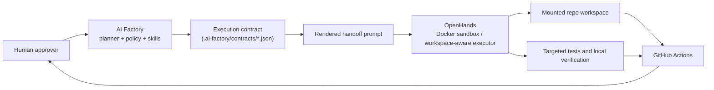

# AI Factory + OpenHands Architecture

Date: 2026-03-06

## Intent

This repo uses a split control-plane and execution-plane model:

- AI Factory = planner, policy, skills, project memory, contract authoring
- OpenHands = bounded executor, workspace edits, test runs, git-aware task execution
- GitHub Actions = independent arbiter
- Human = final approver

This is a foundation document, not a claim of full live integration.

## Current State

| Component | Status | Notes |
|---|---|---|
| AI Factory metadata | Ready | `.ai-factory/` already existed before this setup |
| Repo-specific execution skills | Ready | Added as narrow local skills |
| Contract templates | Ready | Stored in `.ai-factory/contracts/` |
| OpenHands launcher | Ready as v1 wrapper | Docker/WSL oriented, not fully validated end-to-end in this session |
| Planner-to-executor handoff | Partial | Contract file plus rendered handoff prompt |
| Automatic API/RPC integration | Pending | Not implemented and not claimed |
| MCP connectivity in AI Factory config | Pending | Existing flags are still disabled in `.ai-factory.json` |

## Topology

## Execution Boundaries

### AI Factory responsibilities

- inspect repo state
- choose only relevant local or reviewed skills
- write or update execution contracts
- define scope, constraints, stop conditions, and required artifacts
- preserve project memory and guardrails

### OpenHands responsibilities

- execute only the contract that was handed off
- stay inside workspace and diff budget
- run only the required targeted checks
- stop on protected-path or protected-domain escalation
- prepare artifacts for human and CI review

### GitHub Actions responsibilities

- validate code quality, tests, architecture boundaries, parity, and role integrity
- remain independent from planner and executor claims

### Human responsibilities

- approve task contract before execution
- approve any protected-zone work
- decide whether the result is mergeable after CI and review

## Why The Initial OpenHands Path Is Docker GUI

The local environment found during precheck favors Docker GUI over local CLI:

- Docker CLI and Compose are installed
- WSL is present
- host Python is `3.11.1`
- `uv` is not installed
- official OpenHands local CLI guidance expects Python `3.12+`

For that reason, this setup uses a repo-local Docker/WSL wrapper as the primary execution path and keeps headless automation out of the default path.

## Handoff Model

1. AI Factory selects a task class and fills a contract template.
2. Human reviews the contract before execution.
3. The contract is rendered into an OpenHands-ready handoff prompt.
4. OpenHands runs the task inside its sandboxed workspace context.
5. Output is validated locally and then by GitHub Actions.
6. Human decides whether to continue, revise, or merge.

## Deliberate Non-Claims

This foundation does not claim:

- full AI Factory plus OpenHands integration
- automatic agent-to-agent RPC
- autonomous merge or push flow
- secret management integration
- protected-zone self-approval

## Key Limitations

- Docker daemon was not reachable in this session, so launcher validation is syntax-level and runbook-level, not full runtime proof.
- No LLM provider credentials were configured as part of this setup.
- Existing AI Factory MCP flags remain disabled.
- OpenHands headless mode is intentionally not the default because it operates in always-approve mode and is a poor fit for protected domains.
