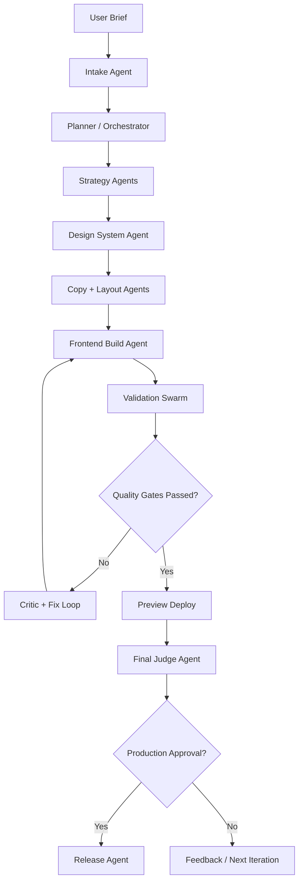

# AI Landing Factory Architecture

> Reusable blueprint for an AI-first landing page factory inside this workspace. This document is intentionally separate from the clinic product architecture. It describes how to turn one high-level brief into design, code, QA evidence, and a release candidate through an orchestrated agent pipeline.

## Outcome

Goal: one request in, production-grade landing out.

The system should produce:

- a structured brief
- messaging and offer strategy
- design tokens and layout plan
- implemented landing page code
- SEO, accessibility, performance, and UX audit evidence
- a deployable preview artifact
- a gated production release candidate

The system should not rely on a single "gen everything" step. It should operate as a controlled pipeline with explicit artifacts, measurable gates, and repair loops.

## Core Architecture



## Operating Model

### 1. Intake Layer

Transforms a vague prompt into a working specification.

Inputs:

- product or offer description
- target audience
- desired action
- tone and brand references
- proof points, constraints, and compliance notes

Outputs:

- `landing_brief.json`
- `brand_constraints.json`
- `success_metrics.json`

Rules:

- missing information becomes explicit assumptions
- every assumption is recorded and shown to later agents
- risky gaps trigger a clarification checkpoint before production release

### 2. Planning Layer

Creates a task graph, not a flat todo list.

Responsibilities:

- break work into strategy, design, implementation, and validation stages
- define dependencies between agents
- allocate token and runtime budget per stage
- stop low-value loops when metrics plateau

Outputs:

- `pipeline_plan.md`
- `task_graph.json`
- `budget_policy.json`

### 3. Generation Layer

This layer builds the actual landing.

Recommended agents:

- `Offer Strategist Agent`: promise, differentiation, objection handling
- `Research Agent`: competitor patterns, proof structures, CTA norms
- `Copy Agent`: hero, sections, CTA variants, metadata, schema copy
- `Design System Agent`: color roles, spacing scale, type scale, component rules
- `Layout Agent`: section order, above-the-fold hierarchy, responsive structure
- `Frontend Agent`: implements page, components, assets, analytics hooks
- `Motion Agent`: adds intentional entrance and interaction motion

Outputs:

- `content/landing-copy.md`
- `content/seo-meta.json`
- `design/tokens.json`
- `design/layout-spec.json`
- landing page source files

### 4. Validation Swarm

This is where quality becomes repeatable.

Recommended audit agents:

- `Design Audit Agent`
- `UX Audit Agent`
- `Conversion Audit Agent`
- `Accessibility Agent`
- `SEO Agent`
- `Performance Agent`
- `Code Quality Agent`
- `Visual Regression Agent`

Each agent reviews only one dimension and returns:

- critical issues
- medium issues
- minor improvements
- pass or fail signal
- suggested fixes tied to files or sections

### 5. Debate Layer

Use a structured multi-agent debate before accepting fixes.

Roles:

- `Critic Agent`: argues why the page still fails user or business goals
- `Defender Agent`: argues why the current solution should remain
- `Judge Agent`: decides what must change now vs later

This prevents noisy refactors and preserves good decisions.

### 6. Release Layer

Release should be staged.

Allowed automation:

- build preview artifact automatically
- run preview deployment automatically
- collect QA evidence automatically

Gated automation:

- production deployment should require explicit approval
- rollback plan should be generated before final release

Outputs:

- `release/preview-summary.md`
- `release/qa-scorecard.json`
- `release/release-notes.md`

## OpenHands Skill Map

The pipeline works best when each concern is a dedicated skill instead of one giant prompt.

Suggested skill set:

- `landing-intake.skill`: normalize brief, assumptions, and goals
- `landing-strategy.skill`: positioning, offer, audience segmentation
- `landing-copy.skill`: page copy, CTA variants, SEO meta text
- `landing-design-system.skill`: tokens, typography, spacing, component rules
- `landing-ui-build.skill`: implement React/Vite landing sections
- `landing-design-audit.skill`: hierarchy, contrast, spacing, consistency
- `landing-ux-audit.skill`: clarity, friction, page flow, form burden
- `landing-accessibility.skill`: WCAG, keyboard nav, aria, semantics
- `landing-seo.skill`: heading structure, metadata, schema, crawlability
- `landing-performance.skill`: bundle, LCP, CLS, image and font strategy
- `landing-visual-qa.skill`: screenshot alignment and responsive inspection
- `landing-conversion.skill`: trust signals, CTA placement, objection handling
- `landing-release.skill`: preview package, release notes, deploy checklist

Skill contract:

- consume explicit input artifacts only
- emit machine-readable findings and a short human summary
- never silently mutate upstream assumptions
- attach file references or section ids for every actionable fix

## Evidence-Driven Quality Gates

Do not accept "looks good". Accept only measured evidence.

Minimum target scorecard:

- Lighthouse Performance: `>= 95`
- Lighthouse Accessibility: `100`
- Lighthouse SEO: `>= 95`
- Lighthouse Best Practices: `>= 95`
- CLS: `< 0.10`
- LCP: `< 2.5s`
- INP: `< 200ms`
- broken links: `0`
- console errors on happy path: `0`
- critical Axe violations: `0`

Recommended tooling:

- `Lighthouse` for performance, accessibility, SEO
- `Playwright` for CTA, form, and responsive flow checks
- `Axe` for accessibility assertions
- screenshot capture for layout review
- bundle analyzer for JS and asset budgets

Example gate sequence:

1. `npm run build`
2. run preview server
3. run Lighthouse against preview URL
4. run Playwright smoke and conversion tests
5. run Axe accessibility checks
6. run visual screenshot review
7. aggregate results into one scorecard

## Artifact Contracts

Every stage should leave durable artifacts so later agents can reason from facts instead of guesses.

Suggested structure:

```text
.ai-factory/
  landing/
    briefs/
      landing_brief.json
      brand_constraints.json
      success_metrics.json
    plans/
      pipeline_plan.md
      task_graph.json
    design/
      tokens.json
      layout-spec.json
      screenshot-baseline/
    content/
      landing-copy.md
      seo-meta.json
      schema.json
    audits/
      design-audit.json
      ux-audit.json
      accessibility-audit.json
      seo-audit.json
      performance-audit.json
      conversion-audit.json
      visual-audit.json
    release/
      qa-scorecard.json
      preview-summary.md
      release-notes.md
```

Why this matters:

- agents can resume after interruption
- humans can review evidence without replaying the run
- CI can compare one run against another

## Control Plane

The orchestrator should behave like a workflow engine, not a chat thread.

Responsibilities:

- maintain run state and artifact locations
- know current stage, retries, and unresolved blockers
- dispatch skills in order or in parallel where safe
- aggregate scores from audit agents
- trigger repair loops only for failed dimensions
- stop after max iterations or diminishing returns

Recommended stop conditions:

- all blocking gates pass
- or maximum fix loops reached
- or no metric improved in the last two loops
- or unresolved conflict requires human decision

## Repair Loop Policy

Not every failure should send the whole page back to regeneration.

Preferred routing:

- content issue -> `landing-copy.skill`
- hierarchy or spacing issue -> `landing-design-system.skill` + `landing-ui-build.skill`
- semantic or aria issue -> `landing-accessibility.skill` + `landing-ui-build.skill`
- performance regression -> `landing-performance.skill` + `landing-ui-build.skill`
- test failure -> `landing-ui-build.skill` + targeted test rerun

This keeps the system fast and reduces regression churn.

## Suggested Prompt Contract

Use a structured master prompt for the orchestrator:

```text
Build a landing page release candidate from this brief.

Goals:
- maximize clarity and conversion intent
- preserve brand constraints
- meet all release score thresholds

Required stages:
- strategy
- design system
- copy
- implementation
- audit swarm
- repair loop
- preview packaging

Do not stop after generation.
Stop only after the scorecard is attached and all blocking issues are resolved or explicitly escalated.
```

## What Makes This Stronger Than a Simple Audit Chain

A simple chain is:

- generate
- audit
- fix

This architecture adds the missing production pieces:

- explicit intake and assumptions
- artifact contracts between agents
- dedicated design-system synthesis
- debate before accepting changes
- evidence-based gate aggregation
- targeted repair routing
- preview release packaging
- approval-aware production deployment

That is the difference between "AI can make a landing" and "AI can run a landing factory".

## Implementation Phases

### Phase 1: Foundation

- create artifact folders
- define scorecard schema
- implement intake, planner, and audit result formats

### Phase 2: Builder Stack

- add copy, design-system, layout, and UI build skills
- standardize how generated files are patched into the frontend

### Phase 3: Audit Swarm

- wire Lighthouse, Playwright, Axe, and screenshot capture
- create one JSON report format for all auditors

### Phase 4: Release Control

- add preview deployment
- add judge agent and approval gate
- add release notes and rollback checklist

## Non-Negotiable Rules

- no production deploy without explicit approval
- no pass result without attached evidence
- no fix loop without a bounded target
- no UI acceptance without mobile and desktop validation
- no accessibility pass while critical Axe issues remain
- no performance pass while Core Web Vitals regress past threshold

## Recommended First Build

If this workspace later implements the system, start with:

1. one landing page template
2. one intake schema
3. one orchestrator runbook
4. three hard gates: accessibility, performance, conversion smoke
5. preview-only deployment

That gets most of the value with much lower complexity than a full autonomous release system.
