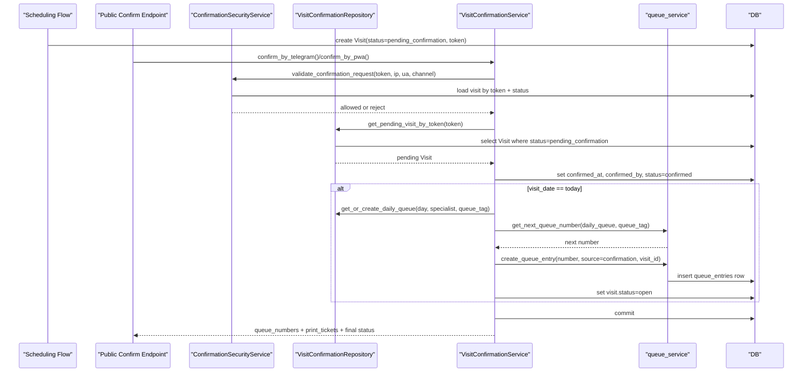

# Wave 2C Confirmation Flow Trace

Date: 2026-03-07
Mode: analysis-first, characterization-first

## Runtime Trace

### Public token-based confirmation flow

1. A scheduling flow creates a `Visit` in `pending_confirmation` state and
   stores a `confirmation_token`.
2. Patient triggers a public endpoint:
   - `POST /api/v1/telegram/visits/confirm`
   - or `POST /api/v1/patient/visits/confirm`
3. `VisitConfirmationService.confirm_by_*()` calls
   `ConfirmationSecurityService.validate_confirmation_request()`.
4. Security validation checks:
   - token exists
   - token is not expired
   - visit status is still `pending_confirmation`
   - rate limits and suspicious-activity rules
5. `VisitConfirmationRepository.get_pending_visit_by_token()` loads the pending
   visit.
6. `_confirm_visit()` stamps:
   - `confirmed_at`
   - `confirmed_by`
   - `visit.status = "confirmed"`
7. If `visit.visit_date == today`, `_assign_queue_numbers_on_confirmation()`
   runs.
8. `_assign_queue_numbers_on_confirmation()` resolves queue tags:
   - first from `VisitService.queue_tag`
   - fallback from `visit.department`
9. The flow resolves queue ownership:
   - primary path: `visit.doctor_id -> Doctor.user_id`
   - fallback path: treat `visit.doctor_id` as already holding `user.id`
   - resource-user fallbacks for `ecg` and `lab`
10. Repository gets or creates the target `DailyQueue`.
11. Number allocation occurs with `queue_service.get_next_queue_number()`.
12. Queue-row persistence occurs with
    `queue_service.create_queue_entry(number=next_number, source="confirmation", visit_id=visit.id)`.
13. `_confirm_visit()` sets `visit.status = "open"` for same-day confirmations.
14. Service commits once and returns visible payload:
    - `status`
    - `queue_numbers`
    - `print_tickets`

### Registrar confirmation bridge

1. Registrar calls `POST /api/v1/registrar/visits/{visit_id}/confirm`.
2. Mounted router in `registrar_wizard.py` checks:
   - visit exists
   - status is `pending_confirmation`
   - token has not expired
3. Router stamps `confirmed_at`, `confirmed_by`, and `visit.status = "confirmed"`.
4. If same-day, router-level `_assign_queue_numbers_on_confirmation()` runs.
5. That helper repeats split allocation:
   - `queue_service.get_next_queue_number()`
   - then manual `OnlineQueueEntry(...)` creation with `source="confirmation"`
6. Router commits and returns `ConfirmVisitResponse`.

## Sequence View

## Observed Runtime Behavior from Characterization

- Same-day confirmation creates a queue row with `source="confirmation"` and
  links it to `visit_id`.
- Replay of the same public confirmation token fails before a second allocation
  because the visit status is no longer `pending_confirmation`.
- A pre-existing active queue row for the same patient does not block
  confirmation; confirmation creates another active row with the next number.
- Parallel validation and pending-visit lookup can both observe the same pending
  visit before any status flip occurs.
